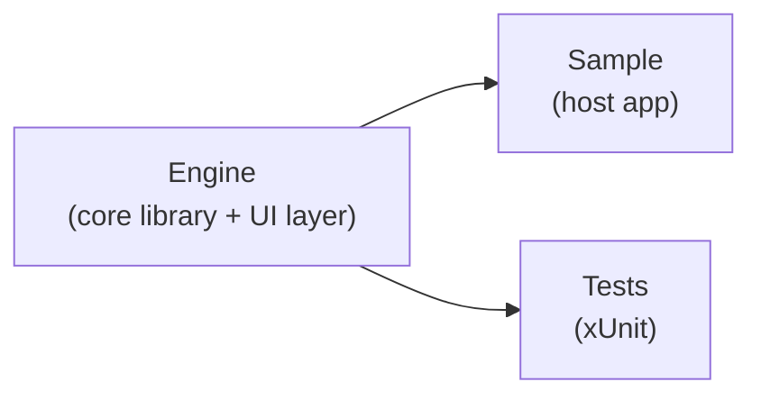
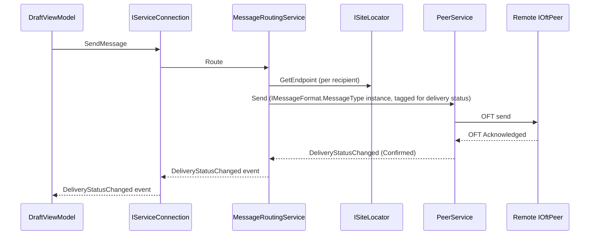
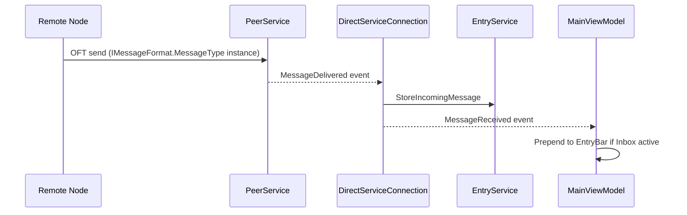

# Architecture Overview

Comlink is a peer-to-peer messaging system. The solution has three projects:

| Project | Description |
|---------|-------------|
| **Engine** | The whole engine, in one library — networking, data, services, ViewModels, and the Avalonia UI layer (Views, Themes, converters). The only project that depends on Avalonia. |
| **Sample** | Host application. References Engine. |
| **Tests** | xUnit tests. References Engine. |



## Modes

The engine runs in one of two modes selected at startup via `EngineMode`:

| Mode | Description |
|------|-------------|
| `Client` | Desktop UI via Engine's Avalonia layer. Includes LiteDB persistence, all ViewModels, and a peer listener for receiving messages. |
| `Headless` | Runs as a normal peer client — same LiteDB persistence, same `IServiceConnection` — but with no UI. |

Both modes run `PeerService` to accept and send peer-to-peer messages over [OFT](Oft.md), and both always run `InterfaceService`, hosting the local interface listener for external programs — see [Interface.md](Interface.md). The interface listener is not tied to Headless mode; it is active regardless of which mode the engine runs in.

Headless mode does not remove the Avalonia dependency — Engine is a single assembly, so Avalonia and its packages are always loaded regardless of mode. `HeadlessMode` only controls whether `EngineApplication` shows a window (`AppBuilder...StartWithClassicDesktopLifetime`) or runs the `IHost` directly with no UI; it is not a build-time or package-level option.

## Component Map

```
Engine/src/
├── Control/       DI interfaces — all external configuration points
├── Data/          LiteDB persistence (Client and Headless modes)
│   ├── Entities/  LiteDB document models
│   └── Repositories/
├── Interface/      Local interface listener (always active) — see Interface.md
├── Logging/        Daily file logger + activity log writer
├── Models/         Shared DTOs (SiteInfo, SiteEndpoint, SiteState, Folder, etc.)
├── Peer/           P2P networking over OFT — send and receive messages between nodes
├── Services/       Business logic
├── ViewModels/     MVVM layer — mostly Avalonia-agnostic (primitive types, custom interfaces),
│                   except the Avalonia-specific converters and TextDocumentBodyDocument(Factory)
├── Themes/         Avalonia dark theme resources
└── Views/          Avalonia XAML + code-behind (Client mode only; [ExcludeFromCodeCoverage])
```

## Key Flows

### Sending a message (Client mode)



### Receiving a message (Client mode)



### Receiving a message (via an interface connection)
1. Remote node sends to this site's `PeerService` over OFT.
2. `InterfaceService` (subscribed to `PeerService.MessageDelivered`) mirrors the message, unmodified, to every currently connected interface connection.
3. Any connected external program receives it directly over its own OFT connection — see [Interface.md](Interface.md). This happens in both Client and Headless mode.

### Sending a message from an interface
1. An external program sends an instance of `IMessageFormat.MessageType` on its interface connection.
2. `InterfaceService` reads `Subject`/`Body`/`Addresses` from it via `IMessageFormat` and calls `MessageRoutingService.Route` with this site's own installed name as `fromSite` — exactly as if the site itself had composed the message. This happens in both Client and Headless mode.

## Startup Sequence

`EngineExtensions.UseEngine()` registers the core services. For Client mode, `EngineUiExtensions.UseEngineUi()` additionally registers `MainWindow` and overrides `IBodyDocumentFactory`. `EngineHost` (an `IHostedService`) runs at startup:


1. `SiteService.Load` — restores installed site from `State.json` (or applies `IDebugSiteOverride`)
2. `PeerService.Start` — begins accepting peer connections
3. `InterfaceService.Start` — begins accepting interface connections (always, regardless of mode)

## Data Storage

All persistent data lives under `IAppDataPathProvider.AppDataPath` (default: `%APPDATA%/{AppName}`):

```
{AppDataPath}/
├── Data.db      LiteDB file (messages, drafts, notes, folders, activity)
├── State.json   Installed site state (name, code, environment)
└── Logs/
    └── yyyy-MM-dd.log
```

## Dependency Injection

All external configuration is expressed as interfaces in `Engine/src/Control/`. `EngineExtensions.UseEngine` registers defaults with `TryAddSingleton`, so a host can override any of them by registering its own implementation before or after calling `UseEngine` (later registrations win with `AddSingleton`).

One control interface, `IMessageFormat`, is not a settings provider but a message-shape provider: it supplies the concrete DTO type used to represent a message everywhere in the engine — on the wire (peer and interface connections) and in `MessageEntity.Message` in the database — and maps the engine's logical fields (subject, body, addresses, etc.) onto that type's real fields. Unlike the other control interfaces, it has no Engine default at all. Hosts using the `EngineApplication` entry point supply it as a required generic type parameter to `EngineApplication.Start<TMessageFormat>`, which registers it before running; omitting it is a compile error. See `Sample/src/SampleMessageFormat.cs` for a working example and [Control.md](Control.md#required-no-default).

`EngineUiExtensions.UseEngineUi` overrides `IBodyDocumentFactory` with `TextDocumentBodyDocumentFactory` so that drafts created in Client mode use a live AvaloniaEdit `TextDocument`. Without this call (e.g., in tests or Headless mode), the `BodyDocumentFactory` default creates `StringBodyDocument` instances.

See `Docs/Configuration.md` for all configuration interfaces.
