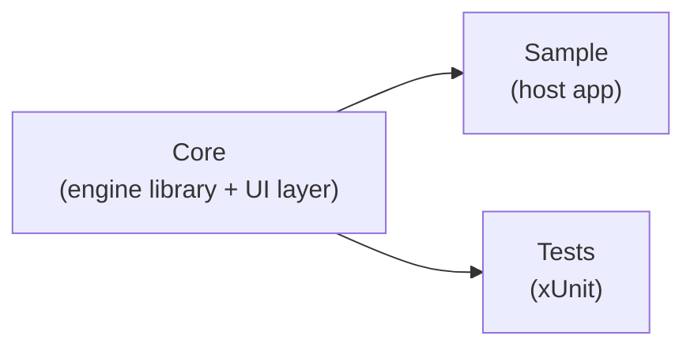
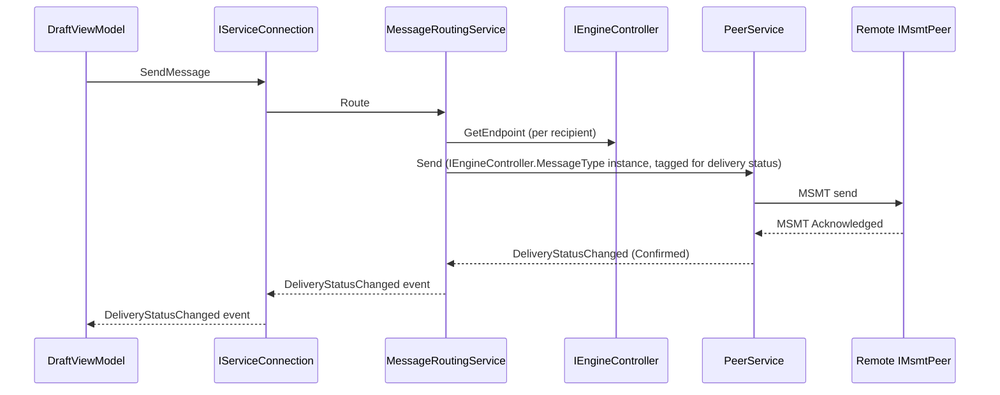
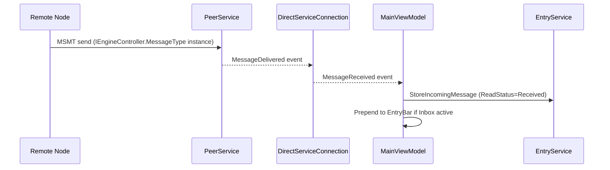
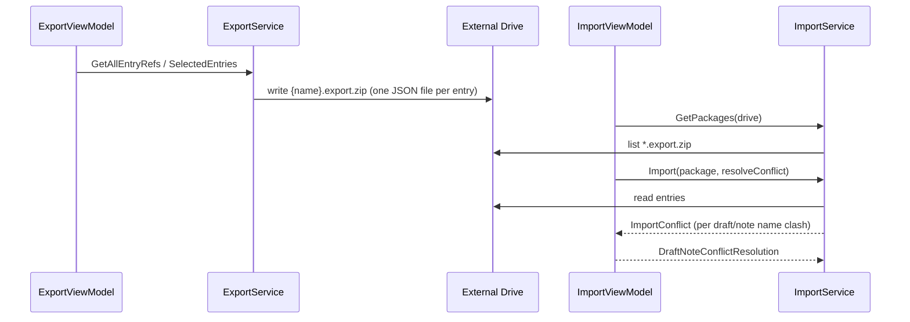
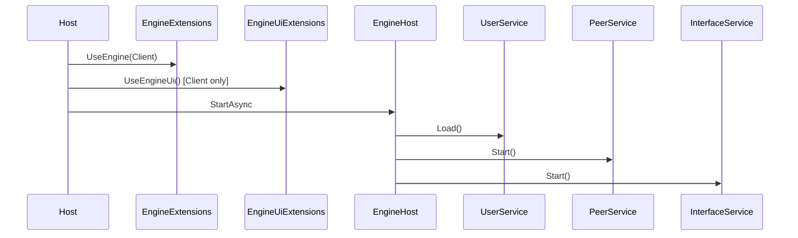

# Architecture Overview

Comlink is a peer-to-peer messaging system. The solution has three projects:

| Project | Description |
|---------|-------------|
| **Core** | The whole engine, in one library — networking, data, services, ViewModels, and the Avalonia UI layer (Views, Themes, converters). The only project that depends on Avalonia. Published as the `BlueHeighliner.Comlink` NuGet package. |
| **Sample** | Host application demonstrating `Core`'s `IEngineController`/`Engine.Start` API. References `Core`. |
| **Tests** | xUnit tests. References `Core`. |



## Modes

The engine runs in one of two modes selected at startup via `EngineMode`:

| Mode | Description |
|------|-------------|
| `Client` | Desktop UI via Engine's Avalonia layer. Includes LiteDB persistence, all ViewModels, and a peer listener for receiving messages. |
| `Headless` | Runs as a normal peer client — same LiteDB persistence, same `IServiceConnection` — but with no UI. |

Both modes run `PeerService` to accept and send peer-to-peer messages over [MSMT](Components/MsmtIntegration.md), and both always run `InterfaceService`, hosting the local interface listener for external programs — see [Interface.md](Components/Interface.md). The interface listener is not tied to Headless mode; it is active regardless of which mode the engine runs in.

Headless mode does not remove the Avalonia dependency — Core is a single assembly, so Avalonia and its packages are always loaded regardless of mode. `HeadlessMode` only controls whether `Engine` shows a window (`AppBuilder...StartWithClassicDesktopLifetime`) or runs the `IHost` directly with no UI; it is not a build-time or package-level option.

## Component Map

```
Core/src/
├── Control/       DI interfaces — all external configuration points
├── Data/          LiteDB persistence (Client and Headless modes)
│   ├── Entities/  LiteDB document models
│   └── Repositories/
├── Devices/       Real OS-level device integrations, not control interfaces — alarm sound
│                  playback, printer discovery/driving, external drive discovery
├── ExternalSystems/ Conduits to systems outside Comlink — connect/poll/send/receive lifecycle
│                  and the relay/mirror coordinator — see Components/ExternalSystems.md
├── Logging/        Daily file logger + activity log writer
├── Models/         Shared DTOs (UserInfo, UserEndpoint, UserState, Folder, etc.)
├── Peer/           P2P networking over MSMT — send/receive messages between nodes, and the
│                   local interface listener (always active) — see Components/Interface.md
├── Services/       Business logic
├── ViewModels/     MVVM layer — mostly Avalonia-agnostic (primitive types, custom interfaces),
│                   except the Avalonia-specific converters and TextDocumentBodyDocument(Factory)
├── Themes/         Avalonia dark theme resources
└── Views/          Avalonia XAML + code-behind (Client mode only; [ExcludeFromCodeCoverage])
```

## Key Flows

### Sending a message (Client mode)



### Receiving a message (Client mode)



When the user opens that Inbox message, `ContentAreaViewModel` calls `IServiceConnection.MarkMessageRead`, which transitions `ReadStatus` to `Read` and sends a user-read confirmation back to the sender — see [Peer.md](Components/Peer.md#read-confirmation). If the message is an alert (`IEngineController.GetIsAlert`), `AlertViewModel` also alarms (title bar box + sound) until it — and every other pending alert — is read; see `Docs/Components/ViewModels.md`.

### Receiving/relaying a message (via an external system)
1. An external system (`IEngineController.ExternalSystems`) reports an inbound message via `Receive`.
2. `ExternalSystemsService` calls `IPeerService.DeliverLocal`, which processes it exactly like an ordinary received message (stored, shown in the UI) and raises `MessageDelivered`.
3. `ExternalSystemsService`'s own `MessageDelivered` subscription relays the message out through every other configured external system, excluding the one it was originally received from. This happens in both Client and Headless mode. See [ExternalSystems.md](Components/ExternalSystems.md).

### Sending a message from an interface
1. An external program sends an instance of `IEngineController.MessageType` on its interface connection.
2. `InterfaceService` reads `Subject`/`Body`/`Addresses` from it via `IEngineController` and calls `MessageRoutingService.Route` with this user's own installed name as `fromUser` — exactly as if the user itself had composed the message. This happens in both Client and Headless mode.

### Exporting and importing entries (Client mode)

The title bar's EXPORT/IMPORT buttons back up and restore messages, drafts, notes, and activity logs to/from an external drive (USB, etc.), independent of the peer network. See `Docs/Components/ViewModels.md` (`IExportViewModel`/`IImportViewModel`) and `Docs/Components/Services.md` (`ExportService`/`ImportService`) for the full behavior — conflict resolution, activity log merging, the `.export.zip` package format, and how the export/import screens keep their own state (including an in-progress operation) while the user navigates the rest of the app.



## Startup Sequence

Before any host container exists, `Engine.Start(args, configureServices)` resolves `IEngineController` from a minimal, throwaway service provider built from `configureServices` alone (this interface must never depend on `EngineConfig` — see [Control.md](Components/Control.md#config-file) — since that's exactly what it decides whether to load). If enabled (the default), `EngineConfig.Load(args)` reads `--config`; otherwise `--config` is ignored and every setting uses its default.

`EngineExtensions.UseEngine()` registers the core services. For Client mode, `EngineUiExtensions.UseEngineUi()` additionally registers `MainWindow` and overrides `IBodyDocumentFactory`. After the host's `configureServices` callback registers `IEngineController` and any further control-interface overrides, `EngineExtensions.UseEngineConfigOverrides()` layers `EngineConfig` on top of every control interface that has a corresponding `config.json` field — see [Control.md](Components/Control.md#config-overrides). `EngineHost` (an `IHostedService`) runs at startup:



1. `UserService.Load` — restores installed user from `State.json` (or applies `IEngineController.DebugUserName`)
2. `PeerService.Start` — begins accepting peer connections
3. `InterfaceService.Start` — begins accepting interface connections (always, regardless of mode)

## Data Storage

All persistent data lives under `IEngineController.AppDataPath` (default: `%APPDATA%/{AppName}`):

```
{AppDataPath}/
├── Data.db      LiteDB file (messages, drafts, notes, folders, activity)
├── State.json   Installed user state (name, code, environment)
└── Logs/
    └── yyyy-MM-dd.log
```

Export packages (`{name}.export.zip`, one JSON file per entry) are written to and read from an external drive selected by the user, not `AppDataPath` — see "Exporting and importing entries" above.

## Dependency Injection

All external configuration and rule-based behavior — including the concrete message type and its logical field mapping — is expressed as a single interface, `IEngineController`, in `Core/src/Control/EngineController.cs`. `DefaultEngineController<TMessage>` is generic over the host's message DTO and `abstract` (its message-field members are `protected abstract`, since the engine has no message DTO of its own), so a host must always define a subclass (see `Sample/src/SampleEngineController.cs`) and register it inside the `configureServices` callback passed to `Engine.Start(args, configureServices)` (see `Sample/src/Program.cs` and [Api.md](Api.md)) exactly like any other service. A control-interface implementation never reads `EngineConfig` or an environment variable itself; where a member has a corresponding `config.json` field, `EngineExtensions.UseEngineConfigOverrides()` (called last, after every other registration) layers a small decorator, `ConfiguredEngineController`, on top instead. See [Control.md](Components/Control.md#config-overrides) and [Control.md](Components/Control.md#message-format).

`EngineUiExtensions.UseEngineUi` overrides `IBodyDocumentFactory` with `TextDocumentBodyDocumentFactory` so that drafts created in Client mode use a live AvaloniaEdit `TextDocument`. Without this call (e.g., in tests or Headless mode), the `BodyDocumentFactory` default creates `StringBodyDocument` instances.

See `Docs/Components/Configuration.md` for all configuration interfaces.
