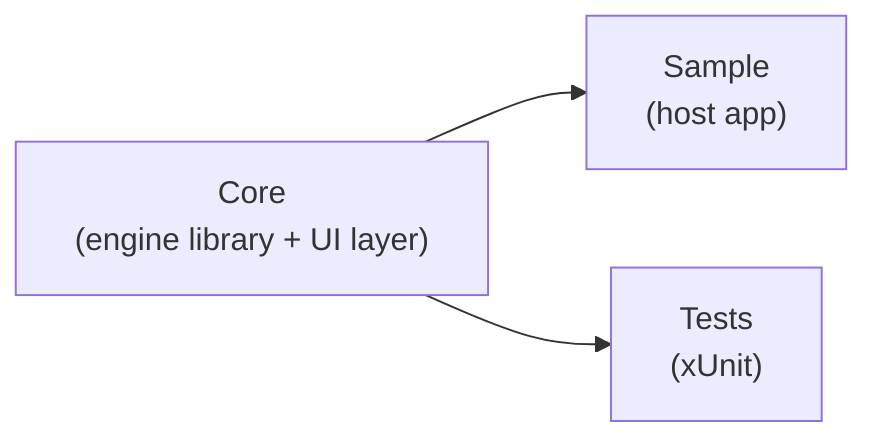
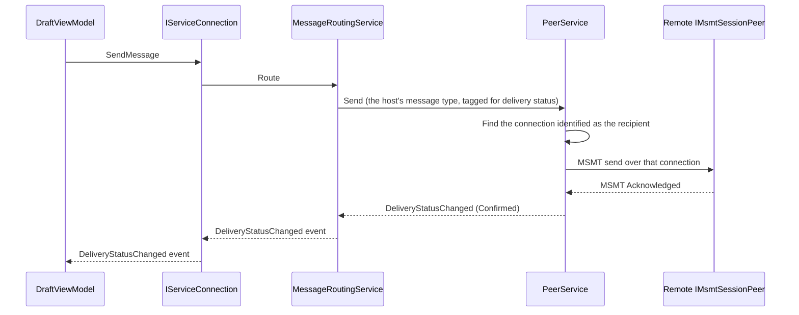
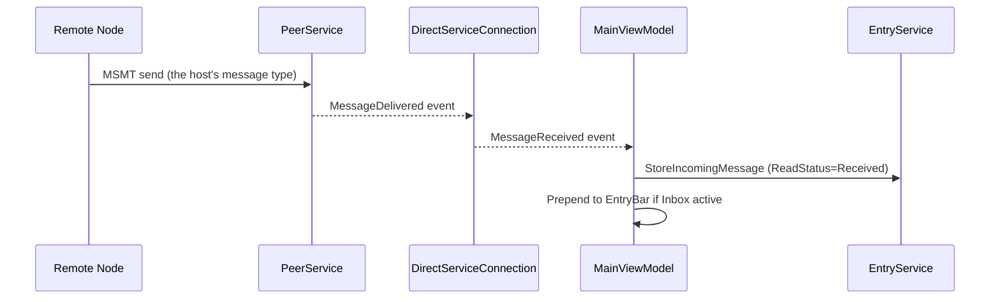
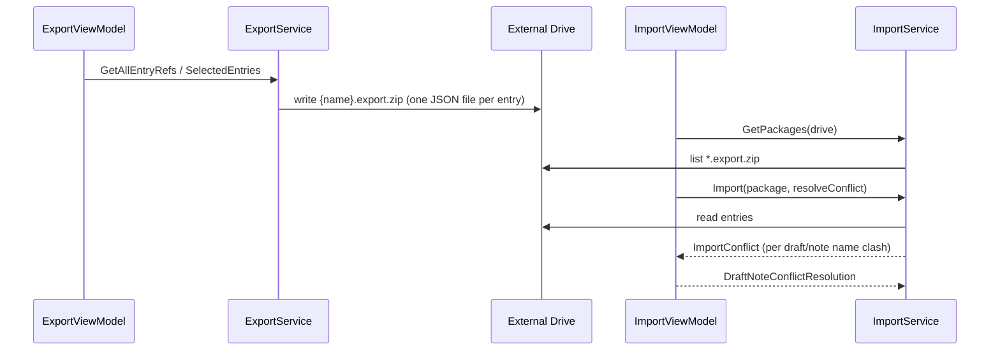
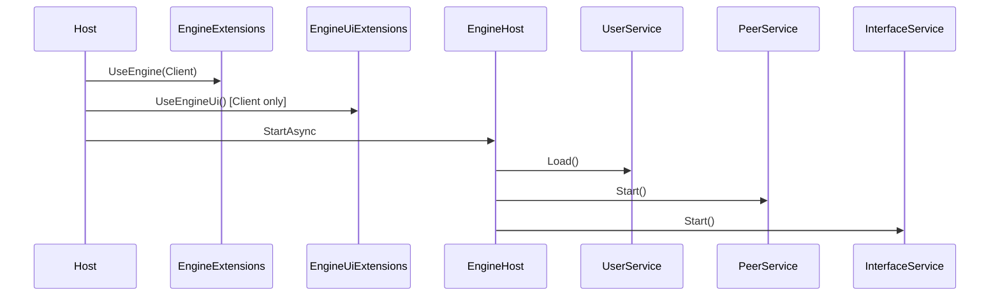

# Architecture Overview

Comlink is a peer-to-peer messaging system. The solution has three projects:

| Project | Description |
|---------|-------------|
| **Core** | The whole engine, in one library — networking, data, services, ViewModels, and the Avalonia UI layer (Views, Themes, converters). The only project that depends on Avalonia. Published as the `BlueHeighliner.Comlink` NuGet package. |
| **Sample** | Host application demonstrating `Core`'s `IEngineConfiguration`/`Engine.Start` API. References `Core`. |
| **Tests** | xUnit tests. References `Core`. |


```mermaid
graph LR
    Core["Core\n(engine library + UI layer)"]
    Sample["Sample\n(host app)"]
    Tests["Tests\n(xUnit)"]
    Core --> Sample
    Core --> Tests
```

## Modes

The engine runs in one of two modes selected at startup via `EngineMode`:

| Mode | Description |
|------|-------------|
| `Client` | Desktop UI via Engine's Avalonia layer. Includes LiteDB persistence, all ViewModels, and a peer listener for receiving connections. |
| `Headless` | Runs as a normal peer client — same LiteDB persistence, same `IServiceConnection` — but with no UI. |

Both modes run `PeerService` to accept and send peer-to-peer messages over [MSMT](Components/MsmtIntegration.md), and both always run `InterfaceService`, hosting the local interface listener for external programs — see [Interface.md](Components/Interface.md). The interface listener is not tied to Headless mode; it is active regardless of which mode the engine runs in.

Headless mode does not remove the Avalonia dependency — Core is a single assembly, so Avalonia and its packages are always loaded regardless of mode. `HeadlessMode` only controls whether `Engine` shows a window (`AppBuilder...StartWithClassicDesktopLifetime`) or runs the `IHost` directly with no UI; it is not a build-time or package-level option.

## Component Map

```
Core/src/
├── Engine.cs, EngineConfiguration.cs   The primary public types: the entry point and the configuration a host passes to it
├── Public/        The rest of the package's public surface
│   ├── Configuration/   The fluent builders a configuration is written against, and the types they take
│   ├── Connection/      IServiceConnection and its models
│   ├── ExternalSystems/ The external system contract and its base class
│   ├── Models/          Types that appear in configuration (UserInfo, ConnectionPoint, ConnectionInfo, ...)
│   └── Serialization/   The network serializer contract and its protobuf default
└── Internal/      Everything else, never public
    ├── Control/       The controller the builder's state becomes, the config file decorator, and the builders' implementations
    ├── Data/          LiteDB persistence (Client and Headless modes)
    │   ├── Entities/  LiteDB document models
    │   └── Repositories/
    ├── Devices/       Real OS-level device integrations, not configurable - alarm sound
    │                  playback, printer discovery/driving, external drive discovery
    ├── ExternalSystems/ The relay/mirror coordinator - see Components/ExternalSystems.md
    ├── Logging/       Daily file logger + activity log writer
    ├── Models/        Shared DTOs (UserState, Folder, etc.)
    ├── Peer/          P2P networking - send/receive messages between nodes over MSMT (IP) or a
    │   │              MicroGate serial cable, and the local interface listener (always active) -
    │   │              see Components/Interface.md
    │   └── Transport/ The IP/serial transport abstraction the peer services send through -
    │                  see Components/Transport.md
    ├── Services/      Business logic
    ├── ViewModels/    MVVM layer - mostly Avalonia-agnostic (primitive types, custom interfaces),
    │                  except the Avalonia-specific converters and TextDocumentBodyDocument(Factory)
    ├── Themes/        Avalonia dark theme resources
    └── Views/         Avalonia XAML + code-behind (Client mode only; [ExcludeFromCodeCoverage])
```

## Key Flows

### Sending a message (Client mode)


```mermaid
sequenceDiagram
    participant DVM as DraftViewModel
    participant SC as IServiceConnection
    participant MRS as MessageRoutingService
    participant PS as PeerService
    participant RP as Remote IMsmtSessionPeer
    DVM->>SC: SendMessage
    SC->>MRS: Route
    MRS->>PS: Send (the host's message type, tagged for delivery status)
    PS->>PS: Find the connection identified as the recipient
    PS->>RP: MSMT send over that connection
    RP-->>PS: MSMT Acknowledged
    PS-->>MRS: DeliveryStatusChanged (Confirmed)
    MRS-->>SC: DeliveryStatusChanged event
    SC-->>DVM: DeliveryStatusChanged event
```

### Receiving a message (Client mode)


```mermaid
sequenceDiagram
    participant RN as Remote Node
    participant PS as PeerService
    participant DSC as DirectServiceConnection
    participant MVM as MainViewModel
    participant ES as EntryService
    RN->>PS: MSMT send (the host's message type)
    PS-->>DSC: MessageDelivered event
    DSC-->>MVM: MessageReceived event
    MVM->>ES: StoreIncomingMessage (ReadStatus=Received)
    MVM->>MVM: Prepend to EntryBar if Inbox active
```

When the user opens that Inbox message, `ContentAreaViewModel` calls `IServiceConnection.MarkMessageRead`, which transitions `ReadStatus` to `Read` and sends a user-read confirmation back to the sender — see [Peer.md](Components/Peer.md#read-confirmation). If the message is an alert (`IEngineController.GetIsAlert`), `AlertViewModel` also alarms (title bar box + sound) until it — and every other pending alert — is read; see `Docs/Components/ViewModels.md`.

### Receiving/relaying a message (via an external system)
1. An external system (the configured external systems) reports an inbound message via `Receive`.
2. `ExternalSystemsService` calls `IPeerService.DeliverLocal`, which processes it exactly like an ordinary received message (stored, shown in the UI) and raises `MessageDelivered`.
3. `ExternalSystemsService`'s own `MessageDelivered` subscription relays the message out through every other configured external system, excluding the one it was originally received from. This happens in both Client and Headless mode. See [ExternalSystems.md](Components/ExternalSystems.md).

### Sending a message from an interface
1. An external program sends an instance of the host's message type on its interface connection.
2. `InterfaceService` reads `Subject`/`Body`/`Addresses` from it via `IEngineController` and calls `MessageRoutingService.Route` with this user's own installed name as `fromUser` — exactly as if the user itself had composed the message. This happens in both Client and Headless mode.

### Exporting and importing entries (Client mode)

The title bar's EXPORT/IMPORT buttons back up and restore messages, drafts, notes, and activity logs to/from an external drive (USB, etc.), independent of the peer network. See `Docs/Components/ViewModels.md` (`IExportViewModel`/`IImportViewModel`) and `Docs/Components/Services.md` (`ExportService`/`ImportService`) for the full behavior — conflict resolution, activity log merging, the `.export.zip` package format, and how the export/import screens keep their own state (including an in-progress operation) while the user navigates the rest of the app.


```mermaid
sequenceDiagram
    participant EXV as ExportViewModel
    participant EXS as ExportService
    participant Drive as External Drive
    participant IMV as ImportViewModel
    participant IMS as ImportService
    EXV->>EXS: GetAllEntryRefs / SelectedEntries
    EXS->>Drive: write {name}.export.zip (one JSON file per entry)
    IMV->>IMS: GetPackages(drive)
    IMS->>Drive: list *.export.zip
    IMV->>IMS: Import(package, resolveConflict)
    IMS->>Drive: read entries
    IMS-->>IMV: ImportConflict (per draft/note name clash)
    IMV-->>IMS: DraftNoteConflictResolution
```

## Startup Sequence

`Engine.Start<T>(args, configureServices)` first constructs the host's `IEngineConfiguration` through dependency injection, from a bootstrap container holding logging plus the host's `configureServices` registrations, and runs it against an `EngineBuilder`, validating the result. The result says whether `--config` may be read at all, which is why it must exist before `EngineConfigFile` does: a configuration must never depend on `EngineConfigFile`, since that is exactly what it decides whether to load. If the configuration allowed it (`ConfigFile`, off by default), `EngineConfigFile.Load(args)` reads `--config`; otherwise `--config` is ignored and every setting uses what the host stated or its default.

`EngineExtensions.UseEngine()` registers the core services, including the `IEngineController` built from the builder and wrapped by `ConfiguredEngineController` (which layers `EngineConfigFile` on top of every setting that has a corresponding `config.json` field, see [Configuration.md](Components/Configuration.md#config-file-overlay)). For Client mode, `EngineUiExtensions.UseEngineUi()` additionally registers `MainWindow` and overrides `IBodyDocumentFactory`. The host's `configureServices` registrations run last, against the running engine's own container. `EngineHost` (an `IHostedService`) runs at startup:


```mermaid
sequenceDiagram
    participant H as Host
    participant EE as EngineExtensions
    participant EA as EngineUiExtensions
    participant EH as EngineHost
    participant SS as UserService
    participant PS as PeerService
    participant IS as InterfaceService
    H->>EE: UseEngine(Client)
    H->>EA: UseEngineUi() [Client only]
    H->>EH: StartAsync
    EH->>SS: Load()
    EH->>PS: Start()
    EH->>IS: Start()
```

1. `UserService.Load` - restores installed user from `State.json` (or applies the configured debug user)
2. `PeerService.Start` — begins accepting peer connections
3. `InterfaceService.Start` — begins accepting interface connections (always, regardless of mode)

Steps 2 and 3 (and external systems) only run once a user is installed: a fresh installation has no name, so it cannot identify itself to peers, pick its own certificate, or stamp messages it routes. When no user is installed yet, `EngineHost` waits for `UserService.Installed` and starts networking then, without a restart.

## Data Storage

All persistent data lives under the configured app data path (default: `%APPDATA%/{AppName}`):

```
{AppDataPath}/
├── Data.db      LiteDB file (messages, drafts, notes, folders, activity)
├── State.json   Installed user state (name, code, environment)
└── Logs/
    └── yyyy-MM-dd.log
```

Export packages (`{name}.export.zip`, one JSON file per entry) are written to and read from an external drive selected by the user, not `AppDataPath` — see "Exporting and importing entries" above.

## Dependency Injection

All external configuration and rule-based behavior, including the concrete message type and its logical field mapping, is stated by the host through the fluent `IEngineBuilder` its `IEngineConfiguration` receives (see `Sample/src/SampleEngineConfiguration.cs`, `Sample/src/Program.cs`, and [Api.md](Api.md)). The builder only records what it is told; internally an `IEngineController` (implemented by `EngineController`, in `Core/src/Internal/Control/EngineController.cs`) reads the record and supplies a default for everything left unstated, and is what the rest of the engine depends on. It is registered explicitly rather than by convention scanning, and a host has no way to replace it. A configuration never reads `EngineConfigFile` or an environment variable itself; where a setting has a corresponding `config.json` field, `ConfiguredEngineController`, a small decorator the engine owns, layers it on top instead. See [Configuration.md](Components/Configuration.md#config-file-overlay) and [Configuration.md](Components/Configuration.md#message-format).

`EngineUiExtensions.UseEngineUi` overrides `IBodyDocumentFactory` with `TextDocumentBodyDocumentFactory` so that drafts created in Client mode use a live AvaloniaEdit `TextDocument`. Without this call (e.g., in tests or Headless mode), the `BodyDocumentFactory` default creates `StringBodyDocument` instances.

See `Docs/Components/Configuration.md` for everything a configuration can state.
