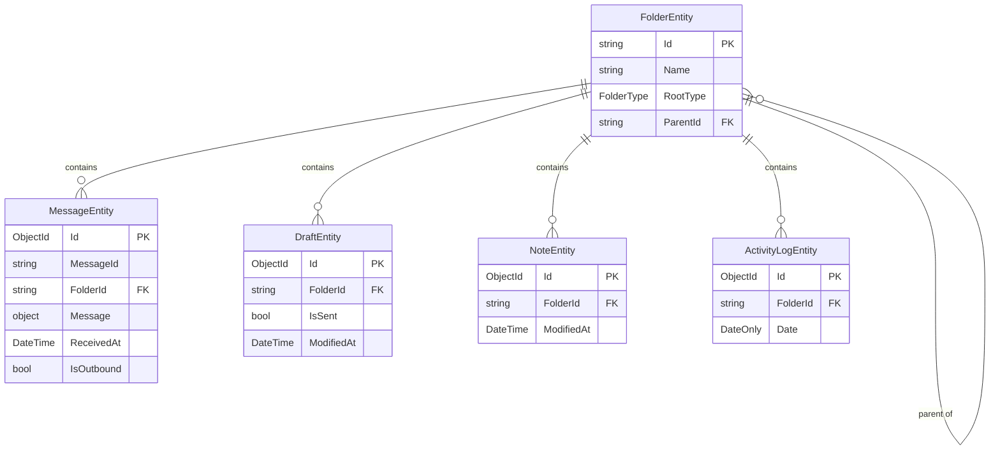

# Data Layer

The data layer is active in `Client` mode only. It uses LiteDB (a single-file embedded document database) and lives in `Core/src/Internal/Data/`.

## Database File

A single file `Data.db` in `IEngineController.AppDataPath`, the current user's own folder `%APPDATA%/{AppName}/{USERNAME}`. The file is created on first `LiteDbContext.Initialize()` call.

## LiteDbContext

`LiteDbContext` owns the `LiteDatabase` instance and exposes typed collection handles. Call `Initialize()` after the user is known (on install or on startup when an existing user is loaded). Re-calling `Initialize()` is safe: it does nothing when the database is already open on the current user's folder and reopens it when the folder has changed. A storage server's repository calls it itself, since a server with a named user starts routing before its window has initialized the database.

Collections initialized:

| Collection name | Type | Purpose |
|----------------|------|---------|
| `messages` | `MessageEntity` | Received and sent messages |
| `drafts` | `DraftEntity` | In-progress and sent drafts |
| `notes` | `NoteEntity` | Text notes |
| `activity_logs` | `ActivityLogEntity` | Daily activity entries |
| `folders` | `FolderEntity` | Folder hierarchy |
| `auto_forward_targets` | `AutoForwardTargetsEntity` | Auto forward controller target lists |
| `stored_messages` | `StoredMessageEntity` | Copies of routed messages a storage server keeps |

On each `Initialize()` call, root folders are auto-created (Inbox, Outbox, Drafts, Notes, Activity) if absent.

## Entity Relationships



## Entities

### `MessageEntity`

Stored in both Inbox (received) and Outbox (sent).

| Field | Type | Notes |
|-------|------|-------|
| `Id` | `ObjectId` | LiteDB auto-ID (the actual primary key) |
| `MessageId` | `string` | Denormalized from `Message` (via `IEngineController.GetFrameId`) so LiteDB can query/index on it directly. **Not unique** — see below |
| `Message` | `object` | The message content — body, sender, addresses, sent time — as an instance of `IEngineController.FrameType`. This is the canonical representation; LiteDB serializes it using its own runtime type (via its built-in `object`-property polymorphism, storing a `_type` discriminator) and reconstructs the same concrete type on load. Read its logical fields through the registered `IEngineController` — see `Docs/Components/Peer.md` and `Docs/Components/Configuration.md`. |
| `DeliveryStatuses` | `List<DeliveryStatus>` | Per-user delivery state (Outbox messages) |
| `ReadStatus` | `DestinationStatus?` | Inbox-only: `Received` when stored, `Read` once the user opens it (see `Docs/Components/Peer.md#receipts`). Always `null` on Outbox records — per-destination read state lives in `DeliveryStatuses` instead |
| `ReceivedAt` | `DateTime` | UTC timestamp; denormalized from `Message`'s sent time so LiteDB can sort/index on it directly |
| `FolderId` | `string` | Parent folder ID |
| `IsOutbound` | `bool` | `true` for the Outbox (sent) record, `false` for the Inbox (received) record |

**Self-addressed messages**: when a user sends a message to itself (see `Docs/Components/Peer.md`), one `MessageEntity` document is created in the Inbox (`IsOutbound = false`, no `DeliveryStatuses`) and a second in the Outbox (`IsOutbound = true`, populated `DeliveryStatuses`) — both sharing the same `MessageId`. `MessageRepository.Get`/`Delete` always take an explicit `outbound` flag to disambiguate which of the two documents to target; delivery-status updates are always scoped to the outbound record.

### `DraftEntity`

| Field | Type | Notes |
|-------|------|-------|
| `Id` | `ObjectId` | LiteDB auto-ID |
| `Body` | `string` | Plain text representation |
| `BodySegmentsJson` | `string` | JSON array of `DraftBodySegmentData` — used for fill-ins |
| `Addresses` | `List<AddressData>` | |
| `IsSent` | `bool` | `true` after successful send |
| `IsAlert` | `bool` | Whether this draft will be sent as an alert; see `Docs/Components/Peer.md#alert-messages` |
| `Priority` | `int` | Priority number this draft should be sent at; see `Docs/Components/Configuration.md#message-composition` |
| `Tag` | `string` | Short user-inputted tag identifying the type of this message; see `Docs/Components/Configuration.md#message-composition` |
| `SecurityLevel` | `string` | Security level name this draft should be sent at, one of `IEngineController.SecurityLevels`, or an empty string when none are configured |
| `SentAt` | `DateTime?` | UTC send time |
| `ModifiedAt` | `DateTime` | UTC last edit time |
| `FolderId` | `string` | |

`BodySegmentsJson` encodes the structured draft body. Each segment is:
```json
{ "kind": "text" | "fillin", "text": "...", "id": "hex-id", "options": ["..."], "selected": "..." }
```

### `NoteEntity`

| Field | Type |
|-------|------|
| `Id` | `ObjectId` |
| `Body` | `string` |
| `ModifiedAt` | `DateTime` |
| `FolderId` | `string` |

### `ActivityLogEntity`

One record per day, accumulated throughout the day.

| Field | Type |
|-------|------|
| `Id` | `ObjectId` |
| `Date` | `DateOnly` |
| `Events` | `List<string>` | Legacy plain-string events |
| `EventEntries` | `List<ActivityLogEntry>` | Structured events: `{ At, Message }` |
| `FolderId` | `string` |

### `FolderEntity`

| Field | Type | Notes |
|-------|------|-------|
| `Id` | `string` | Root folders use fixed IDs like `"root-inbox"` |
| `Name` | `string` | |
| `RootType` | `FolderType?` | `null` for user-created subfolders |
| `ParentId` | `string?` | `null` for root folders |

### `AutoForwardTargetsEntity`

One document per configured auto forward controller, keyed by the controller's own name rather than an auto-generated ID: `Id (string)` is that name verbatim (see `Docs/Components/Configuration.md#auto-forward-controllers`), and `Targets (List<string>)` is the user names it currently forwards a matching received message to - empty until a user with access adds at least one. No document exists for a controller until its target list is saved for the first time.

### `StoredMessageEntity`

A storage server's copy of one routed message (see `Docs/Components/Configuration.md#server-storage`): `Id (ObjectId)`, `MessageId (string)` denormalized from `Message` and indexed so a duplicate is caught cheaply, `Message (object)` as an instance of `IEngineController.FrameType` stored the same way `MessageEntity.Message` is, and `StoredAt (DateTime)`. Written only by a server whose user is in `IEngineController.StorageServers`; a client's database never has any. A stored `DateTime` reads back as local time, so anything comparing a stored message's sent time converts it to UTC first.

### Embedded Types

**`AddressData`**: `UserName (string)`, `Type (string)` (`"To"`, `"Cc"` or `"External"`), `Information (string)` (free-form instructions for the user, e.g. `Deliver to Eastside Office`)

**`DeliveryStatus`**: `UserName (string)`, `Status (DestinationStatus enum)` — `Sending`, `Sent`, `Failed`, `Received`, `Read`

## Repositories

All repositories take `LiteDbContext` by constructor. All public methods are `Task`-wrapped (run synchronous LiteDB operations on the calling thread — LiteDB is thread-safe internally).

### `MessageRepository` — page size 50

| Method | Description |
|--------|-------------|
| `GetPage(folderId, page)` | Paginated list, ordered by `ReceivedAt` descending |
| `Count(folderId)` | Total count in folder |
| `Get(messageId, outbound)` | Single message by `MessageId` and direction — `outbound` disambiguates the Inbox vs. Outbox record of a self-addressed message |
| `Insert(entity)` | Insert |
| `Update(entity)` | Update |
| `Delete(messageId, outbound)` | Delete by `MessageId` and direction, same disambiguation as `Get` |
| `GetAll()` | Every message document, both Inbox and Outbox, across all folders — unpaginated; used by `ExportService` for a full export |
| `GetAllInFolder(folderId)` | Every message in one folder, unpaginated, same ordering as `GetPage`; used by `EntryService` to search a folder's entries, since a message's searchable fields live inside the host's own opaque `Message` type and cannot be queried in LiteDB directly |

### `DraftRepository` — page size 50

| Method | Description |
|--------|-------------|
| `GetPage(folderId, page, alphabetical)` | Alphabetical by body or by `ModifiedAt` descending |
| `Count(folderId)` | |
| `Get(id)` | |
| `Insert / Update / Delete` | |
| `GetAll()` | Every draft document, sent or unsent, across all folders — unpaginated; used by `ExportService` |
| `GetAllInFolder(folderId, alphabetical)` | Every unsent draft in one folder, unpaginated, same ordering as `GetPage`; used by `EntryService` to search a folder's entries |

### `NoteRepository` — page size 50

Same interface shape as `DraftRepository`, including `GetAll()` and `GetAllInFolder(folderId, alphabetical)`.

### `ActivityLogRepository` — page size 50

| Method | Description |
|--------|-------------|
| `GetPage(page)` | All logs, newest first |
| `Count()` | Total log records |
| `GetForToday()` | Today's log record or `null` |
| `Get(id)` | Single by ID |
| `Insert / Update` | |
| `AppendEvent(eventText)` | Upserts today's record and appends one `ActivityLogEntry` |
| `GetAll()` | Every activity log document — unpaginated; used by `ExportService` |

### `FolderRepository`

| Method | Description |
|--------|-------------|
| `GetAll()` | All folder entities |
| `Get(id)` | Single folder |
| `GetRootId(type)` | ID of the root folder for a given `FolderType` |
| `GetTree()` | Builds hierarchical `Folder` tree (returns root `Folder` objects with `Children`) |

### `StoredMessageRepository`

`InsertIfNew(entity)` stores a copy unless one with the same `MessageId` exists (serialized by a lock so two concurrent routes of one message keep one), returning whether it stored; `GetAll()` returns every copy, since a message's searchable fields live inside the host's opaque type and cannot be queried in LiteDB.

### `AutoForwardTargetsRepository`

`Get(controllerName)` returns that controller's `AutoForwardTargetsEntity` by its name (the document's own `Id`), or `null` if its target list has never been saved. `Save(controllerName, targets)` upserts the document, replacing the whole target list in one call rather than adding or removing individual entries - `AutoForwardViewModel` reads the current `Targets` collection, mutates it, and saves the entire result back, so there is no separate add/remove operation at the repository level.
| `Insert / Delete` | |
