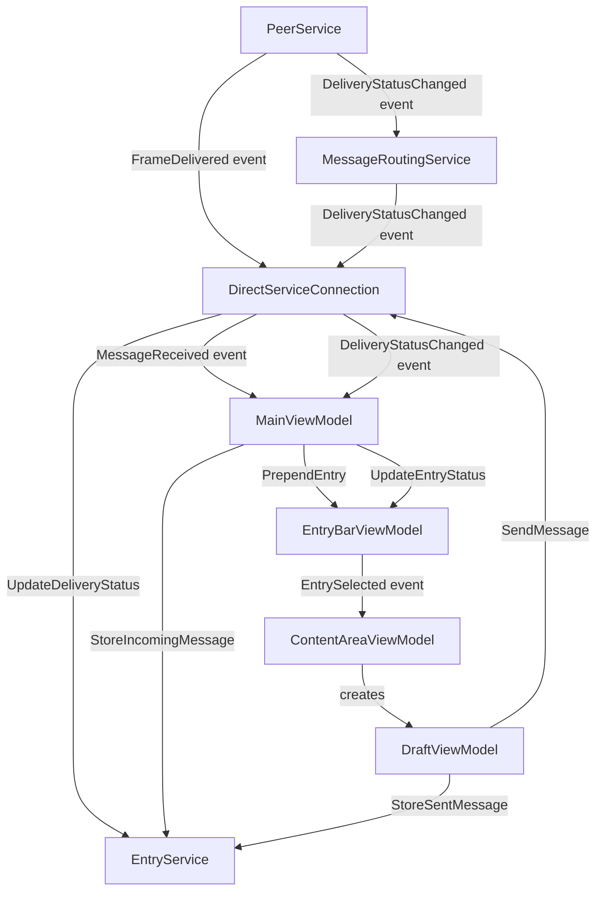

# Services

Business logic lives in `Core/src/Internal/Services/`. All services are registered as singletons.



Message and delivery-status persistence (`StoreIncomingMessage`, `StoreSentMessage`, `UpdateDeliveryStatus`) all go through `EntryService`, which is only ever driven from Client-mode ViewModels (`MainViewModel`, `DraftViewModel`) and `DirectServiceConnection`'s own delivery-status handler — never from `DirectServiceConnection.OnMessageDelivered`/`SendMessage` directly. In Headless mode, no ViewModels are constructed, so a host consuming `IServiceConnection` in that mode observes messages and delivery-status changes purely as events/calls and is responsible for its own persistence if it needs any — the data layer is Client-mode-only (see below).

## UserService

Manages user installation and persists user identity to `User.json`.

**Key responsibilities**:
- Load existing user state on startup (`Load`)
- Install a new user by name, after checking their certificate (`Install`)
- Re-read `User.json` while running (`Refresh`, raising `Changed`; see NetworkReloadService)
- Apply the `--user` override (`IEngineController.DebugUserName`) that bypasses `User.json`

**State file**: `IEngineController.UserFilePath` (`%APPDATA%/{AppName}/User.json`, beside the user folders since it says whose folder to use) contains `UserName`. `IsInstalled` is a computed property: `true` when `UserName` is non-null. The message level shown in the title bar banner (see `MainViewModel`) is not persisted here; it is resolved fresh from `IEngineController.GetUserMessageLevel(UserName)` each time, so a level a host reassigns to a user takes effect for an already-installed user without reinstalling.

**Certificate check**: `IEngineController.GetCertificateProblem(userName)` (built on `MsmtCertificateLookup.GetProblem`) returns why a user's certificate is not usable, or `null`: the network's `CertificateStore` and `AuthorityCertificate` are set, `{userName}.pfx` exists in the store, its certificate has the user name as a subject common name, and it chains to the authority certificate alone (custom root trust, no revocation check). `Install` finds the name among the network's users (`FindUserName`, case-insensitive; `null` if there is none), then throws `InvalidOperationException` carrying the problem if there is one, installing and persisting nothing. `Load` makes the same checks for a remembered user and, on a problem, logs it, deletes the user file and leaves nobody installed.

**Thread safety**: `Install` uses a `SemaphoreSlim(1,1)` to prevent concurrent installs.

**`--user` override**: If `IEngineController.DebugUserName` (the `--user` command-line argument, when the host allows overrides) is non-null, `Load` skips the user file entirely and passes that name through the same checks as an install (`FindUserName`, then `GetCertificateProblem`); when it passes, it is the user (not persisted), and when it fails nobody is installed and the user file is left alone. Useful for development without installing.

```csharp
// Consumers call:
UserInfo? info = service.GetCurrentUserInfo();  // null if not installed
UserState state = service.CurrentState;
await service.Load(cancellation);
UserInfo? installed = await service.Install("SN01", cancellation);
```

---

## MessageRoutingService

Routes outbound messages to peer nodes and surfaces their delivery status. Delivery status comes from `IPeerService`'s `DestinationStatus` stream: `Sent` and `Failed` from the transport, `Received` and `Read` from the receipt frame flow (see [Peer.md](Peer.md#delivery-status)).

**Key responsibilities**:
- Build the outbound message via `IEngineController` (`CreateMessage` with the message content, which runs the host's message handler, with the sent time in its content, with the identifier it was just given in that content, then the `SetFromUser` and `SetAddresses` setters for the fields every frame has) so it can be sent as whatever concrete type the host has configured (see [Configuration.md](Configuration.md#frame-format))
- For each recipient in `SendMessagePayload.Addresses`, deliver via `IPeerService.Send`
- Subscribe to `IPeerService.DeliveryStatusChanged` and forward each `DestinationStatus` unchanged as its own `DeliveryStatusChanged`
- Subscribe to `IPeerService.ReceiveReceiptReceived` and `ReadReceiptReceived` and re-raise them as `DeliveryStatusChanged(messageId, user, DestinationStatus.Received)` and `(..., DestinationStatus.Read)` — reusing the same event as peer-driven status changes

**Events**:
- `DeliveryStatusChanged(messageId, userName, DestinationStatus)` — raised on every per-user status change

**Result timing**: `IPeerService.Send` does not return until the remote node has accepted the message, so `Route`'s per-user `UserDeliveryResult.Success` means accepted (status `Sent`); `Received` and `Read` follow later as receipt frames arrive.

**External addresses**: An `AddressType.External` address is information for the reader only (with its `Information`, e.g. `OMAHA - Deliver to Eastside Office`). It is stored and shown with the message but never routed: no group expansion, no delivery, no status row, and the server ignores it when choosing recipients.

**Message levels**: `Route` reads the message's level name (`SendMessagePayload.MessageLevel`) and, before sending, drops any destination whose own assigned level (`IEngineController.GetUserMessageLevel`) ranks lower - it is never dialed, and its `UserDeliveryResult.Success` is `false`. Unrecognized or empty level names (no message levels configured at all) skip the check entirely, so a host with no use for the feature sees no behavior change. The check applies per destination, so a message can still reach every recipient cleared for it even when others in the same address list are blocked.

**Self-addressing**: a recipient that is the sending user is sent like any other.

```csharp
var (messageId, results) = await routing.Route(fromUser, payload, ct);
// results: IReadOnlyList<UserDeliveryResult> { UserName, Success, AddressedVia }
```

---

## EntryService

CRUD for messages, drafts, notes, and activity log reads. Runs in `Client` mode only.

**Events** (all `Func<entity, Task>`):
- `MessageInserted` — fired after `StoreIncomingMessage`
- `MessageRead` — fired after `MarkMessageRead` transitions an Inbox record from `Received` to `Read`; consumed by `AlertViewModel` to track pending alerts (see [Peer.md](Peer.md#receipts))
- `DraftInserted` — after `InsertDraft` or `DuplicateDraft`
- `DraftUpdated` — after `SaveDraft`, only if the draft has not yet been sent
- `NoteInserted` — after `InsertNote` or `DuplicateNote`
- `NoteUpdated` — after `SaveNote`

Both `StoreIncomingMessage` and `StoreSentMessage` take the message's logical fields (body, addresses, etc.) as plain parameters, plus an `isAlert` flag, and build `MessageEntity.Message` from them via `IEngineController` (`CreateMessage` followed by the common field setters) before saving — callers never construct the stored frame type directly. `MessageEntity.MessageId` is denormalized from the same value passed to `IEngineController.SetFrameId` so it stays queryable/indexable (see [Data.md](Data.md#messageentity)).

**Key methods**:

| Method | Description |
|--------|-------------|
| `StoreIncomingMessage(messageId, fromUser, body, addresses, sentAt, priority = null, tag = "", messageLevel = "")` | Creates a `MessageEntity` in the Inbox folder (`IsOutbound = false`, `ReadStatus = Received`), fires `MessageInserted` |
| `StoreSentMessage(messageId, body, addresses, sentAt, userResults, priority = null, tag = "", messageLevel = "")` | Creates a `MessageEntity` in the Outbox (`IsOutbound = true`) with per-user delivery statuses seeded from the routing result — `Sent` when `Success` is `true`, otherwise `Failed`; a status that arrived before the record was stored is applied here |
| `IncomingMessageExists(messageId)` | Whether the Inbox already holds a record for the ID (an Outbox-only record does not count). `MainViewModel` checks it before `StoreIncomingMessage`, so a message delivered twice - notably a storage server's answer to a retrieval request that includes messages the Inbox already has - is stored and shown once |
| `UpdateDeliveryStatus(messageId, userName, status)` | Updates per-user delivery status on the Outbox record for `messageId` - always scoped to the outbound record, since a self-addressed message also has an Inbox record sharing the same `messageId`. The user name matches case-insensitively, and a status only ever moves forward (Sending, then Sent, then Failed, then Received, then Read): status events for different stages can arrive out of order, so a late earlier one is ignored rather than undoing a later one |
| `MarkMessageRead(messageId)` | Transitions the Inbox record's `ReadStatus` from `Received` to `Read` and fires `MessageRead`. A no-op (returns `null`) if the record is missing or already `Read` — see [Peer.md](Peer.md#receipts) |
| `NewDraft()` / `NewNote()` | Build a blank draft (with the draft handler's defaults) or note for the Drafts or Notes root folder without storing it, so one that is never written in leaves nothing behind |
| `InsertDraft(entity)` / `InsertNote(entity)` | Store an entity built by `NewDraft` / `NewNote`, firing `DraftInserted` / `NoteInserted` |
| `DuplicateDraft(entity)` / `DuplicateNote(entity)` | Store a copy (same name, body, fill-ins, recipients, tag, priority, message level and width, never sent) as a new entry in the same folder, firing the inserted event, and return it; the original is untouched |
| `SaveDraft(entity)` | Persists draft changes, fires `DraftUpdated` if not yet sent |
| `SaveNote(entity)` | Persists note changes, fires `NoteUpdated` |
| `SaveDraftQuietly(entity)` / `SaveNoteQuietly(entity)` | Persist what the user wrote in a draft or note they are leaving, firing `DraftSavedQuietly` / `NoteSavedQuietly` instead of the update events, so nothing is selected |
| `GetMessages(folderId, page, filter = null)` | Paginated messages, ordered by `ReceivedAt` descending. A non-empty `EntryFilter` loads the whole folder to filter in memory instead of paginating the LiteDB query directly, since a message's fields live inside the host's own opaque frame type: `Search` matches case-insensitively against body, sender, destinations, tag, priority label, or message level name; `Author` matches the sender and `Destination` any addressee, both by case-insensitive substring; `DateFrom`/`DateTo` bound `ReceivedAt` as exact instants (a caller wanting a whole calendar day combines the date with its start/end of day itself - `EntryBarViewModel` does this by default); `MessageLevel`/`Priority` match the decoded message exactly and `Alert` (`true` for alerts only, `false` for non-alerts only, `null` for both) is checked against the handler's `IsAlert` |
| `GetDrafts(folderId, page, alphabetical, filter = null)` | Paginated drafts, same in-memory filtering approach. `Search` matches name, body or tag; `Destination` matches any address's user name by case-insensitive substring; `DateFrom`/`DateTo` bound `ModifiedAt` the same exact-instant way; `MessageLevel`/`Priority` match directly against `DraftEntity`'s own fields; drafts have no alert criterion |
| `GetNotes(folderId, page, alphabetical, filter = null)` | Paginated notes, same in-memory filtering approach. `Search` matches body text; `DateFrom`/`DateTo` bound `ModifiedAt` the same exact-instant way; `Author`/`Destination`/`MessageLevel`/`Priority`/`AlertOnly` are ignored - `NoteEntity` has none of those fields |
| `GetActivityLogs(page)` | Paginated activity log entries, newest first |
| `DeleteEntry(id, entryType, isOutboundMessage = false)` | Permanently deletes an entry; `isOutboundMessage` disambiguates the Inbox vs. Outbox record for a self-addressed message |
| `Locate(id, entryType, isOutboundMessage = false)` | Finds the folder that holds a message, draft or note, together with whether a message is an alert, or `null` when there is no such entry or it has no folder |
| `MoveEntry(entryId, entryType, targetFolderId, isOutboundMessage = false)` | Moves an entry to another folder; same disambiguation as `DeleteEntry` |
| `DeleteFolderContents(folderId)` | Permanently deletes every message, draft and note in one folder; used when a folder is deleted so no entry is left pointing at a folder that no longer exists |

---

## DirectServiceConnection

Implements `IServiceConnection`, registered in both `Client` and `Headless` mode. Wires engine internals to the interface consumed by ViewModels (Client) or embedding host code (Headless).

**Responsibilities**:
- Forwards `IServiceConnection.SendMessage(body, addresses, priority, tag, messageLevel)` (whether the message is an alert is decided by the message handler from the other properties and reported in `SendMessageResult.IsAlert`) (priority and message level are members of the host's enums, and the call throws for one that is not a configured level) → `MessageRoutingService.Route` and returns the result. It does not persist anything itself — in Client mode, `DraftViewModel` calls `EntryService.StoreSentMessage` after a successful send
- Translates `PeerService.FrameDelivered` → fires `IServiceConnection.MessageReceived` for each frame that is a message (`IEngineController.IsMessage`, answered by the message handler; any other frame is neither shown nor stored). Each such message from another user is also answered with a receive receipt sent straight to its sender. It does not persist the message itself — in Client mode, `MainViewModel`'s handler for that event calls `EntryService.StoreIncomingMessage`
- On `MessageRoutingService.DeliveryStatusChanged`, updates the Outbox record via `EntryService.UpdateDeliveryStatus`, then fires `IServiceConnection.DeliveryStatusChanged` with the user's status as stored and the resulting `OverallStatus`, so an ignored late status is not shown either
- `MarkMessageRead(messageId)`: calls `EntryService.MarkMessageRead`, fires `IServiceConnection.DeliveryStatusChanged` locally (empty `UserName`, status `Read`) so Client-mode UI reflects the read state immediately, then sends a read receipt to the original sender via `IPeerService.Send` directly — or, for a self-addressed message, calls `EntryService.UpdateDeliveryStatus` directly with no network round-trip. See [Peer.md](Peer.md#receipts)
- Implements install, user info query, and user names query by delegating to `UserService` / `IEngineController`

---

## NetworkIndicatorService

Keeps the network indicator (`INetworkIndicator`, which the top bar's `NetworkIndicatorViewModel` follows) in step with the node's direct connection to its parent, in a client or relay. `EngineHost` starts it with the other services; nothing runs for a server. When a network processor exists, it is first asked `UseAutomaticNetworkIndicator` with an engine context, and a `false` answer ends the service so only the processor's `SetNetworkIndicator` calls change the indicator. Otherwise it starts from `IPeerService.IsUserConnected(ParentUser)` and follows `UserConnected`/`UserDisconnected` for the parent only (names compared case-insensitively), so the connection beyond the parent never matters.

## DisconnectAlarmService

Sounds an alarm in every role (Client, Server and Relay) when a connection drops, separately from the alarm for alerts. `EngineHost` starts it with the other services once networking starts; it subscribes to `IPeerService.UserDisconnected` (raised when a user's last live connection goes) and `UserConnected`, and plays its own sound through `IDisconnectAlarmPlayer`, a player of its own so it never starts or stops the alert alarm's sound or the reverse.

- A disconnect adds the user to the set of connections that dropped during the current alarm, plays the sound, and (re)starts a timer of `IEngineController.DisconnectAlarmDuration`, the alarm handler's `DisconnectDuration` (30 seconds by default), so another drop while it sounds starts the time again.
- A connection coming back removes its user from that set; once the set is empty the alarm stops early. A connection that did not drop during the alarm does nothing.
- When the timer runs out the sound stops and the set is cleared, so the alarm is over; the next drop starts a new one.

## NetworkReloadService

Re-reads the configuration while the engine runs (`Reload()`, raising `Reloaded` afterwards) and applies what changed, which is what the "Refresh configuration" button of the title bar's info panel does (`IMainViewModel.RefreshCommand`). Besides the network file it reads `Logging.json` again (`ILogSettings.Reload()`, so the log categories it turns on take effect at once) and `User.json` (`IUserService.Refresh()`). `NetworkConfig.Reload()` reads the file again from wherever it was loaded and replaces the trusted authority, certificate store, groups and users; the user the process runs as stays. A reload changes only what the new file makes necessary. The running peer service is told to reconfigure (`IRolePeerService.Reconfigure()`, implemented by `PeerService`, `ClientPeerService` and `ServerRoutingService` through `IReconfigurable`): a changed listen port restarts only the listener (`IPeerTransport.StopListener()` then `StartListener`), and `PointMaintenance` diffs the outgoing points, closing the ones no longer defined (or whose named serial user changed), opening newly defined ones, and leaving the rest, and their connections, untouched; a client moves to its new first point only if that point changed; a server updates its topology in place, disconnecting and forgetting only the children and servers no longer listed. The peer layer is restarted (`IRolePeerService.Restart()`) only when the current user's role changed, since that needs a different implementation, or the certificate settings (certificate store, authority certificate, trusted authority name, the user's certificate name) changed, since those are fixed when it is created; the interface listener is restarted (`IInterfaceService.Restart()`) only when the interface port or those certificate settings changed. Everything else, such as users, groups, message levels and node settings, is read on demand and is current as soon as the file has been read, and a reload that changes nothing touches nothing. `User.json` is followed too: when it now names another user, that user becomes current after the checks of an install (the network lists them and their certificate is in order); when it names one that fails them, or is gone, nobody is current and the file of a failing one is deleted, exactly as at startup. A changed user is not adjusted in place: `EngineHost` stops every service that runs on a user's behalf and starts them again for the new user (none for nobody), and the peer and interface adjustments above are skipped as the restart reads the new file anyway. `MainViewModel` then recomputes the role, message level and access shown, and for another user also reopens the database of that user, reloads the folders and shows the home content, or shows the install screen again when nobody is current. A file that cannot be read or parsed throws before anything changes, and the view model logs it and leaves the engine running on what it had.

## InterfaceService

Hosts the local interface listener described in [Interface.md](Interface.md). Always active, in both `Client` and `Headless` mode. `Restart()` closes the listener and opens it again from the configuration as it is then, and it keeps waiting for a restart when it cannot start (for example before its certificates are in place) instead of ending. Mirrors `PeerService.FrameDelivered` out to every connected interface connection, and routes messages received from an interface via `MessageRoutingService.Route`.

---

## ExportService

Builds the entry-reference list for a full export and writes selected entries to a zip archive as one file per entry, in the engine's own built-in JSON format or a host-configured custom one. Backs the export feature described in `Docs/Components/ViewModels.md` (`IExportViewModel`).

**Key responsibilities**:
- `GetAllEntryRefs()` — returns an `ExportEntryRef` (`Id`, `EntryType`, `IsOutboundMessage`) for every message (both Inbox and Outbox, across every folder), draft, note, and activity log document in the database, via each repository's `GetAll()`
- `Export(entries, zipPath, format, cancellation)` - for each reference whose root folder type `format?.AllowedTypes` accepts (every type, when `format` is `null` or states no filter), loads the full entity from the appropriate repository, maps it to a public export DTO (`MessageExportData`/`DraftExportData`/`NoteExportData`/`ActivityLogExportData`, see [Configuration.md](Configuration.md#export-formats)) via `IEngineController` for messages, and writes it as `{index}_{EntryType}_{id}.{extension}` inside a new `ZipArchive` - the engine's own `JsonSerializer` when `format` is `null` (extension `json`), otherwise `format.Serialize` (extension derived from the format's `Name`, lowercased and stripped to letters/digits, falling back to `dat` if that leaves nothing). The archive is written to `zipPath + ".partial"` and only moved over `zipPath` once complete, so a cancelled or failed export (e.g. a full or removed drive) never leaves a truncated package, or destroys an existing one of the same name. A reference whose entity has since been deleted, or whose type `format` does not accept, is left out without failing the export. Returns how many entries were actually written, which callers use instead of `entries.Count` to report an accurate count.
- On cancellation (or any other failure) mid-write, the partially written zip file at `zipPath` is deleted before the exception propagates — the `try`/`catch` wraps the entire archive-writing block, so this holds regardless of how many entries had already been written.

Message content is read through `IEngineController`, matching every other message read path in Engine — `ExportService` has no knowledge of the host's concrete frame type.

`IExportService.PackageExtension` (a `const` interface member, `".export.zip"`) is the file extension every export package is written with, distinguishing it from an ordinary zip file so `ImportService.GetPackages` can find it on a drive. `ExportViewModel` appends this to the user-entered file name.

```csharp
IReadOnlyList<ExportEntryRef> refs = await exportService.GetAllEntryRefs();
int written = await exportService.Export(refs, "/media/usb/backup" + IExportService.PackageExtension, format: null, cancellation);
```

---

## ImportService

Lists files on a drive and restores their entries into the local database, in the built-in package format or a host-configured custom one. Backs the import feature described in `Docs/Components/ViewModels.md` (`IImportViewModel`). Operates directly on the repositories, the same way `ExportService` does — it is a bulk data-restore operation, not a "live" business event, so it does not raise `IEntryService`'s insert/update events (no retroactive alerting for an imported alert message, no auto-navigation to Drafts/Notes; the imported data is visible as soon as the user browses to the relevant folder, since `EntryBarViewModel.Refresh()` always re-queries the database). Every built-in-package entry is read back as JSON regardless of its file extension, so only a package written with the built-in JSON export format (`ExportService.Export`'s `format: null`) round-trips through the built-in import format; a package written with a custom export format (see [Configuration.md](Configuration.md#export-formats)) is for external consumption only, not for import at all.

**Key responsibilities**:
- `GetPackages(driveRootPath, format)` — when `format` is `null`, returns every `IExportService.PackageExtension` file directly under the drive root as an `ImportPackageInfo` (`FileName`, `FullPath`); otherwise returns every file whose extension matches `format`'s own name-derived `FileExtension` (see [Configuration.md](Configuration.md#import-formats)). Ordered by file name; returns an empty list (never throws) if the path is inaccessible.
- `Import(packagePath, resolveConflict, format, cancellation)` — when `format` is `null`, opens the package and, for each JSON entry (its `EntryType` is parsed from the `{index}_{EntryType}_{id}.json` file name), applies per-type conflict resolution:
  | Entry type | Match key | On conflict |
  |---|---|---|
  | Message | `MessageId` + direction (`IsOutbound`), and the same calendar date (`ReceivedAt.Date`) | Skipped — no prompt |
  | Draft | `Name` when set, otherwise first line of `Body`, trimmed | Invokes `resolveConflict` (unless a prior conflict in this call chose `OverwriteAll`) |
  | Note | `Name` when set, otherwise first line of `Body`, trimmed (same rule `EntryBarViewModel` uses for a note's display title) | Invokes `resolveConflict` (unless a prior conflict in this call chose `OverwriteAll`) |
  | Activity log | `Date` | Always merged (see below) — no prompt |

  A draft carries the integer values of its message level and message aspect (`DraftExportData.MessageLevel`/`MessageAspect`), restored onto the draft; a value that is not a configured member of the importing network's enums is left unset.

  For a draft/note conflict, `resolveConflict` is awaited once and the returned `DraftNoteConflictResolution` applied: `KeepExisting` skips the imported entry; `Overwrite` replaces the existing entry's content fields (keeping its `Id` and `FolderId`); `OverwriteAll` overwrites this entry and is remembered for the rest of this `Import` call, so every subsequent draft/note conflict overwrites without asking again. New (non-conflicting) drafts/notes/messages are inserted into the corresponding root folder (`root-drafts`/`root-notes`/`root-inbox`/`root-outbox`); imported folder IDs are not preserved, since they are opaque to the source installation. Otherwise (`format` given), opens `packagePath` as a plain stream and calls `format.Read(stream, context, cancellation)`, handing it an `ImportFormatContext` - the internal `IImportFormatContext` implementation - that applies these exact same message/draft/note rules to whatever the reader adds through it, and separately collects whatever it adds via `AddStagedSend` (never subject to conflict resolution, since nothing is written to the database until the user sends it from the staged send screen).
- Activity log merge: when an existing log exists for the imported log's `Date`, each imported `ActivityLogEventEntry` is checked against the existing entries — an exact match (`At` and `Message` both equal) is skipped, otherwise the line is inserted into the existing (already chronologically ordered) list at the position where its `At` timestamp keeps the list sorted. When no log exists for that date, the imported log is inserted as-is.
- Returns an `ImportSummary` (`Imported`, `Skipped`, `Overwritten` counts, plus any `StagedSends` a custom format's reader added) once every entry in the package, or the custom format's `read` call, has completed.

```csharp
IReadOnlyList<ImportPackageInfo> packages = importService.GetPackages("/media/usb");
ImportSummary summary = await importService.Import(packages[0].FullPath, conflict =>
{
    // Prompt the user; return their choice.
    return Task.FromResult(DraftNoteConflictResolution.Overwrite);
});
```

---

## MessageStorageService

The storage half of a server (see [Configuration.md](Configuration.md#server-storage)); `ServerRoutingService` is its only caller, and it deliberately does not depend on `IPeerService`, so finding copies and sending them are separate steps. `IsEnabled` is true when the current user is in `IEngineController.StorageServers`, which is every server user. `Store(message)` keeps a copy through `IStoredMessageRepository.InsertIfNew` unless disabled or the message is a receipt or retrieval request, and swallows and logs any failure. `Find(requester, request)` reads the request's retrieval fields into a `RetrievalCriteria`, loads every stored message, keeps those that fit the criteria (any sender or recipient - no check that the requester was involved), orders them by original sent time, and returns a freshly built copy of each addressed to the requester alone with the alert flag cleared (see [Peer.md](Peer.md#message-storage--retrieval) for why). Times are compared as UTC, since LiteDB returns stored times as local. A server that is not a storage server yields an empty list.

---

## RetrievalService

The client's half: `Request(serverName, criteria)` builds a request through the host's retrieval handler with `CreateRetrieval(criteria, serverName)`, which gives the server to the handler as the request's destination, routes it from the current user with `IMessageRoutingService.RouteFrame` (which sets the sender), and returns whether that server's delivery succeeded - not whether anything matched, since the answer arrives later as ordinary received messages. Throws `InvalidOperationException` with no installed user. `RetrievalCriteria` (`Core/src/Internal/Services/RetrievalCriteria.cs`) holds `From`/`To` (UTC instants), `Authors`, `Destinations` and `Ids`, which the engine controller hands to the retrieval handler to build a request and reads back from a received one.

---

## ConnectionModels

DTOs used across the service layer:

| Type | Fields |
|------|--------|
| `MessageReceivedEvent` | `MessageId`, `FromUser`, `Body`, `Addresses[]`, `SentAt`, `IsAlert`, `Priority`, `Tag` |
| `AddressRequest` | `UserName`, `Type` |
| `UserDeliveryResult` | `UserName`, `Success (bool)`, `AddressedVia[]` |
| `SendMessageResult` | `MessageId`, `UserResults[]` |
| `DeliveryStatusChangedEvent` | `MessageId`, `UserName`, `Status`, `OverallStatus` — an empty `UserName` marks a local read-status notification for this user's own Inbox record rather than a remote destination (see [Peer.md](Peer.md#receipts)) |
| `SendMessagePayload` | `Body`, `Addresses[]` (of `AddressPayload`), `Priority`, `Tag` |
| `AddressPayload` | `UserName`, `Type` |

---

## ExportModels

`ExportEntryRef` (`Id`, `EntryType`, `IsOutboundMessage` - identifies one entry to export) is internal, in `Core/src/Internal/Services/ExportModels.cs`. The DTOs a custom export format's serializer actually receives - `MessageExportData`, `DraftExportData`, `NoteExportData`, `ActivityLogExportData`, plus `MessageDeliveryStatus` and `ActivityLogEventEntry` nested within them - are public, in `Core/src/Public/Models/ExportModels.cs`, and documented in full (every field) via their own XML doc comments rather than restated here; see [Configuration.md](Configuration.md#export-formats).

---

## ImportModels

Internal DTOs used by `ImportService` (`Core/src/Internal/Services/ImportModels.cs`):

| Type | Fields |
|------|--------|
| `ImportPackageInfo` | `FileName`, `FullPath` — a file found on a drive, matching either the built-in package extension or a custom format's own |
| `ImportConflict` | `EntryType` (always `Draft` or `Note`), `Name` (the name, or else the first line of the body, of the conflicting draft or note) |
| `DraftNoteConflictResolution` (enum) | `KeepExisting`, `Overwrite`, `OverwriteAll` |
| `ImportSummary` | `Imported`, `Skipped`, `Overwritten` (counts), `StagedSends` (a custom format's reader's `AddStagedSend` additions; always empty for the built-in package format) |

The public `StagedSendData` type a custom import format's reader builds for `AddStagedSend` - body,
addresses, and the same `Priority`/`Tag`/`MessageLevel` fields a send normally carries - is in
`Core/src/Public/Models/ImportModels.cs`; see [Configuration.md](Configuration.md#import-formats).
