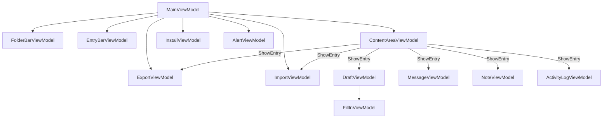

# ViewModels

The ViewModel layer is active in `Client` mode only. All ViewModels use CommunityToolkit.Mvvm (`ObservableObject`, `RelayCommand`).

ViewModels and their interfaces live in `Core/src/Internal/ViewModels/` and are themselves Avalonia-agnostic (primitive types, custom interfaces) even though Views, Themes, and Avalonia-specific helpers live in the same `Core` assembly under `Core/src/Internal/Views/` and `Core/src/Internal/Themes/`. The convention scanner auto-registers all `IFoo → Foo` pairs as singletons from the `Core` assembly, except for entry ViewModels (marked `[ConstructedManually]`) which are constructed with `new()` per-entry using entity arguments and cannot be DI-resolved.

Call `builder.UseEngine(EngineMode.Client).UseEngineUi()` — `UseEngineUi()` (from `EngineUiExtensions`) registers `MainWindow` and overrides the default `IBodyDocumentFactory` with `TextDocumentBodyDocumentFactory` so drafts receive a live `TextDocument`.

---

## IMainViewModel / MainViewModel

Root coordinator. Registered as singleton via `IMainViewModel → MainViewModel`; bound to `MainWindow(IMainViewModel)`.

**Properties**: `IsInstallScreenVisible`, `IsKioskMode`, `UserName`, `SecurityLevelName`, `SecurityLevelColor` (the current user's security level, resolved via `IEngineController.GetUserSecurityLevel`/`SecurityLevels` and shown in the title bar's `SecurityLevelBanner`, replacing what used to be a fixed "DEBUG" banner; empty and hidden when no security levels are configured), `AppVersion` (from `IEngineController.AppVersion`), `AppName` (from `IEngineController.AppName`), `Help (IHelpViewModel)`, `IsServerMode`/`IsClientMode` (fixed for the process's lifetime, from `IEngineController.Role`), `ShowMainLayout` (`!IsServerMode && !IsInstallScreenVisible`), `ShowConnectionsTable` (`IsServerMode && !IsInstallScreenVisible && !IsServerActivityViewActive`), `ShowServerActivityView` (`IsServerMode && !IsInstallScreenVisible && IsServerActivityViewActive`), plus `FolderBar (IFolderBarViewModel)`, `EntryBar (IEntryBarViewModel)`, `ContentArea (IContentAreaViewModel)`, `InstallView (IInstallViewModel)`, `Alert (IAlertViewModel)`, `Export (IExportViewModel)`, `Import (IImportViewModel)`, `StagedSend (IStagedSendViewModel)`, `Retrieve (IRetrieveViewModel)`, `AutoForward (IAutoForwardViewModel)`, `PrintManager (IPrintManagerViewModel)`, `ConnectionStatus (IConnectionStatusViewModel)`. `CanRetrieve (bool)` - `IsClientMode` and at least one `IEngineController.StorageServers` entry (fixed for the process's lifetime); gates whether the title bar's RETRIEVE button is shown at all (see `TitleBar.CanRetrieve`). `HasAutoForwardAccess (bool)` — whether the installed user is named in at least one `IEngineController.AutoForwardControllers` entry (case-insensitive), recomputed by `ApplyUserInfo` on install/login; gates whether the title bar's AUTO FORWARD button is shown at all (see `TitleBar.HasAutoForwardAccess`).

**Server/Client mode UI** (see [IConnectionStatusViewModel](#iconnectionstatusviewmodel--connectionstatusviewmodel)): `MainWindow.axaml`'s `TitleBar` is always shown, in both modes — a `UserRole.Server` or `UserRole.Relay` instance routes messages only and has no inbox/outbox/notes/drafts of its own, so `TitleBar.IsServerMode` (bound to `MainViewModel.IsServerMode`) hides the left-side drafts/notes/export/import/print action buttons and shows two view-switching buttons, CONNECTIONS and ACTIVITY, in that same left-side position instead — the window controls themselves (minimize/maximize/close) are unaffected by `IsServerMode` and always shown, same as peer/client mode. `ShowMainLayout` (the normal 3-panel folder/entry/content layout) is never shown in Server mode; instead, exactly one of two views is shown, mutually exclusive, toggled by those two buttons (`ShowConnectionsCommand`/`ShowActivityCommand` below) and defaulting to the connections table at startup:
- `ShowConnectionsTable` shows up to two tables, stacked: a "SERVERS" table bound to `ConnectionStatus.ServerRows` (visible only while `ConnectionStatus.HasServerRows`) and a "CLIENTS" table bound to `ConnectionStatus.ClientRows` (visible only while `ConnectionStatus.HasClientRows`) — either table is hidden outright while it has no rows (e.g. no other servers configured, or no children configured).
- `ShowServerActivityView` shows the same `EntryBar`/`ContentArea` pairing peer/client mode shows for the Activity folder (see [IEntryBarViewModel](#ientrybarviewmodel--entrybarviewmodel)), without a folder bar, since a routing-only server has no other folders worth navigating to.

A `UserRole.Client` instance keeps the normal layout, with a single `ConnectionRow` (bound to `ConnectionStatus.ServerRows[0]`, since a client's own connection is to a server) pinned to the bottom of the window, visible only while `IsClientMode` is `true`.

**Commands**: `CreateDraftCommand`, `CreateNoteCommand` (`IAsyncRelayCommand`); `ShowExportCommand`/`ShowImportCommand` (`IRelayCommand`) — each deselects the current folder and entry (`IFolderBarViewModel.DeselectFolder`/`IEntryBarViewModel.DeselectEntry`), refreshes its ViewModel's drive list (`RefreshDrivesCommand`), then displays it in the content area (see [IExportViewModel](#iexportviewmodel--exportviewmodel), [IImportViewModel](#iimportviewmodel--importviewmodel)); `ShowRetrieveCommand` (`IRelayCommand`) — deselects the current folder and entry, then displays `Retrieve` in the content area (see [IRetrieveViewModel](#iretrieveviewmodel--retrieveviewmodel)); `ShowAutoForwardCommand` (`IRelayCommand`) — deselects the current folder and entry, refreshes `AutoForward.RefreshCommand` (see [IAutoForwardViewModel](#iautoforwardviewmodel--autoforwardviewmodel)), then displays it in the content area; `RefreshCommand` (`IRelayCommand`) — bound to the right-click "Refresh" menu item of the title bar's user name label (`TitleBar.RefreshCommand`); calls `INetworkReloadService.Reload()` (see [Services.md](Services.md#networkreloadservice)) and logs a failure instead of throwing, and `MainViewModel` also reacts to the service's `Reloaded` event by recomputing `IsServerMode`, `IsClientMode`, `CanRetrieve`, the security level and `HasAutoForwardAccess` from the reloaded info; `ShowPrintManagerCommand` (`IRelayCommand`) — deselects the current folder and entry, then displays `PrintManager` in the content area (see [IPrintManagerViewModel](#iprintmanagerviewmodel--printmanagerviewmodel)); `PrintEntryCommand` (`IRelayCommand<EntryItemViewModel>`) — calls `PrintManager.EnqueueManual(entry)`, bound to the entry list's right-click "Print" context menu item (`EntryBar.axaml`, via `$parent[Window].DataContext.PrintEntryCommand`); `ShowHomeCommand` (`IRelayCommand`) — calls `ContentAreaViewModel.ShowHome()` and nothing else. Bound to the "×" close button in `ExportView`/`ImportView`/`StagedSendView`/`RetrieveView`/`AutoForwardView`/`PrintManagerView` (via `$parent[Window].DataContext.ShowHomeCommand`, since those views' own `DataContext` is the export/import/staged-send/auto-forward/print-manager ViewModel, not `MainViewModel`) — closing restores the content area to its default state exactly as if the user had navigated away by picking a folder, without touching `Export`/`Import`/`Retrieve`/`AutoForward`/`PrintManager`'s own state, which remains intact for next time. `StagedSend` is the one exception: since `ContentAreaViewModel` discards it on the way out of any navigation (see [IContentAreaViewModel](#icontentareaviewmodel--contentareaviewmodel) above), closing it this way loses it exactly the same as navigating away any other way. `ShowConnectionsCommand` (`IRelayCommand`, `IsServerMode` only) — switches to `ShowConnectionsTable`. `ShowActivityCommand` (`IAsyncRelayCommand`, `IsServerMode` only) — switches to `ShowServerActivityView`, then either selects the Activity folder (`IFolderBarViewModel.SelectFolderByType(FolderType.Activity)`, which loads it into `EntryBar` the same way any folder selection does) if it is not already selected, or refreshes `EntryBar` in place if it is (so re-clicking ACTIVITY always shows the latest entries instead of a no-op).

**Method**: `Task Initialize()` — connects, loads user info, shows main UI or install screen.

**Wiring**:
- `IInstallViewModel.InstallSucceeded` → initializes DB, applies user info, loads folder tree
- `IServiceConnection.MessageReceived` → skips a message the Inbox already holds (`IEntryService.IncomingMessageExists`), otherwise stores it, prepends to entry bar when Inbox is active
- `IServiceConnection.DeliveryStatusChanged` → passes to `IEntryBarViewModel.UpdateEntryStatus`

Both `IServiceConnection` events fire on peer/transport threads, so `MainViewModel` and `ContentAreaViewModel` marshal their handlers onto the UI thread (`UiThread.Run`) before touching bound collections or properties.
- `IContentAreaViewModel.DraftSent` → navigates to Outbox and selects sent message
- `IImportViewModel.StagedSendsReady` → calls the private `ShowStagedSend()` method directly (there is no public command for it - see `IStagedSendViewModel` below), switching the content area to the staged send screen
- `IFolderBarViewModel.FolderSelected` → normally calls `ContentAreaViewModel.ShowHome()` before `IEntryBarViewModel.LoadFolder`; skipped (leaving the export view showing) when `ContentArea.ActiveContent` is the `Export` ViewModel and `Export.IsCollectingEntries` is `true` — so browsing folders refreshes the entry listing to pick more entries from without losing the export view (see [IExportViewModel](#iexportviewmodel--exportviewmodel))
- `IEntryBarViewModel.EntriesSelected` → if `ContentArea.ActiveContent` is the `Export` ViewModel and `Export.IsCollectingEntries` is `true`, adds every entry in the raised list to `Export.SelectedEntries` (so a shift-range or ctrl-click selection adds them all at once); otherwise, if exactly one entry was selected, shows it in the content area as usual — a multi-selection outside the export view opens nothing, since the content area can only display one entry at a time
- `IEntryBarViewModel.EntryDeleted` → if `ContentArea.ActiveContent` is the entry ViewModel for the just-deleted entry (matched by `IMessageViewModel.MessageId`/`IDraftViewModel.Id`/`INoteViewModel.Id` against the deleted `EntryItemViewModel.Id`), calls `ContentAreaViewModel.ShowHome()` so a deleted entry's stale detail view doesn't linger; deleting an entry that is not currently shown leaves the content area untouched

---

## IFolderBarViewModel / FolderBarViewModel

Left-side folder tree. Registered as `IFolderBarViewModel → FolderBarViewModel` singleton.

**Properties**: `SelectedFolder (FolderItemViewModel?)`, `RootFolders (ObservableCollection<FolderItemViewModel>)`.

**Separated alerts.** While the display handler's `SeparateAlerts` is on, `Load` follows the stored Inbox root with an alert inbox root and the stored Outbox root with an alert outbox root (named "Alert Inbox"/"Alert Outbox" through the display handler's names). They store nothing of their own: each is a `FolderItemViewModel` of the same `RootType` with a `StorageId` of the stored root and an `AlertView` of `true` (the stored root's own item gets `false`), so `EntryBarViewModel` lists the stored folder keeping only alerts or only non-alerts, and a dropped entry is moved to the `StorageId`. The alert roots take no subfolders; subfolders hang under the normal inbox and list everything stored in them. `MainViewModel` shows a received message, and selects after a send, in the root whose `AlertView` matches whether the message is an alert.

**Events**: `FolderSelected (Action<FolderItemViewModel>)`, `EntryMoved (Action)`.

**Showing what is opened.** `IContentAreaViewModel.EntryOpened` is raised with the type, ID and direction of a message, draft or note whenever one is opened in the content area, however it got there (a click in the list, a new or duplicated draft or note, a sent draft's message, an alert). `MainViewModel` answers by finding the stored folder (`IEntryService.Locate`) and selecting it in the folder listing (the alert inbox or alert outbox for an alert while alerts are kept apart) without closing what was opened, then queueing the entry to be selected in that folder's list; one that is already selected in the list is left alone, and a list selection that is for what the content area already shows does not reopen it.

**Methods**: `Load()`, `SelectFolder(FolderItemViewModel)`, `SelectFolderByType(FolderType)`, `DeselectFolder()` - clears `SelectedFolder` and its `IsSelected` flag without raising `FolderSelected` (used by `MainViewModel.ShowExportCommand`/`ShowImportCommand`), `MoveEntry(EntryItemViewModel, FolderItemViewModel)`, `AddSubfolder(FolderItemViewModel, string)`, `CanDeleteFolder(FolderItemViewModel)`, `DeleteFolder(FolderItemViewModel)` - only for a subfolder, and only when `IEngineController.CanDelete` allows deleting entries of its root type, since the delete removes them. It permanently deletes the folder, all its subfolders and every entry in any of them (`IEntryService.DeleteFolderContents`, deepest folder first, so nothing is left pointing at a missing folder), and selects the parent if the selection was inside the deleted tree. `FolderBar.axaml.cs` asks for confirmation first (`ConfirmDialog`), `CollapseAll()`.

**Static utility**: `FolderBarViewModel.IsCompatibleMove(EntryType, FolderType, bool isOutboundMessage = false)` - used by `FolderBar.axaml.cs` drag-and-drop; not on the interface since it is a static helper. A message may only move within its own tree (received within Inbox, sent within Outbox), since its direction is fixed by the record and moving it across would list a sent message among received ones.

---

## IEntryBarViewModel / EntryBarViewModel

Middle-column paginated entry list. Registered as `IEntryBarViewModel → EntryBarViewModel` singleton.

**Properties**: `SelectedEntry (EntryItemViewModel?)`, `Entries (ObservableCollection<EntryItemViewModel>)`, `CurrentPage`, `TotalPages`, `IsAlphabeticalSort`, `CanGoNext`, `CanGoPrev`, `ShowSortToggle`, `CanDeleteEntries` — set by `LoadFolder` from `IEngineController.CanDelete(folder.RootType)` (see `Docs/Components/Configuration.md`); drives the visibility of the entry list's right-click "Delete" context menu item. `SearchText (string)`, `ShowSearch (bool)`, `DateFrom (DateTimeOffset?)`, `TimeFrom (TimeSpan?)`, `DateTo (DateTimeOffset?)`, `TimeTo (TimeSpan?)`, `AvailableSecurityLevelFilters (IReadOnlyList<SecurityLevelFilterOption>)`, `SelectedSecurityLevelFilter (SecurityLevelFilterOption)`, `AvailablePriorityFilters (IReadOnlyList<PriorityFilterOption>)`, `SelectedPriorityFilter (PriorityFilterOption)`, `AlertOnlyFilter (bool)`, `AuthorFilter (string)`, `DestinationFilter (string)`, `ShowAuthorFilter (bool)`, `ShowDestinationFilter (bool)`, `ShowSecurityLevelFilter (bool)`, `ShowPriorityFilter (bool)`, `ShowAlertFilter (bool)`, `IsFiltersExpanded (bool)`, `FiltersExpandIndicator (string)`, `ActiveFilterCount (int)`, `HasActiveFilters (bool)`.

Every filter control shares the same behavior: setting it resets `CurrentPage` to 1 and reloads. Internally they combine into one `EntryFilter` (search text, date range, security level, priority, and alerts only or non-alerts only), built fresh from the current property values and passed to `IEntryService.GetMessages`/`GetDrafts`/`GetNotes`; `null` when every criterion is unset, which skips filtering server-side entirely rather than passing an empty filter through. Since exactly one `EntryFilter` carries every criterion at once, search always runs against the same already-filtered set - it can only narrow what the date range/security level/priority/alert-only criteria already allow, never restore something they exclude. Matching is entry-type-specific: a message matches search on body, sender, destinations, tag, priority label, or security level name, and matches date/security level/priority/alert-only against its own decoded fields; a draft matches search on body or tag and the rest directly against its own stored fields (security level, priority and alert flag all live as plain fields on `DraftEntity`, unlike a message's, which are read through `IEngineController`); a note matches only search (on body text) and date range, since it has no security level, priority, or alert flag.

`DateFrom`/`DateTo` (the calendar date, from a `DatePicker`) and `TimeFrom`/`TimeTo` (the time of day, from a paired `TimePicker`) combine into one exact instant per bound: `DateFrom.Date + (TimeFrom ?? midnight)`, `DateTo.Date + (TimeTo ?? 23:59:59.999)`. Picking only a date and leaving its time unset therefore still covers that entire calendar day, while an explicit time narrows the bound to that instant; either combined value is `null` when no date is set, regardless of whether a time is. `EntryFilter.DateFrom`/`DateTo` themselves are exact instants with no special "whole day" handling - that convenience lives here, not in `IEntryService`. Every picker shows dates as `DD MMM YYYY` with an uppercase month and times as 24 hour `HH mm` with no AM/PM, all zero padded, with each cell centered and the control able to shrink to the narrow column; the theme sets the picker formats and `PickerFormatting` (applied with the styles) supplies what properties cannot: uppercase month names for the current culture, zero padded hours, and centered flyout items.

`SelectedSecurityLevelFilter`/`SelectedPriorityFilter` default to `AvailableSecurityLevelFilters[0]`/`AvailablePriorityFilters[0]`, each list's leading "Any" (no filter) entry ahead of one option per `IEngineController.SecurityLevels`/`Priorities` entry. `LoadFolder` resets every filter control (search text, date range and its times, author and destination text, both pickers back to "Any", alert-only off) and sets: `ShowSearch` to `true` for Inbox, Outbox, Drafts and Notes, `false` for Activity (no free-text fields worth searching); `ShowAuthorFilter` to `true` for Inbox only and `ShowDestinationFilter` for Outbox and Drafts only (each a free-text sender/addressee name box matched by case-insensitive substring, and only passed to the service while its box is shown); `ShowPriorityFilter` to `true` for Inbox, Outbox and Drafts only; `ShowAlertFilter` to `true` for Inbox and Outbox only, and never for Drafts, and only while the display handler's `SeparateAlerts` is off (when it is on, the alert inbox and alert outbox are the alert filter); `ShowSecurityLevelFilter` the same, further gated on at least one security level being configured. `EntryBar.axaml` binds each control's visibility to its matching `Show*` property. `ResetFiltersCommand` (concrete class only) clears the same set of controls back to those defaults on demand, without touching `SearchText`, and is bound to a "RESET FILTERS" button inside the filter section. A live-arriving message (`PrependEntry`) is left out of the visible page while any filter is active, since only `IEntryService` can tell whether it matches; `RefreshPaginationCounts` still reflects it in the totals if it does.

The search box and the date range/author/destination/security level/priority/alert-only controls all live together in one collapsible section, collapsed by default via `IsFiltersExpanded` and toggled by `ToggleFiltersCommand` (concrete class only, like `ToggleSortCommand`); the toggle header itself (its "FILTERS" label and active count horizontally centered, with `FiltersExpandIndicator`, `"▼"`/`"▲"` the same way `MessageViewModel.DeliveryExpandIndicator` is) stays visible whenever `ShowSearch` is `true`, regardless of expansion state. Collapsing is purely a display concern - it never touches the filter values (including `SearchText`) themselves, so a filter set before collapsing keeps narrowing the list (and what search can return) exactly as before. `ActiveFilterCount` (date range counts up to two, plus one each for a non-empty author/destination, a non-"Any" security level/priority and alert-only) and `HasActiveFilters` are shown next to the collapsed header specifically so an active filter is never silently forgotten once its controls are hidden; neither counts `SearchText`, since it stays enterable while expanded rather than needing its own persistent indicator. Each control in the expanded section - the search `TextBox`, `DatePicker`/`TimePicker` pair, security level `ComboBox`, priority `ComboBox` - gets its own labeled, full-width row in `EntryBar.axaml` rather than sharing one, since a segmented control like `DatePicker`/`TimePicker` does not shrink to fit a narrower column and gets visually cut off when squeezed into one.

**Commands** (concrete `EntryBarViewModel` only, not on the interface — bound directly in `EntryBar.axaml` since its `x:DataType` is the concrete class): `NextPageCommand`/`PrevPageCommand`, `ToggleSortCommand`, `DeleteCommand (IAsyncRelayCommand<EntryItemViewModel>)` — delegates to `DeleteEntry`, bound to the entry list's right-click "Delete" context menu item (`EntryBar.axaml`, via `$parent[UserControl].DataContext.DeleteCommand`, `IsVisible` bound to `CanDeleteEntries`).

**Events**: `EntriesSelected (Action<IReadOnlyList<EntryItemViewModel>>)` — raised whenever the list's selection changes, carrying every entry newly *added* to the selection: one entry for a plain click, several for a shift-range or an accumulated ctrl-click selection. `EntryBar.axaml`'s `ListBox` uses `SelectionMode="Multiple"` (native Avalonia shift-range/ctrl-toggle support — no custom hit-testing code) and forwards its `SelectionChanged` (`AddedItems`/`RemovedItems`) straight to `SelectEntries` in code-behind. `EntryDeleted (Action<EntryItemViewModel>)` — raised by `DeleteEntry` with the just-deleted entry after it is removed from `Entries`; not raised on the silent no-op path (`CanDeleteEntries` forbids it). `MainViewModel` uses this to reset the content area away from a deleted entry's now-stale detail view — see its Wiring section above.

**Why `SelectEntries` never touches `SelectedEntry`**: `EntryList`'s `SelectedItem="{Binding SelectedEntry, Mode=OneWay}"` pushes `SelectedEntry` back into the ListBox whenever it changes. If the click-driven `SelectEntries` path also assigned `SelectedEntry`, that push-back would immediately collapse the native multi-selection down to a single item — Avalonia's `SelectedItem` setter always narrows selection to just that one item, even in `Multiple` mode. This was a real bug: clicking entry A, then ctrl-clicking entry B, ended up with only B selected. `SelectedEntry` is now written only by the programmatic `SelectEntry(entry)` (single-entry pending-select flow), where collapsing to one item is exactly the desired effect.

**Methods**:
- `LoadFolder(FolderItemViewModel)` — also deselects the current entry via `DeselectEntry()`
- Every load is tagged with a generation number and only the newest one repopulates `Entries`, so overlapping refreshes (e.g. a folder click racing a live insert) never list entries twice or show an older folder
- `Refresh()`, `UpdateEntryStatus(string messageId, DestinationStatus?)`, `PrependEntry(EntryItemViewModel)`, `DeleteEntry(EntryItemViewModel)` — a silent no-op if `IEngineController.CanDelete(currentFolder.RootType)` returns `false` (see `Docs/Components/Configuration.md`) — `SetPendingSelectId(string)`
- `SelectEntry(EntryItemViewModel)` — programmatic single-entry selection (used by the pending-select-after-refresh flow); deselects every other entry, including any multi-selection, and raises `EntriesSelected` with a single-item list
- `SelectEntries(IReadOnlyList<EntryItemViewModel> added, IReadOnlyList<EntryItemViewModel> removed)` — applies a selection-list delta from the View's `SelectionChanged`: marks `added` selected and `removed` deselected, then raises `EntriesSelected` with `added` if non-empty. Deliberately does **not** assign `SelectedEntry` — see below.
- `DeselectEntry()` — clears every selected entry's `IsSelected` flag (not just `SelectedEntry`, so a multi-selection is fully cleared) without raising `EntriesSelected` (used by `LoadFolder` and by `MainViewModel.ShowExportCommand`/`ShowImportCommand`)

---

## IContentAreaViewModel / ContentAreaViewModel

Right-side content pane. Registered as `IContentAreaViewModel → ContentAreaViewModel` singleton.

**Properties**: `ActiveContent (object?)`, `IsHomeVisible (bool)`, `HomeText (string)`.

**Events**: `DraftSent (Func<MessageEntity, Task>)`; `EntryDeleted (Func<Task>)` - raised, after the content area has already returned to the home screen, when the draft or note it is showing is deleted from its own editor. `MainViewModel` reloads the entry list on it.

**Methods**: `ShowHome()`, `ShowEntry(EntryItemViewModel)`, `ShowEntry(object)`. `ShowEntry(EntryItemViewModel)` loads from the database, so if another entry (or home) is shown before it finishes, its result is discarded rather than replacing what the user chose afterwards. All three first check whether `ActiveContent` is currently the injected `IStagedSendViewModel` instance and, if so, execute its `ClearCommand` before replacing it - the staged send screen only ever appears automatically (see `IStagedSendViewModel` below) and is never itself the destination of a `ShowHome()`/`ShowEntry()` call, so this check only ever fires on the way *out* of it, discarding whatever it was still holding the moment the user navigates anywhere else.

The `DeliveryStatusChanged` handler checks `ActiveContent is IMessageViewModel` to route status updates to the currently displayed message — an empty `UserName` sets `IMessageViewModel.ReadStatus` directly (a local read-status notification), otherwise it calls `UpdateDeliveryStatus(userName, status)` (a remote destination's delivery status).

When `ShowEntry(EntryItemViewModel)` opens an Inbox message whose `ReadStatus` is `Received`, it calls `IServiceConnection.MarkMessageRead(messageId)` before building the `MessageViewModel`, so the message is marked read (and a read receipt sent to the sender) as soon as it is displayed. See [Peer.md](Peer.md#receipts).

---

## IMessageViewModel / MessageViewModel

Read-only message display. Constructed with `new MessageViewModel(MessageEntity)` — not DI-registered.

**Properties**: `MessageId`, `Body`, `FromUser`, `ToLabel`, `ToList`, `CcLabel`, `CcList`, `ExternalLabel`, `ExternalList` (each list entry is the name, followed by ` - ` and the information when there is any; each `*Label` is the section header, uppercased, defaulting to the address type's enum name unless the engine configuration overrides it), `ReceivedAt (DateTime)`, `IsAlert`, `PriorityLabel (string)`, `TagsEnabled (bool)`, `Tag (string)`, `SecurityLevelName (string)`, `SecurityLevelColorHex (string?)`, `HasDeliveryStatuses`, `DeliveryStatuses (ObservableCollection<DeliveryStatusRow>)`, `OverallStatus`, `OverallStatusText`, `ReadStatus`, `ReadStatusText`, `IsDeliveryExpanded`, `DeliveryExpandIndicator`.

`PriorityLabel`, `Tag` and `SecurityLevelName` read the message's stored priority, tag and security level the same way `EntryItemViewModel` does for the entry listing. `MessageView.axaml` shows all four - priority, tag (gated on `TagsEnabled`), security level, and `IsAlert` - as a row of badges at the top of the message, the security level and alert ones colored (the security level's configured color, and a fixed red for alert) and priority/tag neutral. `SecurityLevelColorHex` is `null` for an empty or unrecognized level, hiding that badge entirely rather than falling back to a color.

**Commands**: `ToggleDeliveryCommand (IRelayCommand)`.

**Method**: `UpdateDeliveryStatus(string userName, DestinationStatus)` — updates per-user row and recomputes `OverallStatus`.

**Status priority** (per-user `OverallStatus`, Outbox only): `Failed > Read (all) > Received (all Received/Read) > Sent > Sending`.

**ReadStatus** (Inbox only, `null` on Outbox messages): `Received` when stored, `Read` once opened. Set directly by `ContentAreaViewModel` when it marks an unread message read, or by `ContentAreaViewModel.OnDeliveryStatusChanged` when a `DeliveryStatusChangedEvent` with an empty `UserName` arrives (see [Peer.md](Peer.md#receipts)) — distinct from `UpdateDeliveryStatus`, which only ever applies to `DeliveryStatuses` rows.

---

## IDraftViewModel / DraftViewModel

Editable draft with fill-in support. Constructed with `new DraftViewModel(entity, ...)` — not DI-registered.

**Properties**: `Id`, `NewAddressUser` (auto-uppercased), `NewAddressType (AddressTypeOption)`, `NewAddressInformation` (cleared after each add), `IsSent`, `IsAlert` (read-only), `AlertLabel (string)`, `AvailablePriorities (IReadOnlyList<MessagePriorityOption>)`, `SelectedPriority (MessagePriorityOption)`, `AvailableSecurityLevels (IReadOnlyList<SecurityLevel>)`, `SelectedSecurityLevel (SecurityLevel?)`, `Tag (string)`, `TagsEnabled (bool)`, `TagLabel (string)`, `PlsoMode (PlsoMode)`, `PlsoButtonText`, `IsSaving`, `StatusMessage`, `Addresses (ObservableCollection<AddressData>)`, `BodyDocument (IBodyDocument)`, `FillIns (IReadOnlyDictionary<string, IFillInViewModel>)`, `AllUserNames`, `AddressTypes (IReadOnlyList<AddressTypeOption>)` (`To`, `Cc`, `External`, each paired with its display label - overridable per type in the engine configuration).

`AvailableSecurityLevels` is every level from `IEngineController.SecurityLevels` up to and including the current user's own assigned level (`IEngineController.GetUserSecurityLevel`) - a user can declassify a message to a lower level but never send above their own clearance - and is empty (hiding the picker) when no security levels are configured. `SelectedSecurityLevel` initializes to the option matching `DraftEntity.SecurityLevel`, falling back to the user's own (highest available) level. `SelectedSecurityLevel?.Name` (or an empty string when unset) is persisted on `DraftEntity.SecurityLevel` on save, and passed through `IServiceConnection.SendMessage(..., securityLevel)` on send; `MessageRoutingService.Route` then drops any destination whose own level does not support it.

`LineWidth` (a number of characters, or `null` for no limit; `LineWidthValue`, `LineWidthMinimum`, `LineWidthMaximum` and `IsLineWidthAvailable` drive the width control) is kept within the range of `IEngineController.DraftLineWidth` but never below the longest line of `Header` (`LineWidthMinimum` includes it, `LineWidthMaximum` is never below it, and `UpdateHeader` raises the width until the header fits, since the header can depend on the width), starts at the draft's own saved width or the handler's default, and is saved on `DraftEntity.LineWidth`; it only changes how `DraftEditor` shows the body and header (it sizes them to that many monospace characters and the text wraps there) and never changes the text. `Header` is `IEngineController.GetDraftHeader` for the draft's current tag, priority, security level, alert flag, recipients and line width, asked for again whenever one of them changes, and shown above the body where it cannot be edited; `Send` puts it, and a line break, in front of the body it sends and stores in the Outbox, while the saved draft keeps only what the user wrote. `IsAlert` is persisted on `DraftEntity.IsAlert` across save/reload and passed through `IServiceConnection.SendMessage(..., IsAlert)` on send — see [Peer.md](Peer.md#alert-messages).

`AlertLabel` is set once from `IEngineController.AlertLabel` — the same interface and value that drives the title bar's alert box (`AlertViewModel.AlertText`), so the alert mark in `DraftEditor.axaml` and the title bar's alarm box always agree on what "alert" is called (e.g. the network file's `AlertText` applies to both). `IsAlert` is not set by the user: it is `IEngineController.ComputeIsAlert` for the draft's priority, tag, security level and recipients (the engine makes a message from them, with no body yet, and the host's message handler says whether it is an alert), recomputed whenever one of them changes, and `DraftEditor.axaml` shows the `AlertLabel` mark while it is `true`. `Send` sends without an alert argument and the sent message is an alert if the message handler says so of the message it makes (`SendMessageResult.IsAlert`). See `Docs/Components/Configuration.md`.

`AvailablePriorities` starts from the `User` mode priorities of `IEngineController.Priorities` (see `Docs/Components/Configuration.md`) but is **not** static: it is recomputed every time `Tag` changes, excluding any priority that `IEngineController.BlockedCombinations` blocks for the current tag, so a blocked combination is never even offered in the priority `ComboBox`. `SelectedPriority` initializes to the option whose `Value` matches `DraftEntity.Priority` within the tag-filtered list, falling back to the first available option (and finally a hard-coded `Value = 0` option) if the stored value no longer matches any currently available option — e.g. after a host changes its `IEngineController` registration, or because the stored (tag, priority) pair is itself blocked. `SelectedPriority.Value` is persisted on `DraftEntity.Priority` on save, and passed through `IServiceConnection.SendMessage(..., priority)` on send, from which it flows to the MSMT send priority — see [Peer.md](Peer.md).

`Tag` is filtered by `IEngineController.DraftTagRules` as it changes (and when the draft opens), `TagMaxLength` sizes the tag box, and `Send` refuses a missing tag when one is required and a tag shorter than the minimum. `Tag` is persisted on `DraftEntity.Tag` across save/reload and passed through `IServiceConnection.SendMessage(..., tag)` on send. Setting `Tag` to a value that `IEngineController.BlockedCombinations` blocks in combination with the currently-selected `SelectedPriority` is rejected outright — the value silently reverts to the last accepted tag instead of taking effect — so a blocked tag/priority combination can never actually be entered in the draft editor; `SendCommand` also re-checks before sending as a defense-in-depth safety net (setting `StatusMessage` and refusing to send if it is somehow still blocked). `TagsEnabled` is set once from `IEngineController.TagsEnabled`; `DraftEditor.axaml` hides the tag `TextBox` entirely when `false` (combined with `!IsSent` via a `MultiBinding`), and `EntryBarViewModel` likewise omits `TagText` from the entry listing. `TagLabel` is set once from `IEngineController.TagLabel` and drives the tag `TextBox`'s watermark, letting a host rename the concept (e.g. the network file's `MessageTagLabel`) without changing engine behavior — see the Message Composition section in `Docs/Components/Configuration.md`.

`PlsoMode` is editor-session-only UI state, cycled by the "PLSO" button (`OFF` → `ON` → `SPACES` → `OFF`, `PlsoButtonText` displays the current state) in `DraftEditor.axaml`'s toolbar — never read from or written to `DraftEntity`, so it resets to `PlsoMode.Off` whenever a draft is reopened.

**IBodyDocument** — framework-agnostic body document abstraction in `Core/src/Internal/ViewModels/Entries/`. `BodyDocumentFactory` provides the default `StringBodyDocument` (plain string, used in tests and Headless mode). `TextDocumentBodyDocumentFactory` provides `TextDocumentBodyDocument` (wraps AvaloniaEdit's `TextDocument`) for Client mode. `DraftEditor.axaml.cs` casts to `TextDocumentBodyDocument` to bind the editor. `IBodyDocumentFactory` controls which implementation is created; `UseEngineUi()` overrides the default with `TextDocumentBodyDocumentFactory`.

**Events**: `DraftSent (Func<IDraftViewModel, MessageEntity, Task>)`; `Deleted (Func<Task>)`.

**Deleting**: `CanDelete` (from `IEngineController.CanDelete(FolderType.Drafts, false)`, fixed at construction) controls whether `DraftEditor.axaml` shows its DELETE button. `DeleteCommand` is a two-press confirmation (`DeleteConfirmation`): the first press arms it and `DeleteButtonText` reads `"CONFIRM DELETE"`; a second press within four seconds calls `IEntryService.DeleteEntry` and raises `Deleted`, and if no second press comes the button disarms itself. A draft that has already been sent can still be deleted; the sent message is a separate record and is unaffected.

**Commands**: `SaveCommand`, `SendCommand` (`IAsyncRelayCommand`); `AddAddressCommand` (`IRelayCommand`); `RemoveAddressCommand`, `MoveAddressUpCommand` and `MoveAddressDownCommand` (`IRelayCommand<AddressData>`).

**Recipients.** `AddressGroups` groups `Addresses` by address type, in the order of the types, and is rebuilt whenever `Addresses` changes. `MoveAddressUp` and `MoveAddressDown` swap a recipient with the next one of its own type in that direction, skipping the other types, and do nothing at the end of its group. `DraftEditor` shows them in a panel beside the body (one group per type, each recipient with move up, move down and remove buttons), above a short form: the address type picked from a row of equal-width buttons, the name (Enter or Add adds it, and the name box is focused again for the next one) and an optional note. The name, tag, priority and security level are in the same bar as the actions (FILL-IN, width, PLSO, DUPLICATE, DELETE, SAVE and SEND), with the aspects on the left and the actions right-aligned, the actions moving to their own right-aligned row when the window is too narrow for both.

**Names and duplicates.** `Name` (empty or whitespace clears it) is shown in the list instead of the first line of the body, and counts as a change. `DuplicateCommand` writes the screen's current state into the entity without saving it, has `IEntryService.DuplicateDraft` store a copy and raises `Duplicated` with its id; `ContentAreaViewModel` then shows the copy, and the original is saved or left alone by the usual leave rule. It is available on sent drafts too. The width control sits in the top bar beside FILL-IN, without a label.

The list row follows edits live: `TitleChanged` fires as the body text (through `IBodyDocument.Changed`) or the name changes, `ContentAreaViewModel` forwards it as `EntryTitleChanged`, and `MainViewModel` hands it to `IEntryBarViewModel.UpdateTitle`, which retitles the row if the list shows it (a note is the same, from its body and name).

**New drafts.** `MainViewModel` builds a draft with `NewDraft()` and constructs the view model with `isNew`: nothing is stored until it has been altered from how it started and is not blank (no body text, no recipients, no name). `SaveChanges()` and `SaveCommand` skip such a draft (`SaveCommand` says "Nothing to save"), the moment an edit makes it qualify it is inserted (`InsertDraft`, so `IEntryBarViewModel.AddEntry` puts its row at the top of the list at once when that folder is showing; the insert runs after the edit that triggered it, and the row is updated in place rather than replaced so the open editor is never rebuilt), and so does sending. `MainViewModel` opens a new draft or note by showing its editor and then selecting the Drafts or Notes folder, without that selection closing the editor. Deleting a draft that was never stored only closes it. A stored draft that is cleared to blank is still saved as it is.

**Leaving.** `SaveChanges()` saves what has been written without saying so, and does nothing when nothing changed (so only looking at a draft never moves it to the top of the list), or when the draft was sent or deleted. `ContentAreaViewModel` calls it on the draft or note it is replacing, whether for another entry, for home or for another screen, so a new draft or note keeps what was written without pressing SAVE. It saves with `IEntryService.SaveDraftQuietly` / `SaveNoteQuietly`, which unlike `SaveDraft` / `SaveNote` do not raise the update events that select the saved entry (which would pull the user back from where they were going); `MainViewModel` instead brings the entry's row in the list up to date in place (`IEntryBarViewModel.UpdateEntry`).

**Method**: `InsertFillIn(int caretOffset)` — adds a fill-in marker to the document and a new `FillInViewModel` to `FillIns`.

**Fill-ins**: Body text contains fill-in markers — Unicode `U+E001` sentinel + 8-character hex ID. `FillIns` maps each ID to its `IFillInViewModel`. `FillInElementGenerator` renders them inline. Internally backed by `Dictionary<string, IFillInViewModel>` with a read-only view exposed on the interface.

**PLSO (Phonetic Language Spell Out)**: `PlsoMode` is a three-state enum (`Off`, `On`, `Spaces`) cycled by the toolbar button. When not `Off`, `DraftEditor.axaml.cs` intercepts body text input at tunnel priority: each typed letter or digit is looked up via `PhoneticAlphabet.TryGetWord` (standard phonetic alphabet for letters — `A` → `ALFA`, `G` → `GOLF` — and spelled-out digits — `5` → `FIVE`) and the resulting word is inserted in place of the character, with a trailing space appended when the mode is `Spaces`. When not `Off`, Backspace is intercepted: the text immediately to the left of the caret is checked against every phonetic word length (longest first, via `PhoneticAlphabet.Lengths`/`IsWord`) and, on a match, the whole word is removed in one keystroke instead of one character — this check runs against the live document text regardless of which word it is or how it got there (typed via PLSO, pasted, edited), not just the most recently inserted word. `PhoneticAlphabet` is a pure static lookup class in `Engine.ViewModels.Entries` with no UI dependency.

---

## INoteViewModel / NoteViewModel

Editable note. Constructed with `new NoteViewModel(entity, entryService)` — not DI-registered.

**Properties**: `Id`, `Name` (as on a draft), `Body`, `IsSaving`, `StatusMessage`, `CanDelete` (from `IEngineController.CanDelete(FolderType.Notes, false)`, passed to the constructor), `IsConfirmingDelete`, `DeleteButtonText`.

**Commands**: `SaveCommand (IAsyncRelayCommand)`; `DuplicateCommand (IAsyncRelayCommand)` and `Duplicated (Func<string, Task>)` (as on a draft); a note created with `NewNote()` is constructed with `isNew` and follows the same rule as a new draft (not stored until altered and not blank; `SaveChanges()` also does nothing for an unchanged note); `DeleteCommand (IAsyncRelayCommand)` - the same two-press confirmation as a draft's (first press arms and the button reads `"CONFIRM DELETE"`, a second within four seconds deletes via `IEntryService.DeleteEntry`, and it disarms itself otherwise), shown by `NoteEditor.axaml` only when `CanDelete`.

**Events**: `Deleted (Func<Task>)`.

---

## IActivityLogViewModel / ActivityLogViewModel

Read-only daily activity log. Constructed with `new ActivityLogViewModel(entity)` — not DI-registered.

**Properties**: `Date (string)`, `Events (IReadOnlyList<ActivityEventRow>)` — merged from legacy `Events (string[])` and structured `EventEntries (ActivityLogEntry[])`, ordered newest-first.

---

## IInstallViewModel / InstallViewModel

One-time setup screen. Registered as `IInstallViewModel → InstallViewModel` singleton.

**Properties**: `UserCode` (auto-uppercased), `ErrorMessage`, `IsLoading`.

**Events**: `InstallSucceeded (Func<UserInfo, Task>)` — raised on success; consumed by `MainViewModel`.

**Commands**: `InstallCommand (IAsyncRelayCommand)`.

---

## INetworkIndicatorViewModel / NetworkIndicatorViewModel

The network indicator in the top bar of a client or relay. Registered as `INetworkIndicatorViewModel → NetworkIndicatorViewModel` singleton; exposed as `MainViewModel.NetworkIndicator` and bound from `MainWindow.axaml` onto `TitleBar`'s `NetworkText`/`NetworkColor` styled properties. `IsOnline`, `Label` and `ColorHex` follow `INetworkIndicator.Changed` (on the UI thread), with the label and color from `IEngineController.GetNetworkIndicatorLabel`/`GetNetworkIndicatorColor`, which are the display handler's for the state, or `ONLINE`/`OFFLINE` and green/orange. The box is always shown, and only a server's title bar (`IsServerMode`) hides it.

## IAlertViewModel / AlertViewModel

Tracks unread alert messages and drives the title bar's alert indicator and the alarm sound (see [Peer.md](Peer.md#alert-messages)). Registered as `IAlertViewModel → AlertViewModel` singleton; exposed as `MainViewModel.Alert` and bound from `MainWindow.axaml` onto `TitleBar`'s `IsAlerting`/`AlertText`/`AlertCommand` styled properties.

**Properties**: `IsAlerting (bool)` — `PendingCount > 0`, which shows the indicator; `PendingCount (int)`; `AlertText (string)` and `QuickReadKeys (IReadOnlyList<string>)` — both read from `IEngineController` (the keys are the message handler's `AlertQuickReadKeys`).

Actually playing the alarm sound is driven through a separate `IAlertSoundPlayer` constructor dependency, not `IEngineController` — see `Docs/Components/Configuration.md`'s `IAlertSoundPlayer` entry (not a control interface; always real Engine behavior, like printer discovery/driving).

**Commands**: `OpenOldestCommand (IAsyncRelayCommand)` — raises `OpenRequested` with the oldest unread alert's ID, which `MainViewModel` turns into opening that message in the content area (opening it reads it). `CanExecute` is `IsAlerting`.

**Wiring**:
- `IEntryService.MessageInserted` — if `IEngineController.GetIsAlert` is `true`, appends the message ID to the unread list and to the set of alerts that set off the current alarm, calls `IAlertSoundPlayer.Play()`, and (re)starts the timer from `IEngineController.AlarmSoundDuration` (the alarm handler's `AlertDuration`)
- `IEntryService.MessageRead` — removes the message ID from the unread list if present (a no-op for a non-alert message read), and from the alarm's set; once that set is empty the timer is disposed and `IAlertSoundPlayer.Stop()` is called, even while older alerts are still unread

When the timer runs out the sound stops and the alarm's set is cleared, but the indicator stays until every unread alert has been read. A new alert received while already alarming resets the timer to the full duration again.

**Opening alerts**: `TitleBar`'s indicator responds to a pointer press by invoking `AlertCommand` (bound to `OpenOldestCommand`), and `MainWindow`'s tunnel-priority `KeyDown` handler invokes the same command when the key is one of `QuickReadKeys` (names parsed as Avalonia `Key` values, case-insensitive; a name that is not a key is ignored) and focus is not in a `TextBox` or the AvaloniaEdit `TextEditor` (the draft body). Each invocation opens the oldest unread alert; opening it reads it, so repeating opens the next one, oldest first, until none remain.

---

## IExportViewModel / ExportViewModel

Drives the export screen: choosing a destination drive, a format, a zip file name, and either every entry or an explicitly built list, then writing them out as one file per entry inside a zip archive. Registered as `IExportViewModel → ExportViewModel` singleton; exposed as `MainViewModel.Export` and shown in the content area via `ContentAreaViewModel.ShowEntry(object)` (`ExportView.axaml`, `DataTemplate`d on `ExportViewModel` in `ContentArea.axaml`). Being a singleton — not constructed per-entry like `DraftViewModel`/`NoteViewModel` — its state, including an export in progress, survives navigating the content area away to other views and back — including via the "×" close button in the view's toolbar (`MainViewModel.ShowHomeCommand`), which only restores the content area to its default state and leaves this ViewModel untouched. Clicking the title bar's EXPORT button always returns to this same instance (see `MainViewModel.ShowExportCommand`).

**Properties**:
- `AvailableDrives (IReadOnlyList<ExternalDriveInfo>)` — populated by `RefreshDrivesCommand`
- `SelectedDrive (ExternalDriveInfo?)`
- `AvailableFormats (IReadOnlyList<ExportFormatOption>)` - the built-in JSON option (`Format` is `null`) followed by one `ExportFormatOption` per `IEngineController.ExportFormats` entry, in the order added; populated once in the constructor, since the set of configured formats never changes at runtime (see `Docs/Components/Configuration.md#export-formats`)
- `SelectedFormat (ExportFormatOption)` - defaults to the built-in JSON option (`AvailableFormats[0]`)
- `FileName (string)` — defaults to `"export"`; the `IExportService.PackageExtension` (`.export.zip`) extension is appended automatically
- `Scope (ExportScope)` — `All` or `Some`; `IsAllScope`/`IsSomeScope` are bindable `bool` mirrors of the same value (for `RadioButton.IsChecked`), each setting `Scope` when set to `true`
- `SelectedEntries (ObservableCollection<EntryItemViewModel>)` — the entries collected for a `Some`-scope export, shown live as they are added
- `IsCollectingEntries (bool)` — `Scope == Some && !IsExporting`; when `true`, `MainViewModel` routes `IEntryBarViewModel.EntriesSelected` to `AddEntry` (for every entry in the raised list) instead of opening the entry (see `IMainViewModel` wiring above) — this is what makes a shift-range or ctrl-click multi-selection in the entry list add every selected entry to the export at once
- `IsExporting (bool)` — loading state; while `true`, `ExportView` disables the drive/format/file-name/scope controls and shows an indeterminate `ProgressBar`
- `StatusMessage (string?)` — validation errors, or the outcome of the last export attempt

**Commands**:
- `RefreshDrivesCommand (IRelayCommand)` — re-scans `IExternalDriveProvider.GetDrives()`; preserves `SelectedDrive` if its `RootPath` is still present in the new list, otherwise clears it
- `AddEntry(EntryItemViewModel)` / `RemoveEntryCommand (IRelayCommand<EntryItemViewModel>)` — add or remove an entry from `SelectedEntries`; `AddEntry` is a no-op if an entry with the same `Id`/`EntryType`/`IsOutboundMessage` is already present
- `ClearEntriesCommand (IRelayCommand)` — removes every entry from `SelectedEntries`. `CanExecute` is `!IsExporting`.
- `StartExportCommand (IAsyncRelayCommand)` — validates a drive is selected, `FileName` is non-blank, and (for `Some` scope) at least one entry is collected, setting `StatusMessage` and returning early otherwise. On success, builds the reference list (`IExportService.GetAllEntryRefs()` for `All`, or `SelectedEntries` mapped to `ExportEntryRef` for `Some`), calls `IExportService.Export` with `SelectedFormat.Format`, and sets `StatusMessage` to the outcome — `"Exported N entries to {drive}"` on success, `N` being `Export`'s actual written count rather than the requested one, since `SelectedFormat`'s own entry-type filter (if any) can leave some out (also clearing `SelectedEntries`), `"Export cancelled"` on `OperationCanceledException`, or `"Export failed: {message}"` on any other exception. `CanExecute` is `!IsExporting`.
- `CancelExportCommand (IRelayCommand)` — cancels the `CancellationTokenSource` backing the running export. `CanExecute` is `IsExporting`.

The package path is `Path.Combine(SelectedDrive.RootPath, SanitizedFileName + IExportService.PackageExtension)`, where invalid file name characters in `FileName` are replaced with `_`.

---

## IImportViewModel / ImportViewModel

Drives the import screen: choosing a source drive, a format, then a file found on that drive by the selected format to restore. Registered as `IImportViewModel → ImportViewModel` singleton; exposed as `MainViewModel.Import` and shown in the content area the same way as `Export` (`ImportView.axaml`, `DataTemplate`d on `ImportViewModel` in `ContentArea.axaml`). Being a singleton, its state — including an import in progress and any pending draft/note conflict prompt — survives navigating the content area away to other views and back — including via the "×" close button in the view's toolbar (`MainViewModel.ShowHomeCommand`), which only restores the content area to its default state and leaves this ViewModel untouched. Clicking the title bar's IMPORT button always returns to this same instance (see `MainViewModel.ShowImportCommand`).

**Event**: `StagedSendsReady (Func<Task>?)` — raised after a successful import whose format added one or more staged sends (already forwarded to `IStagedSendViewModel.Enqueue` by the time this fires); `MainViewModel` subscribes and switches the content area to the staged send screen.

**Properties**:
- `AvailableDrives (IReadOnlyList<ExternalDriveInfo>)` — populated by `RefreshDrivesCommand`
- `AvailableFormats (IReadOnlyList<ImportFormatOption>)` - the built-in package option (`Format` is `null`) followed by one `ImportFormatOption` per `IEngineController.ImportFormats` entry, in the order added; populated once in the constructor (see `Docs/Components/Configuration.md#import-formats`)
- `SelectedFormat (ImportFormatOption)` - defaults to the built-in package option (`AvailableFormats[0]`); setting this refreshes `AvailablePackages`
- `SelectedDrive (ExternalDriveInfo?)` — setting this refreshes `AvailablePackages` from `IImportService.GetPackages(SelectedDrive.RootPath, SelectedFormat.Format)`; setting it to `null` clears `AvailablePackages` without calling the service
- `AvailablePackages (IReadOnlyList<ImportPackageInfo>)` — files found on `SelectedDrive` matching `SelectedFormat`
- `HasPackages (bool)` — `AvailablePackages.Count > 0`; `ImportView` binds its "no files found" message to `!HasPackages` instead of negating `AvailablePackages.Count` directly, which Avalonia does not reliably coerce to a bindable `bool`
- `IsImporting (bool)` — loading state; while `true`, `ImportView` disables the drive/format/package controls and shows an indeterminate `ProgressBar`
- `StatusMessage (string?)` — the outcome of the last import attempt
- `PendingConflict (ImportConflict?)` — the draft/note name conflict currently awaiting the user's choice, or `null`; while non-null, `ImportView` shows an inline prompt over the rest of the screen with Keep Existing / Overwrite / Overwrite All buttons

**Commands**:
- `RefreshDrivesCommand (IRelayCommand)` — same behavior as `ExportViewModel`'s
- `StartImportCommand (IAsyncRelayCommand<ImportPackageInfo>)` — calls `IImportService.Import(package.FullPath, resolveConflict, SelectedFormat.Format)`, where `resolveConflict` creates a `TaskCompletionSource<DraftNoteConflictResolution>`, sets `PendingConflict`, and awaits it — so the import genuinely pauses mid-package until `ResolveConflictCommand` completes it, including across content-area navigation away and back, since the awaited `Task` lives on this singleton, not on any view. On completion, sets `StatusMessage` to `"Imported {Imported}, overwrote {Overwritten}, skipped {Skipped}"` or `"Import failed: {message}"`; when the result carries staged sends, forwards them to `IStagedSendViewModel.Enqueue` with `SelectedFormat.Format`'s `StagedSendMode`/`StagedSendDelay` and raises `StagedSendsReady`. `CanExecute` is `!IsImporting`.
- `ResolveConflictCommand (IRelayCommand<DraftNoteConflictResolution>)` — clears `PendingConflict` and completes the pending `TaskCompletionSource` with the given resolution, resuming `IImportService.Import`.

---

## IStagedSendViewModel / StagedSendViewModel

Drives the staged send screen: every message a custom import format's reader has staged (see `Docs/Components/Configuration.md#import-formats`), reviewed by the user and sent only once they press `SendAllCommand`. Registered as `IStagedSendViewModel → StagedSendViewModel` singleton; exposed as `MainViewModel.StagedSend` and shown in the content area the same way as `Export`/`Import` (`StagedSendView.axaml`, `DataTemplate`d on `StagedSendViewModel` in `ContentArea.axaml`) - but unlike them, there is no title bar button and no public command that shows it: `MainViewModel` displays it only in reaction to `IImportViewModel.StagedSendsReady` (see above), and the user has no way to navigate to it directly. It is deliberately temporary rather than a persistent singleton's-worth of state: `ContentAreaViewModel.ShowHome()`/`ShowEntry(...)` (see [IContentAreaViewModel](#icontentareaviewmodel--contentareaviewmodel) above) execute `ClearCommand` on it whenever it was the active content being navigated away from - by picking a folder, opening an entry, or closing it via the "×" button - so a queue the user does not act on immediately is lost rather than lingering to reappear, stale, the next time an import triggers the screen.

**Properties**:
- `Queue (ObservableCollection<StagedSendEntry>)` — every staged send, in the order added; each carries `Body` (its first line is the queue's `Preview`), `Addresses`, `Priority`/`Tag`/`SecurityLevel`, and a `Status` (`Pending`, `Sending`, `Sent`, or `Failed`, with `StatusMessage` set on failure)
- `HasQueue (bool)` — `Queue.Count > 0`, kept in sync via `Queue.CollectionChanged`; `StagedSendView` binds its "no staged sends yet" message to `!HasQueue` for the same reason `ImportViewModel.HasPackages` exists
- `IsSending (bool)` — `true` while `SendAllCommand` is running; `StagedSendView` shows an indeterminate `ProgressBar`
- `StatusMessage (string?)` — the outcome of the last `SendAllCommand` run (`"Sent {N} of {total}"`)

**Commands**:
- `SendAllCommand (IAsyncRelayCommand)` — sends every `Pending` entry using whichever `StagedSendMode`/delay the import format that most recently added to the queue stated: `Simultaneous` sends every entry at once (`Task.WhenAll`); `Sequential` (the default) sends one at a time, awaiting `Task.Delay` between each when a delay was stated. Each entry is sent the same way `DraftViewModel.Send` sends a draft - `IServiceConnection.SendMessage` then `IEntryService.StoreSentMessage` on success - and its `Status` updates to `Sent`, or to `Failed` with `StatusMessage` set (`SendMessage` returning `null` for "no user installed", or the caught exception's message), without stopping the rest of the batch. `CanExecute` is `!IsSending` and at least one entry is still `Pending`.
- `RemoveCommand (IRelayCommand<StagedSendEntry>)` — removes one entry from the queue, regardless of its status.
- `ClearCommand (IRelayCommand)` — removes every entry from the queue.

**Method**: `Enqueue(IReadOnlyList<StagedSendData> sends, StagedSendMode mode, TimeSpan? delay)` — adds every send to `Queue` as `Pending`, and remembers `mode`/`delay` as how `SendAllCommand` processes the whole queue next. Called by `ImportViewModel.StartImportCommand`, never directly by a host.

---

## IRetrieveViewModel / RetrieveViewModel

Drives the retrieve screen: asking the server a message is stored on (see `Docs/Components/Configuration.md#server-storage`) for copies of the messages it stored that fit a date range, authors, destinations and message IDs. Registered as `IRetrieveViewModel → RetrieveViewModel` singleton; exposed as `MainViewModel.Retrieve` and shown in the content area the same way as `Export`/`Import` (`RetrieveView.axaml`, `DataTemplate`d on `RetrieveViewModel` in `ContentArea.axaml`); being a singleton, what was entered survives navigating away and back. The title bar's RETRIEVE button is shown only when `MainViewModel.CanRetrieve` is `true`.

**Properties**:
- `AvailableServers (IReadOnlyList<string>)` — `IEngineController.StorageServers`, read once at construction; `SelectedServer (string?)` defaults to the first
- `DateFrom (DateTimeOffset?)`/`TimeFrom (TimeSpan?)`, `DateTo (DateTimeOffset?)`/`TimeTo (TimeSpan?)` — the sent-time range, entered as local time and converted to UTC; a lone date covers its whole day (`TimeFrom` defaults to midnight, `TimeTo` to 23:59:59.999)
- `Authors`, `Destinations`, `Ids (string)` — names or IDs separated by commas, semicolons or new lines; entries are trimmed, and blanks and case-insensitive repeats dropped
- `IsRequesting (bool)`, `StatusMessage (string?)`

**Commands**:
- `RequestCommand (IAsyncRelayCommand)` — builds a `RetrievalCriteria` from the fields and calls `IRetrievalService.Request(SelectedServer, criteria)`, setting `StatusMessage` to `"Requested from {server}; matching messages will arrive in your Inbox"`, `"Could not reach {server}"`, `"Retrieval failed: {message}"`, or `"Select a server"` when there is none. `CanExecute` is `!IsRequesting`. The answer is not awaited: copies arrive later as ordinary received messages.
- `ResetCommand (IRelayCommand)` — clears every criterion and the status, keeping `SelectedServer`.

---

## IAutoForwardViewModel / AutoForwardViewModel

Drives the auto forward screen: choosing one of the auto forward controllers (see `Docs/Components/Configuration.md#auto-forward-controllers`) the current user has access to, then adding to and removing from its locally-saved target list. Registered as `IAutoForwardViewModel → AutoForwardViewModel` singleton; exposed as `MainViewModel.AutoForward` and shown in the content area the same way as `Export`/`Import`/`StagedSend` (`AutoForwardView.axaml`, `DataTemplate`d on `AutoForwardViewModel` in `ContentArea.axaml`). The title bar's AUTO FORWARD button, and so this screen, is hidden entirely unless `MainViewModel.HasAutoForwardAccess` is `true` (see `IMainViewModel` below) - a user with no access to any controller has nothing to configure here.

**Properties**:
- `AvailableControllers (IReadOnlyList<AutoForwardControllerDefinition>)` — the configured controllers naming the current user, populated by `RefreshCommand`
- `HasControllers (bool)` — `AvailableControllers.Count > 0`; `AutoForwardView` binds its "no controllers available" message and the rest of the screen to `!HasControllers`/`HasControllers`, the same `Count`-coercion reason `ImportViewModel.HasPackages` exists
- `SelectedController (AutoForwardControllerDefinition?)` — the controller whose target list is shown; setting this reloads `Targets` from `IAutoForwardTargetsRepository`, or clears it for a `null` selection
- `Targets (ObservableCollection<string>)` — `SelectedController`'s target list, in the order added
- `HasTargets (bool)` — `Targets.Count > 0`, kept in sync via `Targets.CollectionChanged`; gates the "no targets yet" message the same way `HasControllers` gates the controller picker
- `NewTargetUser (string)` — the text bound to the add-target field
- `AllUserNames (IReadOnlyList<string>)` — from `IServiceConnection.GetUserNames()`, refreshed by `RefreshCommand`, for the add-target field's auto-complete

**Commands**:
- `RefreshCommand (IAsyncRelayCommand)` — re-filters `IEngineController.AutoForwardControllers` down to the ones naming the current user (`ICurrentUserProvider.UserName`, case-insensitive), refreshes `AllUserNames`, and selects the first available controller (or `null` if none). Called by `MainViewModel.ShowAutoForwardCommand` before displaying the screen, since which controllers the current user has access to cannot be known until after install/login.
- `AddTargetCommand (IAsyncRelayCommand)` — trims `NewTargetUser` and adds it to `Targets` unless already present (case-insensitive), saves the updated list via `IAutoForwardTargetsRepository.Save`, then clears `NewTargetUser`. A no-op with no `SelectedController` or a blank `NewTargetUser`.
- `RemoveTargetCommand (IAsyncRelayCommand<string>)` — removes the given user from `Targets` and saves the updated list.

Unlike `Export`/`Import`, there is no explicit save step: every add or remove is persisted immediately, so the target list a user leaves behind on navigating away, or on the next restart, always matches what the screen last showed.

---

## IPrintManagerViewModel / PrintManagerViewModel

Drives the print manager screen: printer selection, the "print received" toggle, and the print queue. Registered as `IPrintManagerViewModel → PrintManagerViewModel` singleton; exposed as `MainViewModel.PrintManager` and shown in the content area the same way as `Export`/`Import` (`PrintManagerView.axaml`, `DataTemplate`d on `PrintManagerViewModel` in `ContentArea.axaml`). Unlike `Export`/`Import`, this ViewModel does real background work regardless of whether its screen is ever shown: it subscribes to `IEntryService.MessageInserted` directly in its own constructor (the same pattern `AlertViewModel` uses) and runs its print loop for as long as the app is running, since being a singleton keeps exactly one instance alive for the app's lifetime.

**Properties**:
- `Queue (ObservableCollection<PrintQueueEntry>)` — the current print queue, always kept in next-to-print-first order (see `PrintQueueEntry` below)
- `PrintReceivedEnabled (bool)` — initializes from `IEngineController.PrintReceivedDefaultEnabled` (`false` by default); while `true`, every message `IEntryService.MessageInserted` raises is auto-queued (see below)
- `AvailablePrinters (IReadOnlyList<string>)` — from `IPrintDriver.GetAvailablePrinters()`, read once at construction
- `SelectedPrinter (string?)` — initializes from `IPrintDriver.GetDefaultPrinter()`; setting it (re)starts the print loop if the queue is non-empty and no job is currently printing

**Commands**:
- `PurgeCommand (IRelayCommand)` — clears every entry from the queue; if a job is mid-print, the loop detects this the next time it checks between lines (see below) and treats it as an interruption with no restart, since the job is gone
- `RemoveCommand (IRelayCommand<PrintQueueEntry>)` — removes one specific entry; if it is the one currently printing, handled the same way as `PurgeCommand` above

**Method**: `EnqueueManual(EntryItemViewModel entry)` — adds `entry` to the queue as a manual print. Called by `MainViewModel.PrintEntryCommand`, bound to the entry list's right-click "Print" context menu item.

### `PrintQueueEntry`

A single queued print job: `Id` (unique per queue entry — the same underlying entry can be queued more than once), `EntryId`/`EntryType`/`IsOutboundMessage` (identify the underlying entry, mirroring `EntryItemViewModel`), `Title`, `IsManual`, `Priority`, `QueuedAt`, and a computed `BadgeText` (`"MANUAL"` or `"P{Priority}"`, shown in `PrintManagerView`).

**Queue ordering** (next-to-print first): manual entries (`IsManual = true`) always sort ahead of every automatically-queued entry, regardless of priority; among entries with the same `IsManual` value, higher `Priority` sorts first; ties break by `QueuedAt` ascending (first queued, first printed). Manual entries all share `Priority = 0`, which is irrelevant to their ordering since `IsManual` alone already places them ahead of every automatic entry.

**Automatic "print received" queuing**: on `IEntryService.MessageInserted`, if `PrintReceivedEnabled` is `true`, calls `IEngineController.GetPrintCount(entity.Message)` (the print handler's `GetPrintCount`, `1` without one) and enqueues that many separate `PrintQueueEntry` copies (each `IsManual = false`, `Priority` set to `IEngineController.GetPriority(entity.Message)`) — `0` enqueues nothing, `2` enqueues two independent copies that print (and can be individually removed) separately.

**Line-by-line printing loop**: adding to the queue, or setting `SelectedPrinter`, starts the loop if it is not already running (a `SelectedPrinter` is required — the loop stays idle otherwise). Each iteration: peek the entry at the front of the queue, load its printable lines (the `Body` for a message, draft or note, or `"HH:mm {Message}"` per entry for an activity log — each split on newlines), then print them one at a time via `IPrintDriver.PrintLine`, **awaiting each call as the confirmation that line finished printing** before checking whether the front of the queue is still the same entry. If a higher-priority entry was added (or the current one was removed/purged) while a line was printing, the loop breaks out of the entry's line list — this is the "interrupt" — and always calls `IPrintDriver.PageFeed` next, whether the entry finished normally or was interrupted partway through. If the entry finished normally (not interrupted), it is removed from the queue; if it was interrupted, it stays in the queue exactly where its priority places it, and **when it is picked up again it restarts printing from its first line** — there is no partial-progress tracking. See the `IPrintDriver` section in `Docs/Components/Configuration.md`.

---

## IHelpViewModel / HelpViewModel

Content of the help window: a tabbed guide, each tab covering one way of using the application. Registered as `IHelpViewModel → HelpViewModel` singleton and exposed as `MainViewModel.Help`. The tabs are `HelpTab` records of headed `HelpSection` paragraphs, built once from `IEngineController` so the guide only describes what this instance offers:

- A `Server` role gets Overview, Connections, and Activity tabs, since it has no inbox, drafts, or notes.
- Every other role gets Getting started, Sending a message, Receiving messages, Notes and drafts, Folders and entries, Backup and restore, and Printing. A `Client` additionally gets a Connection tab about the status row and what happens while the server is unreachable.
- The tag section of Sending a message appears only when `TagsEnabled`, and an alert section is always there (an alert is decided by the message handler, not by the user); the tag and alert sections, and the alert section of Receiving messages, are titled with the host's own `TagLabel`/`AlertLabel`.

The two title bar buttons live in `TitleBar`, immediately left of the window controls, and are always shown (including in Server mode and on the install screen). The `i` button opens a small popup with `AppName` and `AppVersion`. The `?` button opens a `HelpWindow` (a normal decorated window, `TabControl` with the tabs down the left) bound to `MainViewModel.Help`; pressing it again while the window is open brings it forward instead of opening a second one, and Escape closes it.

---

## IConnectionStatusViewModel / ConnectionStatusViewModel

Drives the connection status display described above: `MainViewModel.ConnectionStatus`'s two row
collections, split by `PeerConnectionKind` — one per configured peer connection. Registered as
`IConnectionStatusViewModel → ConnectionStatusViewModel` singleton (`ConnectionStatusViewModel` itself is
`internal` — only the interface is `public`, since it is exposed through `IMainViewModel.ConnectionStatus`);
like `PrintManagerViewModel`, it does real work regardless of whether it is currently shown, subscribing
directly in its constructor.

**Properties**:
- `ServerRows (ObservableCollection<ConnectionRowViewModel>)` — connections to other servers: one entry in `UserRole.Client` mode (the connection to its configured server — a client's own connection is itself "to a server"), one entry per other server in the cluster in `UserRole.Server` mode, and one entry for its server in `UserRole.Relay` mode.
- `ClientRows (ObservableCollection<ConnectionRowViewModel>)` — connections from own child clients; only ever populated in `UserRole.Server` and `UserRole.Relay` modes.
- `HasServerRows`/`HasClientRows (bool)` — `true` while the corresponding collection is non-empty; `MainWindow.axaml` binds each table's visibility to these, so a table with nothing to show (e.g. a server configured with no children) is hidden outright rather than rendered empty.

Both collections are rebuilt from scratch (clear, then re-add, split by `status.Kind`) every time the
underlying `IConnectionStatusService.StatusesChanged` fires, from that same service's `GetStatuses()`
snapshot — always marshaled onto the UI thread first (`Dispatcher.UIThread`), since `StatusesChanged` can
fire from a background connection thread but these collections are bound to a live Avalonia `ItemsControl`.
`IConnectionStatusService` is registered per `UserRole` (see `Docs/Components/Peer.md#user-roles`): for
`UserRole.Client`, `ClientPeerService` itself implements it; for `UserRole.Server`, `ServerRoutingService`
itself implements it; so does `RelayPeerService` for `UserRole.Relay`.

---

## IFillInViewModel / FillInViewModel

One fill-in slot within a draft. Constructed with `new FillInViewModel(...)` — not DI-registered.

**Properties**: `Id`, `Options (ObservableCollection<FillInOptionViewModel>)`, `IsPopupOpen`, `NewOption`, `SelectedOption`, `DisplayText` (shows selected value or `"______"`).

**Commands**: `SelectOptionCommand`, `RemoveOptionCommand`, `MoveOptionUpCommand`, `MoveOptionDownCommand` (`IRelayCommand<string>`); `AddOptionCommand`, `TogglePopupCommand` (`IRelayCommand`).

Because `FillInInlineControl` is an X11 child window without keyboard focus, `DraftEditor.axaml.cs` tunnels keyboard events and forwards them to the active `IFillInViewModel`'s `NewOption` property and `AddOptionCommand`.

---

## Supporting ViewModels (no interface)

### `FolderItemViewModel`
Wraps a folder entity. Provides `Id`, `Name`, `RootType`, `ParentId`, `Icon`, `IsSelected`, `IsExpanded`, `Children (ObservableCollection<FolderItemViewModel>)`, `CanCreateSubfolder`, `IsRootFolder`, `IsSubfolder`. Treated as a lightweight display-model DTO — constructed freely in `FolderBarViewModel` with no DI.

### `EntryItemViewModel`
Wraps a row in the entry list. Properties: `Id`, `Title`, `SecondaryText`, `PriorityText`, `TagText`, `TimeText`, `FixedStatusText`, `EntryType`, `SortDate`, `OverallStatus`, `StatusText`, `StatusColorHex` (hex string; converted to a brush in the view by `ColorHexToBrushConverter`), `IsOutboundMessage`, `SecurityLevelColorHex`, `IsAlert`, `TitleColorHex`, `SecondaryTextColorHex`. Treated as a display-model DTO.

For `EntryType.Message` rows, `IsOutboundMessage` records whether the row is the Outbox (sent) or Inbox (received) record — `EntryBarViewModel.Refresh()` sets it `true` for Outbox rows. A self-addressed message produces one row of each kind sharing the same `Id` (`MessageId`), so `ContentAreaViewModel`, `EntryBarViewModel.DeleteEntry`, and `FolderBarViewModel.MoveEntry` all pass it through to `IMessageRepository`/`IEntryService` to disambiguate which underlying document to load, delete, or move. See `Docs/Components/Data.md`.

`PriorityText` is set only for `EntryType.Message` rows (Inbox and Outbox): `EntryBarViewModel.Refresh()` resolves the message's stored priority number (`IEngineController.GetPriority`) against `IEngineController.Priorities` and uses the matching option's `Name`, falling back to the plain number if no option matches. `EntryBar.axaml` renders it as a third line below `SecondaryText` (the first line of the body). Drafts, notes, and activity logs leave it `null`.

`TagText` is likewise set only for `EntryType.Message` rows, and only when `IEngineController.TagsEnabled` is `true` and the message's stored tag (`IEngineController.GetTag`) is non-empty; otherwise `null`. `EntryBar.axaml` renders it next to `PriorityText` on that same third line (a `MessageReceived`-triggered `PrependEntry` insert computes both the same way as a full `Refresh()`, so a live-arriving message's row is never missing either label).

`SecurityLevelColorHex` is likewise set only for `EntryType.Message` rows, from the message's stored security level (`IEngineController.GetSecurityLevel`) resolved against `IEngineController.SecurityLevels`; `null` when the level is empty or no longer among them, rather than falling back to a color, so a message with no recognized level shows no banner at all. `EntryBar.axaml` renders it as a thin colored strip across the top of the row.

`IsAlert` is set for `EntryType.Message` rows from `IEngineController.GetIsAlert`, and for `EntryType.Draft` rows directly from `DraftEntity.IsAlert`; always `false` for notes and activity logs, which have no alert flag. Only the entry's first line of text (or its name, for a named draft or note) renders in `"#E06C75"` (the same red used for a `Failed` delivery status) when `IsAlert`; which property that is depends on which one actually holds the first line of the body for that row type - `Title` is the sender/destination and `SecondaryText` is the first line of the message body for `EntryType.Message` rows, while `Title` is the first line of the body itself (with no `SecondaryText`) for `EntryType.Draft` rows, like notes. `TitleColorHex` therefore turns red only when `IsAlert` and `SecondaryText` is unset, and `SecondaryTextColorHex` only when `IsAlert` and `SecondaryText` is set - exactly one of the two ever turns red for a given alert row, and it is always the first line of the body, never the sender. `EntryBar.axaml` binds `Title`'s and `SecondaryText`'s `Foreground` to their respective color property, so an alert entry's first line stands out in the list without needing to open it.

### `DeliveryStatusRow`
Display row for per-user delivery tracking: `UserName`, `DisplayName` (with group context), `Status (DestinationStatus)`, `StatusText`.

### `ConnectionRowViewModel`
Each row also carries the row's right-click menu commands: `ToggleClosedCommand` (closes an open connection or reopens a closed one, with `ToggleClosedText` reading `"Close"`/`"Open"`) and `RefreshCommand` (drops and re-forms the connection; disabled while closed). Both call back into `IConnectionStatusService.SetClosed`/`Refresh` for that row's own kind and user name, supplied by `ConnectionStatusViewModel` when it rebuilds the rows. The menu itself is the `ContextMenu` on `ConnectionRow.axaml`'s root `Border`, so it works on every place the row is shown. See the Peer component doc for what closing and refreshing do.

One row of `IConnectionStatusViewModel.ServerRows`/`ClientRows` (Server mode's connections tables) or the
single row pinned to the bottom of the window (Client mode): `UserName` (set once, at construction), `IsConnected`,
`LastConnectedAt`/`LastDisconnectedAt` (`DateTime?`), `IsClosed`, plus computed `StatusText` (`"CLOSED"` while
closed, otherwise `"UP"`/`"DN"`), `StatusColorHex` (`#ABB2BF` grey while closed, otherwise `#98C379` green while
connected and `#E06C75` red - the same row is rendered by
`Views/Controls/ConnectionRow.axaml` in both places, with its `Border.Background` bound directly to this),
and `LastConnectedText`/`LastDisconnectedText` (formatted `dd-MMM-yyyy HH:mm`, uppercased; an em dash when
`null`). Treated as a lightweight display-model DTO — constructed freely by `ConnectionStatusViewModel`, no DI.
`ConnectionRow.axaml` has no column headers of its own — each of its four columns (user, status, last
connected, last disconnected) instead carries a `ToolTip.Tip` identifying it on hover, since the same row
layout is reused for the compact Server mode tables (which drop the header row entirely) and the single
Client mode row pinned to the bottom of the window.

### `FillInOptionViewModel`
A single selectable option within a `FillInViewModel`: `Value`, `IsSelected`.
