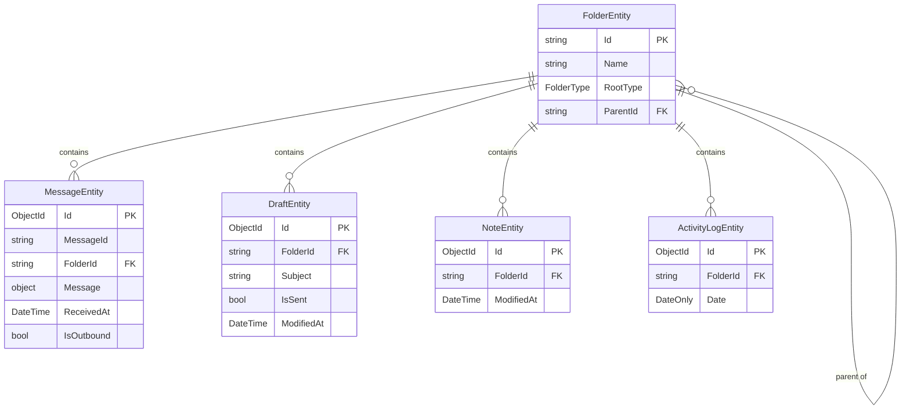

# Data Layer

The data layer is active in `Client` mode only. It uses LiteDB (a single-file embedded document database) and lives in `Engine/src/Data/`.

## Database File

A single file `Data.db` in `IAppDataPathProvider.AppDataPath`. The file is created on first `LiteDbContext.Initialize()` call.

## LiteDbContext

`LiteDbContext` owns the `LiteDatabase` instance and exposes typed collection handles. Call `Initialize()` after the user is known (on install or on startup when an existing user is loaded). Re-calling `Initialize()` is safe — it disposes and reopens the database.

Collections initialized:

| Collection name | Type | Purpose |
|----------------|------|---------|
| `messages` | `MessageEntity` | Received and sent messages |
| `drafts` | `DraftEntity` | In-progress and sent drafts |
| `notes` | `NoteEntity` | Text notes |
| `activity_logs` | `ActivityLogEntity` | Daily activity entries |
| `folders` | `FolderEntity` | Folder hierarchy |

On each `Initialize()` call, root folders are auto-created (Inbox, Outbox, Drafts, Notes, Activity) if absent.

## Entity Relationships



## Entities

### `MessageEntity`

Stored in both Inbox (received) and Outbox (sent).

| Field | Type | Notes |
|-------|------|-------|
| `Id` | `ObjectId` | LiteDB auto-ID (the actual primary key) |
| `MessageId` | `string` | Denormalized from `Message` (via `IMessageFormat.GetMessageId`) so LiteDB can query/index on it directly. **Not unique** — see below |
| `Message` | `object` | The message content — subject, body, sender, addresses, sent time — as an instance of `IMessageFormat.MessageType`. This is the canonical representation; LiteDB serializes it using its own runtime type (via its built-in `object`-property polymorphism, storing a `_type` discriminator) and reconstructs the same concrete type on load. Read its logical fields through the registered `IMessageFormat` — see `Docs/Peer.md` and `Docs/Control.md`. |
| `DeliveryStatuses` | `List<DeliveryStatus>` | Per-user delivery state (Outbox messages) |
| `ReadStatus` | `DestinationStatus?` | Inbox-only: `Received` when stored, `Read` once the user opens it (see `Docs/Peer.md#read-confirmation`). Always `null` on Outbox records — per-destination read state lives in `DeliveryStatuses` instead |
| `ReceivedAt` | `DateTime` | UTC timestamp; denormalized from `Message`'s sent time so LiteDB can sort/index on it directly |
| `FolderId` | `string` | Parent folder ID |
| `IsOutbound` | `bool` | `true` for the Outbox (sent) record, `false` for the Inbox (received) record |

**Self-addressed messages**: when a user sends a message to itself (see `Docs/Peer.md`), one `MessageEntity` document is created in the Inbox (`IsOutbound = false`, no `DeliveryStatuses`) and a second in the Outbox (`IsOutbound = true`, populated `DeliveryStatuses`) — both sharing the same `MessageId`. `MessageRepository.Get`/`Delete` always take an explicit `outbound` flag to disambiguate which of the two documents to target; delivery-status updates are always scoped to the outbound record.

### `DraftEntity`

| Field | Type | Notes |
|-------|------|-------|
| `Id` | `ObjectId` | LiteDB auto-ID |
| `Subject` | `string` | |
| `Body` | `string` | Plain text representation |
| `BodySegmentsJson` | `string` | JSON array of `DraftBodySegmentData` — used for fill-ins |
| `Addresses` | `List<AddressData>` | |
| `IsSent` | `bool` | `true` after successful send |
| `IsAlert` | `bool` | Whether this draft will be sent as an alert; see `Docs/Peer.md#alert-messages` |
| `SentAt` | `DateTime?` | UTC send time |
| `ModifiedAt` | `DateTime` | UTC last edit time |
| `FolderId` | `string` | |

`BodySegmentsJson` encodes the structured draft body. Each segment is:
```json
{ "kind": "text" | "fillin", "text": "...", "id": "hex-id", "options": ["..."], "selected": "..." }
```

### `NoteEntity`

| Field | Type |
|-------|------|
| `Id` | `ObjectId` |
| `Body` | `string` |
| `ModifiedAt` | `DateTime` |
| `FolderId` | `string` |

### `ActivityLogEntity`

One record per day, accumulated throughout the day.

| Field | Type |
|-------|------|
| `Id` | `ObjectId` |
| `Date` | `DateOnly` |
| `Events` | `List<string>` | Legacy plain-string events |
| `EventEntries` | `List<ActivityLogEntry>` | Structured events: `{ At, Message }` |
| `FolderId` | `string` |

### `FolderEntity`

| Field | Type | Notes |
|-------|------|-------|
| `Id` | `string` | Root folders use fixed IDs like `"root-inbox"` |
| `Name` | `string` | |
| `RootType` | `FolderType?` | `null` for user-created subfolders |
| `ParentId` | `string?` | `null` for root folders |

### Embedded Types

**`AddressData`**: `UserName (string)`, `Type (string)` — `"To"` or `"Cc"`

**`DeliveryStatus`**: `UserName (string)`, `Status (DestinationStatus enum)` — `Sending`, `Sent`, `Failed`, `Confirmed`, `Read` (`Received` never appears here — see `ReadStatus` above)

## Repositories

All repositories take `LiteDbContext` by constructor. All public methods are `Task`-wrapped (run synchronous LiteDB operations on the calling thread — LiteDB is thread-safe internally).

### `MessageRepository` — page size 50

| Method | Description |
|--------|-------------|
| `GetPage(folderId, page)` | Paginated list, ordered by `ReceivedAt` descending |
| `Count(folderId)` | Total count in folder |
| `Get(messageId, outbound)` | Single message by `MessageId` and direction — `outbound` disambiguates the Inbox vs. Outbox record of a self-addressed message |
| `Insert(entity)` | Insert |
| `Update(entity)` | Update |
| `Delete(messageId, outbound)` | Delete by `MessageId` and direction, same disambiguation as `Get` |

### `DraftRepository` — page size 50

| Method | Description |
|--------|-------------|
| `GetPage(folderId, page, alphabetical)` | Alphabetical by subject or by `ModifiedAt` descending |
| `Count(folderId)` | |
| `Get(id)` | |
| `Insert / Update / Delete` | |

### `NoteRepository` — page size 50

Same interface shape as `DraftRepository`.

### `ActivityLogRepository` — page size 50

| Method | Description |
|--------|-------------|
| `GetPage(page)` | All logs, newest first |
| `Count()` | Total log records |
| `GetForToday()` | Today's log record or `null` |
| `Get(id)` | Single by ID |
| `Insert / Update` | |
| `AppendEvent(eventText)` | Upserts today's record and appends one `ActivityLogEntry` |

### `FolderRepository`

| Method | Description |
|--------|-------------|
| `GetAll()` | All folder entities |
| `Get(id)` | Single folder |
| `GetRootId(type)` | ID of the root folder for a given `FolderType` |
| `GetTree()` | Builds hierarchical `Folder` tree (returns root `Folder` objects with `Children`) |
| `Insert / Delete` | |
