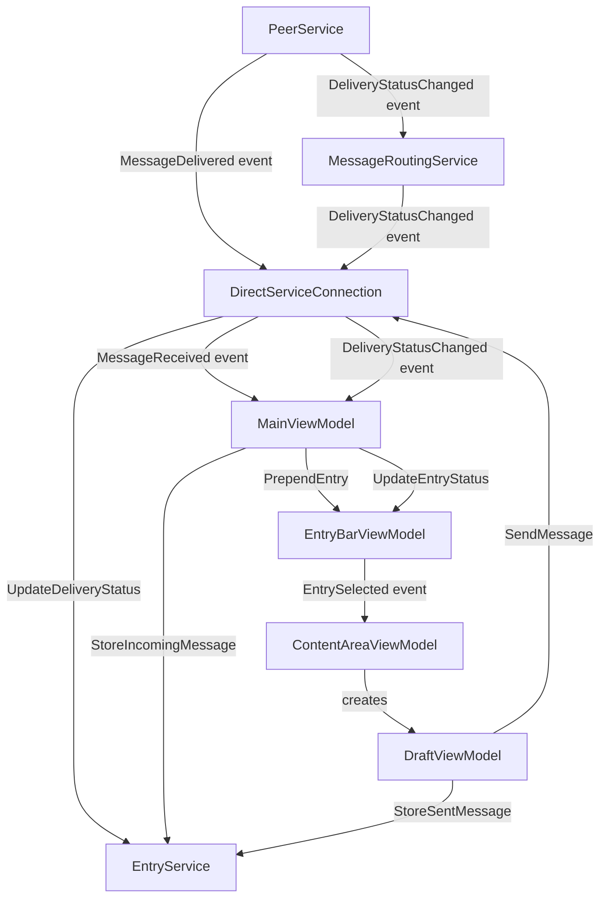

# Services

Business logic lives in `Engine/src/Services/`. All services are registered as singletons.



Message and delivery-status persistence (`StoreIncomingMessage`, `StoreSentMessage`, `UpdateDeliveryStatus`) all go through `EntryService`, which is only ever driven from Client-mode ViewModels (`MainViewModel`, `DraftViewModel`) and `DirectServiceConnection`'s own delivery-status handler — never from `DirectServiceConnection.OnMessageDelivered`/`SendMessage` directly. In Headless mode, no ViewModels are constructed, so a host consuming `IServiceConnection` in that mode observes messages and delivery-status changes purely as events/calls and is responsible for its own persistence if it needs any — the data layer is Client-mode-only (see below).

## UserService

Manages user installation and persists user identity to `State.json`.

**Key responsibilities**:
- Load existing user state on startup (`Load`)
- Install a new user by resolving a code (`Install`)
- Apply a debug override (`IDebugUserOverride`) that bypasses `State.json`

**State file**: `{AppDataPath}/State.json` — contains `UserName`, `UserCode`, `EnvironmentTitle`, `EnvironmentColor`. `IsInstalled` is a computed property: `true` when `UserName` is non-null.

**Thread safety**: `Install` uses a `SemaphoreSlim(1,1)` to prevent concurrent installs.

**Debug override**: If any `IDebugUserOverride` is registered, `Load` skips the state file entirely and uses the override's `UserName` (uppercased) with a synthetic `EnvironmentTitle = "DEBUG"` and color `#FF6200`. Useful for development without a real user code.

```csharp
// Consumers call:
UserInfo? info = service.GetCurrentUserInfo();  // null if not installed
UserState state = service.CurrentState;
await service.Load(cancellation);
UserInfo? installed = await service.Install("SN01", cancellation);
```

---

## MessageRoutingService

Routes outbound messages to peer nodes and surfaces their delivery status. OFT-level delivery status comes entirely from OFT's own delivery status stream (see [Peer.md](Peer.md#delivery-status)); the one application-level status above that — `Read` — comes from the user-read confirmation message flow (see [Peer.md](Peer.md#read-confirmation)).

**Key responsibilities**:
- Build the outbound message via `IMessageFormat` (`CreateMessage()` then the `Set*` logical-field setters, including `SetIsAlert`) so it can be sent as whatever concrete type the host has configured (see [Control.md](Control.md#imessageformat))
- For each recipient in `SendMessagePayload.Addresses`, deliver via `IPeerService.Send`
- Subscribe to `IPeerService.DeliveryStatusChanged` and map each `OftDeliveryStatus` to a `DestinationStatus`, re-raising its own `DeliveryStatusChanged`
- Subscribe to `IPeerService.ConfirmationReceived` and re-raise it as `DeliveryStatusChanged(messageId, confirmingUser, DestinationStatus.Read)` — reusing the same event as OFT-driven status changes

**Events**:
- `DeliveryStatusChanged(messageId, userName, DestinationStatus)` — raised on every per-user status change

**Result timing**: `IPeerService.Send` (and therefore `IOftPeer.Send`) does not return until OFT has fully delivered the message, so `Route`'s own per-user `UserDeliveryResult.Success` already reflects the final outcome by the time `Route` returns — there is no separate "sent but not yet confirmed" pending state to track.

**Self-addressing**: When a recipient user name matches the sending user (`fromUser`), that recipient is delivered in-process via `IPeerService.DeliverLocal` — no network connection is opened, and the delivery status for that user is immediately raised as `Confirmed`. A message can address itself alongside remote users in the same `Route` call; each recipient is handled independently.

```csharp
var (messageId, results) = await routing.Route(fromUser, payload, ct);
// results: IReadOnlyList<UserDeliveryResult> { UserName, Success, AddressedVia }
```

---

## EntryService

CRUD for messages, drafts, notes, and activity log reads. Runs in `Client` mode only.

**Events** (all `Func<entity, Task>`):
- `MessageInserted` — fired after `StoreIncomingMessage`
- `MessageRead` — fired after `MarkMessageRead` transitions an Inbox record from `Received` to `Read`; consumed by `AlertViewModel` to track pending alerts (see [Peer.md](Peer.md#read-confirmation))
- `DraftInserted` — after `CreateDraft`
- `DraftUpdated` — after `SaveDraft`, only if the draft has not yet been sent
- `NoteInserted` — after `CreateNote`
- `NoteUpdated` — after `SaveNote`

Both `StoreIncomingMessage` and `StoreSentMessage` take the message's logical fields (subject, body, addresses, etc.) as plain parameters, plus an `isAlert` flag, and build `MessageEntity.Message` from them via `IMessageFormat` (`CreateMessage()` + `Set*`) before saving — callers never construct the stored message type directly. `MessageEntity.MessageId` is denormalized from the same value passed to `IMessageFormat.SetMessageId` so it stays queryable/indexable (see [Data.md](Data.md#messageentity)).

**Key methods**:

| Method | Description |
|--------|-------------|
| `StoreIncomingMessage(messageId, fromUser, subject, body, addresses, sentAt, isAlert = false)` | Creates a `MessageEntity` in the Inbox folder (`IsOutbound = false`, `ReadStatus = Received`), fires `MessageInserted` |
| `StoreSentMessage(messageId, subject, body, addresses, sentAt, userResults, isAlert = false)` | Creates a `MessageEntity` in the Outbox (`IsOutbound = true`) with per-user delivery statuses seeded from the routing result — `Confirmed` when `Success` is `true` (a successful send already implies full OFT delivery, see `Docs/Peer.md`), otherwise `Failed` |
| `UpdateDeliveryStatus(messageId, userName, status)` | Updates per-user delivery status on the Outbox record for `messageId` — always scoped to the outbound record, since a self-addressed message also has an Inbox record sharing the same `messageId` |
| `MarkMessageRead(messageId)` | Transitions the Inbox record's `ReadStatus` from `Received` to `Read` and fires `MessageRead`. A no-op (returns `null`) if the record is missing or already `Read` — see [Peer.md](Peer.md#read-confirmation) |
| `CreateDraft()` | Creates a blank draft in the Drafts folder, fires `DraftInserted` |
| `CreateNote()` | Creates a blank note in the Notes folder, fires `NoteInserted` |
| `SaveDraft(entity)` | Persists draft changes, fires `DraftUpdated` if not yet sent |
| `SaveNote(entity)` | Persists note changes, fires `NoteUpdated` |
| `GetMessages(folderId, page)` | Paginated messages, ordered by `ReceivedAt` descending |
| `GetDrafts(folderId, page, alphabetical)` | Paginated drafts |
| `GetNotes(folderId, page, alphabetical)` | Paginated notes |
| `GetActivityLogs(page)` | Paginated activity log entries, newest first |
| `DeleteEntry(id, entryType, isOutboundMessage = false)` | Permanently deletes an entry; `isOutboundMessage` disambiguates the Inbox vs. Outbox record for a self-addressed message |
| `MoveEntry(entryId, entryType, targetFolderId, isOutboundMessage = false)` | Moves an entry to another folder; same disambiguation as `DeleteEntry` |

---

## DirectServiceConnection

Implements `IServiceConnection`, registered in both `Client` and `Headless` mode. Wires engine internals to the interface consumed by ViewModels (Client) or embedding host code (Headless).

**Responsibilities**:
- Forwards `IServiceConnection.SendMessage(subject, body, addresses, isAlert)` → `MessageRoutingService.Route` and returns the result. It does not persist anything itself — in Client mode, `DraftViewModel` calls `EntryService.StoreSentMessage` after a successful send
- Translates `PeerService.MessageDelivered` → fires `IServiceConnection.MessageReceived`. It does not persist the message itself — in Client mode, `MainViewModel`'s handler for that event calls `EntryService.StoreIncomingMessage`
- On `MessageRoutingService.DeliveryStatusChanged`, updates the Outbox record via `EntryService.UpdateDeliveryStatus`, then fires `IServiceConnection.DeliveryStatusChanged` with the resulting `OverallStatus`
- `MarkMessageRead(messageId)`: calls `EntryService.MarkMessageRead`, fires `IServiceConnection.DeliveryStatusChanged` locally (empty `UserName`, status `Read`) so Client-mode UI reflects the read state immediately, then sends a user-read confirmation message to the original sender via `IPeerService.Send` directly — or, for a self-addressed message, calls `EntryService.UpdateDeliveryStatus` directly with no network round-trip. See [Peer.md](Peer.md#read-confirmation)
- Implements install, user info query, and user names query by delegating to `UserService` / `IUserNameDirectory`

---

## InterfaceService

Hosts the local interface listener described in [Interface.md](Interface.md). Always active, in both `Client` and `Headless` mode. Mirrors `PeerService.MessageDelivered` out to every connected interface connection, and routes messages received from an interface via `MessageRoutingService.Route`.

---

## ConnectionModels

DTOs used across the service layer:

| Type | Fields |
|------|--------|
| `MessageReceivedEvent` | `MessageId`, `FromUser`, `Subject`, `Body`, `Addresses[]`, `SentAt`, `IsAlert` |
| `AddressRequest` | `UserName`, `Type` |
| `UserDeliveryResult` | `UserName`, `Success (bool)`, `AddressedVia[]` |
| `SendMessageResult` | `MessageId`, `UserResults[]` |
| `DeliveryStatusChangedEvent` | `MessageId`, `UserName`, `Status`, `OverallStatus` — an empty `UserName` marks a local read-status notification for this user's own Inbox record rather than a remote destination (see [Peer.md](Peer.md#read-confirmation)) |
| `SendMessagePayload` | `Subject`, `Body`, `Addresses[]` (of `AddressPayload`), `IsAlert` |
| `AddressPayload` | `UserName`, `Type` |
