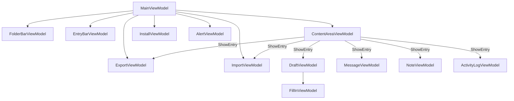

# ViewModels

The ViewModel layer is active in `Client` mode only. All ViewModels use CommunityToolkit.Mvvm (`ObservableObject`, `RelayCommand`).

ViewModels and their interfaces live in `Engine/src/ViewModels/` and are themselves Avalonia-agnostic (primitive types, custom interfaces) even though Views, Themes, and Avalonia-specific helpers live in the same **Engine** assembly under `Engine/src/Views/` and `Engine/src/Themes/`. The convention scanner auto-registers all `IFoo → Foo` pairs as singletons from the Engine assembly, except for entry ViewModels (in `Engine.ViewModels.Entries`) which are constructed with `new()` per-entry using entity arguments and cannot be DI-resolved.

Call `builder.UseEngine(EngineMode.Client).UseEngineUi()` — `UseEngineUi()` (from `EngineUiExtensions`) registers `MainWindow` and overrides the default `IBodyDocumentFactory` with `TextDocumentBodyDocumentFactory` so drafts receive a live `TextDocument`.

---

## IMainViewModel / MainViewModel

Root coordinator. Registered as singleton via `IMainViewModel → MainViewModel`; bound to `MainWindow(IMainViewModel)`.

**Properties**: `IsInstallScreenVisible`, `IsKioskMode`, `UserName`, `EnvironmentTitle`, `EnvironmentColor`, `AppVersion`, plus `FolderBar (IFolderBarViewModel)`, `EntryBar (IEntryBarViewModel)`, `ContentArea (IContentAreaViewModel)`, `InstallView (IInstallViewModel)`, `Alert (IAlertViewModel)`, `Export (IExportViewModel)`, `Import (IImportViewModel)`.

**Commands**: `CreateDraftCommand`, `CreateNoteCommand` (`IAsyncRelayCommand`); `ShowExportCommand`/`ShowImportCommand` (`IRelayCommand`) — each deselects the current folder and entry (`IFolderBarViewModel.DeselectFolder`/`IEntryBarViewModel.DeselectEntry`), refreshes its ViewModel's drive list (`RefreshDrivesCommand`), then displays it in the content area (see [IExportViewModel](#iexportviewmodel--exportviewmodel), [IImportViewModel](#iimportviewmodel--importviewmodel)); `ShowHomeCommand` (`IRelayCommand`) — calls `ContentAreaViewModel.ShowHome()` and nothing else. Bound to the "×" close button in `ExportView`/`ImportView` (via `$parent[Window].DataContext.ShowHomeCommand`, since those views' own `DataContext` is the export/import ViewModel, not `MainViewModel`) — closing restores the content area to its default state exactly as if the user had navigated away by picking a folder, without touching `Export`/`Import`'s own state (drive, file name, scope, collected entries, an import in progress, etc.), which remains intact for next time.

**Method**: `Task Initialize()` — connects, loads user info, shows main UI or install screen.

**Wiring**:
- `IInstallViewModel.InstallSucceeded` → initializes DB, applies user info, loads folder tree
- `IServiceConnection.MessageReceived` → stores inbound message, prepends to entry bar when Inbox is active
- `IServiceConnection.DeliveryStatusChanged` → passes to `IEntryBarViewModel.UpdateEntryStatus`
- `IContentAreaViewModel.DraftSent` → navigates to Outbox and selects sent message
- `IFolderBarViewModel.FolderSelected` → normally calls `ContentAreaViewModel.ShowHome()` before `IEntryBarViewModel.LoadFolder`; skipped (leaving the export view showing) when `ContentArea.ActiveContent` is the `Export` ViewModel and `Export.IsCollectingEntries` is `true` — so browsing folders refreshes the entry listing to pick more entries from without losing the export view (see [IExportViewModel](#iexportviewmodel--exportviewmodel))
- `IEntryBarViewModel.EntriesSelected` → if `ContentArea.ActiveContent` is the `Export` ViewModel and `Export.IsCollectingEntries` is `true`, adds every entry in the raised list to `Export.SelectedEntries` (so a shift-range or ctrl-click selection adds them all at once); otherwise, if exactly one entry was selected, shows it in the content area as usual — a multi-selection outside the export view opens nothing, since the content area can only display one entry at a time

---

## IFolderBarViewModel / FolderBarViewModel

Left-side folder tree. Registered as `IFolderBarViewModel → FolderBarViewModel` singleton.

**Properties**: `SelectedFolder (FolderItemViewModel?)`, `RootFolders (ObservableCollection<FolderItemViewModel>)`.

**Events**: `FolderSelected (Action<FolderItemViewModel>)`, `EntryMoved (Action)`.

**Methods**: `Load()`, `SelectFolder(FolderItemViewModel)`, `SelectFolderByType(FolderType)`, `DeselectFolder()` — clears `SelectedFolder` and its `IsSelected` flag without raising `FolderSelected` (used by `MainViewModel.ShowExportCommand`/`ShowImportCommand`), `MoveEntry(EntryItemViewModel, FolderItemViewModel)`, `AddSubfolder(FolderItemViewModel, string)`, `DeleteFolder(FolderItemViewModel)`, `CollapseAll()`.

**Static utility**: `FolderBarViewModel.IsCompatibleMove(EntryType, FolderType)` — used by `FolderBar.axaml.cs` drag-and-drop; not on the interface since it is a static helper.

---

## IEntryBarViewModel / EntryBarViewModel

Middle-column paginated entry list. Registered as `IEntryBarViewModel → EntryBarViewModel` singleton.

**Properties**: `SelectedEntry (EntryItemViewModel?)`, `Entries (ObservableCollection<EntryItemViewModel>)`, `CurrentPage`, `TotalPages`, `IsAlphabeticalSort`, `CanGoNext`, `CanGoPrev`, `ShowSortToggle`.

**Events**: `EntriesSelected (Action<IReadOnlyList<EntryItemViewModel>>)` — raised whenever the list's selection changes, carrying every entry newly *added* to the selection: one entry for a plain click, several for a shift-range or an accumulated ctrl-click selection. `EntryBar.axaml`'s `ListBox` uses `SelectionMode="Multiple"` (native Avalonia shift-range/ctrl-toggle support — no custom hit-testing code) and forwards its `SelectionChanged` (`AddedItems`/`RemovedItems`) straight to `SelectEntries` in code-behind.

**Why `SelectEntries` never touches `SelectedEntry`**: `EntryList`'s `SelectedItem="{Binding SelectedEntry, Mode=OneWay}"` pushes `SelectedEntry` back into the ListBox whenever it changes. If the click-driven `SelectEntries` path also assigned `SelectedEntry`, that push-back would immediately collapse the native multi-selection down to a single item — Avalonia's `SelectedItem` setter always narrows selection to just that one item, even in `Multiple` mode. This was a real bug: clicking entry A, then ctrl-clicking entry B, ended up with only B selected. `SelectedEntry` is now written only by the programmatic `SelectEntry(entry)` (single-entry pending-select flow), where collapsing to one item is exactly the desired effect.

**Methods**:
- `LoadFolder(FolderItemViewModel)` — also deselects the current entry via `DeselectEntry()`
- `Refresh()`, `UpdateEntryStatus(string messageId, DestinationStatus?)`, `PrependEntry(EntryItemViewModel)`, `DeleteEntry(EntryItemViewModel)`, `SetPendingSelectId(string)`
- `SelectEntry(EntryItemViewModel)` — programmatic single-entry selection (used by the pending-select-after-refresh flow); deselects every other entry, including any multi-selection, and raises `EntriesSelected` with a single-item list
- `SelectEntries(IReadOnlyList<EntryItemViewModel> added, IReadOnlyList<EntryItemViewModel> removed)` — applies a selection-list delta from the View's `SelectionChanged`: marks `added` selected and `removed` deselected, then raises `EntriesSelected` with `added` if non-empty. Deliberately does **not** assign `SelectedEntry` — see below.
- `DeselectEntry()` — clears every selected entry's `IsSelected` flag (not just `SelectedEntry`, so a multi-selection is fully cleared) without raising `EntriesSelected` (used by `LoadFolder` and by `MainViewModel.ShowExportCommand`/`ShowImportCommand`)

---

## IContentAreaViewModel / ContentAreaViewModel

Right-side content pane. Registered as `IContentAreaViewModel → ContentAreaViewModel` singleton.

**Properties**: `ActiveContent (object?)`, `IsHomeVisible (bool)`, `HomeText (string)`.

**Events**: `DraftSent (Func<MessageEntity, Task>)`.

**Methods**: `ShowHome()`, `ShowEntry(EntryItemViewModel)`, `ShowEntry(object)`.

The `DeliveryStatusChanged` handler checks `ActiveContent is IMessageViewModel` to route status updates to the currently displayed message — an empty `UserName` sets `IMessageViewModel.ReadStatus` directly (a local read-status notification), otherwise it calls `UpdateDeliveryStatus(userName, status)` (a remote destination's delivery status).

When `ShowEntry(EntryItemViewModel)` opens an Inbox message whose `ReadStatus` is `Received`, it calls `IServiceConnection.MarkMessageRead(messageId)` before building the `MessageViewModel`, so the message is marked read (and a confirmation sent to the sender) as soon as it is displayed. See [Peer.md](Peer.md#read-confirmation).

---

## IMessageViewModel / MessageViewModel

Read-only message display. Constructed with `new MessageViewModel(MessageEntity)` — not DI-registered.

**Properties**: `MessageId`, `Subject`, `Body`, `FromUser`, `ToList`, `CcList`, `ReceivedAt (DateTime)`, `IsAlert`, `HasDeliveryStatuses`, `DeliveryStatuses (ObservableCollection<DeliveryStatusRow>)`, `OverallStatus`, `OverallStatusText`, `ReadStatus`, `ReadStatusText`, `IsDeliveryExpanded`, `DeliveryExpandIndicator`.

**Commands**: `ToggleDeliveryCommand (IRelayCommand)`.

**Method**: `UpdateDeliveryStatus(string userName, DestinationStatus)` — updates per-user row and recomputes `OverallStatus`.

**Status priority** (per-user `OverallStatus`, Outbox only): `Failed > Read (all) > Confirmed (all Confirmed/Read) > Sent > Sending`.

**ReadStatus** (Inbox only, `null` on Outbox messages): `Received` when stored, `Read` once opened. Set directly by `ContentAreaViewModel` when it marks an unread message read, or by `ContentAreaViewModel.OnDeliveryStatusChanged` when a `DeliveryStatusChangedEvent` with an empty `UserName` arrives (see [Peer.md](Peer.md#read-confirmation)) — distinct from `UpdateDeliveryStatus`, which only ever applies to `DeliveryStatuses` rows.

---

## IDraftViewModel / DraftViewModel

Editable draft with fill-in support. Constructed with `new DraftViewModel(entity, ...)` — not DI-registered.

**Properties**: `Id`, `Subject`, `NewAddressUser` (auto-uppercased), `NewAddressType`, `IsSent`, `IsAlert`, `PlsoMode (PlsoMode)`, `PlsoButtonText`, `IsSaving`, `StatusMessage`, `Addresses (ObservableCollection<AddressData>)`, `BodyDocument (IBodyDocument)`, `FillIns (IReadOnlyDictionary<string, IFillInViewModel>)`, `AllUserNames`, `AddressTypes`.

`IsAlert` is persisted on `DraftEntity.IsAlert` across save/reload and passed through `IServiceConnection.SendMessage(..., IsAlert)` on send — see [Peer.md](Peer.md#alert-messages).

`PlsoMode` is editor-session-only UI state, cycled by the "PLSO" button (`OFF` → `ON` → `SPACES` → `OFF`, `PlsoButtonText` displays the current state) in `DraftEditor.axaml`'s toolbar — never read from or written to `DraftEntity`, so it resets to `PlsoMode.Off` whenever a draft is reopened. Only the body editor is affected; the Subject field is untouched.

**IBodyDocument** — framework-agnostic body document abstraction in `Engine.ViewModels.Entries`. `BodyDocumentFactory` provides the default `StringBodyDocument` (plain string, used in tests and Headless mode). `TextDocumentBodyDocumentFactory` provides `TextDocumentBodyDocument` (wraps AvaloniaEdit's `TextDocument`) for Client mode. `DraftEditor.axaml.cs` casts to `TextDocumentBodyDocument` to bind the editor. `IBodyDocumentFactory` controls which implementation is created; `UseEngineUi()` overrides the default with `TextDocumentBodyDocumentFactory`.

**Events**: `DraftSent (Func<IDraftViewModel, MessageEntity, Task>)`.

**Commands**: `SaveCommand`, `SendCommand` (`IAsyncRelayCommand`); `AddAddressCommand` (`IRelayCommand`); `RemoveAddressCommand` (`IRelayCommand<AddressData>`).

**Method**: `InsertFillIn(int caretOffset)` — adds a fill-in marker to the document and a new `FillInViewModel` to `FillIns`.

**Fill-ins**: Body text contains fill-in markers — Unicode `U+E001` sentinel + 8-character hex ID. `FillIns` maps each ID to its `IFillInViewModel`. `FillInElementGenerator` renders them inline. Internally backed by `Dictionary<string, IFillInViewModel>` with a read-only view exposed on the interface.

**PLSO (Phonetic Language Spell Out)**: `PlsoMode` is a three-state enum (`Off`, `On`, `Spaces`) cycled by the toolbar button. When not `Off`, `DraftEditor.axaml.cs` intercepts body text input at tunnel priority: each typed letter or digit is looked up via `PhoneticAlphabet.TryGetWord` (ICAO/NATO alphabet for letters — `A` → `ALFA`, `G` → `GOLF` — and spelled-out digits — `5` → `FIVE`) and the resulting word is inserted in place of the character, with a trailing space appended when the mode is `Spaces`. When not `Off`, Backspace is intercepted: the text immediately to the left of the caret is checked against every phonetic word length (longest first, via `PhoneticAlphabet.Lengths`/`IsWord`) and, on a match, the whole word is removed in one keystroke instead of one character — this check runs against the live document text regardless of which word it is or how it got there (typed via PLSO, pasted, edited), not just the most recently inserted word. `PhoneticAlphabet` is a pure static lookup class in `Engine.ViewModels.Entries` with no UI dependency.

---

## INoteViewModel / NoteViewModel

Editable note. Constructed with `new NoteViewModel(entity, entryService)` — not DI-registered.

**Properties**: `Id`, `Body`, `IsSaving`, `StatusMessage`.

**Commands**: `SaveCommand (IAsyncRelayCommand)`.

---

## IActivityLogViewModel / ActivityLogViewModel

Read-only daily activity log. Constructed with `new ActivityLogViewModel(entity)` — not DI-registered.

**Properties**: `Date (string)`, `Events (IReadOnlyList<ActivityEventRow>)` — merged from legacy `Events (string[])` and structured `EventEntries (ActivityLogEntry[])`, ordered newest-first.

---

## IInstallViewModel / InstallViewModel

One-time setup screen. Registered as `IInstallViewModel → InstallViewModel` singleton.

**Properties**: `UserCode` (auto-uppercased), `ErrorMessage`, `IsLoading`.

**Events**: `InstallSucceeded (Func<UserInfo, Task>)` — raised on success; consumed by `MainViewModel`.

**Commands**: `InstallCommand (IAsyncRelayCommand)`.

---

## IAlertViewModel / AlertViewModel

Tracks pending (unread) alert messages and drives the title bar's alarm box and sound (see [Peer.md](Peer.md#alert-messages)). Registered as `IAlertViewModel → AlertViewModel` singleton; exposed as `MainViewModel.Alert` and bound from `MainWindow.axaml` onto `TitleBar`'s `IsAlerting`/`AlertText`/`QuickConfirmationEnabled`/`AlertCommand` styled properties.

**Properties**: `IsAlerting (bool)` — `PendingCount > 0`; `PendingCount (int)`; `AlertText (string)` and `QuickConfirmationEnabled (bool)` — both read from `IAlertConfiguration`.

**Commands**: `ConfirmLatestCommand (IAsyncRelayCommand)` — confirms (marks read via `IServiceConnection.MarkMessageRead`) the most recently received pending alert. `CanExecute` is `IsAlerting && QuickConfirmationEnabled`.

**Wiring**:
- `IEntryService.MessageInserted` — if `IMessageFormat.GetIsAlert` is `true`, appends the message ID to the pending list, calls `IAlertSoundPlayer.Play()`, and (re)starts the auto-stop timer from `IAlertConfiguration.AlarmSoundDuration`
- `IEntryService.MessageRead` — removes the message ID from the pending list if present (a no-op for a non-alert message read); once the pending list is empty, disposes the timer and calls `IAlertSoundPlayer.Stop()`

The auto-stop timer only stops the *sound* — the alert box itself stays visible until every pending alert has been read. A new alert received while already alarming resets the timer to the full `AlarmSoundDuration` again.

**Quick confirmation**: When `QuickConfirmationEnabled`, `TitleBar`'s alert box responds to a pointer press by invoking `AlertCommand` (bound to `ConfirmLatestCommand`), and `MainWindow`'s tunnel-priority `KeyDown` handler invokes the same command on Space/Enter when focus is not in a `TextBox` or the AvaloniaEdit `TextEditor` (the draft body). Each invocation confirms one alert (the current last entry in the pending list); repeating the action — clicking or pressing the key again — confirms the next one, most-recently-received first, until none remain.

---

## IExportViewModel / ExportViewModel

Drives the export screen: choosing a destination drive, a zip file name, and either every entry or an explicitly built list, then writing them out as JSON files inside a zip archive. Registered as `IExportViewModel → ExportViewModel` singleton; exposed as `MainViewModel.Export` and shown in the content area via `ContentAreaViewModel.ShowEntry(object)` (`ExportView.axaml`, `DataTemplate`d on `ExportViewModel` in `ContentArea.axaml`). Being a singleton — not constructed per-entry like `DraftViewModel`/`NoteViewModel` — its state, including an export in progress, survives navigating the content area away to other views and back — including via the "×" close button in the view's toolbar (`MainViewModel.ShowHomeCommand`), which only restores the content area to its default state and leaves this ViewModel untouched. Clicking the title bar's EXPORT button always returns to this same instance (see `MainViewModel.ShowExportCommand`).

**Properties**:
- `AvailableDrives (IReadOnlyList<ExternalDriveInfo>)` — populated by `RefreshDrivesCommand`
- `SelectedDrive (ExternalDriveInfo?)`
- `FileName (string)` — defaults to `"export"`; the `IExportService.PackageExtension` (`.export.zip`) extension is appended automatically
- `Scope (ExportScope)` — `All` or `Some`; `IsAllScope`/`IsSomeScope` are bindable `bool` mirrors of the same value (for `RadioButton.IsChecked`), each setting `Scope` when set to `true`
- `SelectedEntries (ObservableCollection<EntryItemViewModel>)` — the entries collected for a `Some`-scope export, shown live as they are added
- `IsCollectingEntries (bool)` — `Scope == Some && !IsExporting`; when `true`, `MainViewModel` routes `IEntryBarViewModel.EntriesSelected` to `AddEntry` (for every entry in the raised list) instead of opening the entry (see `IMainViewModel` wiring above) — this is what makes a shift-range or ctrl-click multi-selection in the entry list add every selected entry to the export at once
- `IsExporting (bool)` — loading state; while `true`, `ExportView` disables the drive/file-name/scope controls and shows an indeterminate `ProgressBar`
- `StatusMessage (string?)` — validation errors, or the outcome of the last export attempt

**Commands**:
- `RefreshDrivesCommand (IRelayCommand)` — re-scans `IExternalDriveProvider.GetDrives()`; preserves `SelectedDrive` if its `RootPath` is still present in the new list, otherwise clears it
- `AddEntry(EntryItemViewModel)` / `RemoveEntryCommand (IRelayCommand<EntryItemViewModel>)` — add or remove an entry from `SelectedEntries`; `AddEntry` is a no-op if an entry with the same `Id`/`EntryType`/`IsOutboundMessage` is already present
- `ClearEntriesCommand (IRelayCommand)` — removes every entry from `SelectedEntries`. `CanExecute` is `!IsExporting`.
- `StartExportCommand (IAsyncRelayCommand)` — validates a drive is selected, `FileName` is non-blank, and (for `Some` scope) at least one entry is collected, setting `StatusMessage` and returning early otherwise. On success, builds the reference list (`IExportService.GetAllEntryRefs()` for `All`, or `SelectedEntries` mapped to `ExportEntryRef` for `Some`), calls `IExportService.Export`, and sets `StatusMessage` to the outcome — `"Exported N entries to {drive}"` on success (also clearing `SelectedEntries`), `"Export cancelled"` on `OperationCanceledException`, or `"Export failed: {message}"` on any other exception. `CanExecute` is `!IsExporting`.
- `CancelExportCommand (IRelayCommand)` — cancels the `CancellationTokenSource` backing the running export. `CanExecute` is `IsExporting`.

The package path is `Path.Combine(SelectedDrive.RootPath, SanitizedFileName + IExportService.PackageExtension)`, where invalid file name characters in `FileName` are replaced with `_`.

---

## IImportViewModel / ImportViewModel

Drives the import screen: choosing a source drive, then an `IExportService.PackageExtension` package on that drive to restore. Registered as `IImportViewModel → ImportViewModel` singleton; exposed as `MainViewModel.Import` and shown in the content area the same way as `Export` (`ImportView.axaml`, `DataTemplate`d on `ImportViewModel` in `ContentArea.axaml`). Being a singleton, its state — including an import in progress and any pending draft/note conflict prompt — survives navigating the content area away to other views and back — including via the "×" close button in the view's toolbar (`MainViewModel.ShowHomeCommand`), which only restores the content area to its default state and leaves this ViewModel untouched. Clicking the title bar's IMPORT button always returns to this same instance (see `MainViewModel.ShowImportCommand`).

**Properties**:
- `AvailableDrives (IReadOnlyList<ExternalDriveInfo>)` — populated by `RefreshDrivesCommand`
- `SelectedDrive (ExternalDriveInfo?)` — setting this refreshes `AvailablePackages` from `IImportService.GetPackages(SelectedDrive.RootPath)`; setting it to `null` clears `AvailablePackages` without calling the service
- `AvailablePackages (IReadOnlyList<ImportPackageInfo>)` — packages found on `SelectedDrive`
- `IsImporting (bool)` — loading state; while `true`, `ImportView` disables the drive/package controls and shows an indeterminate `ProgressBar`
- `StatusMessage (string?)` — the outcome of the last import attempt
- `PendingConflict (ImportConflict?)` — the draft/note name conflict currently awaiting the user's choice, or `null`; while non-null, `ImportView` shows an inline prompt over the rest of the screen with Keep Existing / Overwrite / Overwrite All buttons

**Commands**:
- `RefreshDrivesCommand (IRelayCommand)` — same behavior as `ExportViewModel`'s
- `StartImportCommand (IAsyncRelayCommand<ImportPackageInfo>)` — calls `IImportService.Import(package.FullPath, resolveConflict)`, where `resolveConflict` creates a `TaskCompletionSource<DraftNoteConflictResolution>`, sets `PendingConflict`, and awaits it — so the import genuinely pauses mid-package until `ResolveConflictCommand` completes it, including across content-area navigation away and back, since the awaited `Task` lives on this singleton, not on any view. On completion, sets `StatusMessage` to `"Imported {Imported}, overwrote {Overwritten}, skipped {Skipped}"` or `"Import failed: {message}"`. `CanExecute` is `!IsImporting`.
- `ResolveConflictCommand (IRelayCommand<DraftNoteConflictResolution>)` — clears `PendingConflict` and completes the pending `TaskCompletionSource` with the given resolution, resuming `IImportService.Import`.

---

## IFillInViewModel / FillInViewModel

One fill-in slot within a draft. Constructed with `new FillInViewModel(...)` — not DI-registered.

**Properties**: `Id`, `Options (ObservableCollection<FillInOptionViewModel>)`, `IsPopupOpen`, `NewOption`, `SelectedOption`, `DisplayText` (shows selected value or `"______"`).

**Commands**: `SelectOptionCommand`, `RemoveOptionCommand`, `MoveOptionUpCommand`, `MoveOptionDownCommand` (`IRelayCommand<string>`); `AddOptionCommand`, `TogglePopupCommand` (`IRelayCommand`).

Because `FillInInlineControl` is an X11 child window without keyboard focus, `DraftEditor.axaml.cs` tunnels keyboard events and forwards them to the active `IFillInViewModel`'s `NewOption` property and `AddOptionCommand`.

---

## Supporting ViewModels (no interface)

### `FolderItemViewModel`
Wraps a folder entity. Provides `Id`, `Name`, `RootType`, `ParentId`, `Icon`, `IsSelected`, `IsExpanded`, `Children (ObservableCollection<FolderItemViewModel>)`, `CanCreateSubfolder`, `IsRootFolder`, `IsSubfolder`. Treated as a lightweight display-model DTO — constructed freely in `FolderBarViewModel` with no DI.

### `EntryItemViewModel`
Wraps a row in the entry list. Properties: `Id`, `Title`, `SecondaryText`, `TimeText`, `FixedStatusText`, `EntryType`, `SortDate`, `OverallStatus`, `StatusText`, `StatusColorHex` (hex string; converted to a brush in the view by `ColorHexToBrushConverter`), `IsOutboundMessage`. Treated as a display-model DTO.

For `EntryType.Message` rows, `IsOutboundMessage` records whether the row is the Outbox (sent) or Inbox (received) record — `EntryBarViewModel.Refresh()` sets it `true` for Outbox rows. A self-addressed message produces one row of each kind sharing the same `Id` (`MessageId`), so `ContentAreaViewModel`, `EntryBarViewModel.DeleteEntry`, and `FolderBarViewModel.MoveEntry` all pass it through to `IMessageRepository`/`IEntryService` to disambiguate which underlying document to load, delete, or move. See `Docs/Data.md`.

### `DeliveryStatusRow`
Display row for per-user delivery tracking: `UserName`, `DisplayName` (with group context), `Status (DestinationStatus)`, `StatusText`.

### `FillInOptionViewModel`
A single selectable option within a `FillInViewModel`: `Value`, `IsSelected`.
