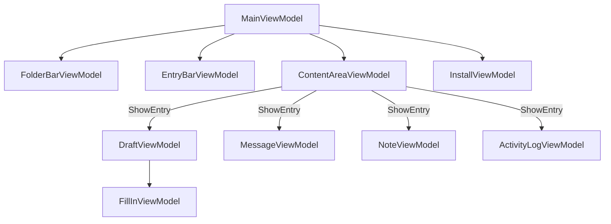

# ViewModels

The ViewModel layer is active in `Client` mode only. All ViewModels use CommunityToolkit.Mvvm (`ObservableObject`, `RelayCommand`).

ViewModels and their interfaces live in `Engine/src/ViewModels/` and are themselves Avalonia-agnostic (primitive types, custom interfaces) even though Views, Themes, and Avalonia-specific helpers live in the same **Engine** assembly under `Engine/src/Views/` and `Engine/src/Themes/`. The convention scanner auto-registers all `IFoo → Foo` pairs as singletons from the Engine assembly, except for entry ViewModels (in `Engine.ViewModels.Entries`) which are constructed with `new()` per-entry using entity arguments and cannot be DI-resolved.

Call `builder.UseEngine(EngineMode.Client).UseEngineUi()` — `UseEngineUi()` (from `EngineUiExtensions`) registers `MainWindow` and overrides the default `IBodyDocumentFactory` with `TextDocumentBodyDocumentFactory` so drafts receive a live `TextDocument`.

---

## IMainViewModel / MainViewModel

Root coordinator. Registered as singleton via `IMainViewModel → MainViewModel`; bound to `MainWindow(IMainViewModel)`.

**Properties**: `IsInstallScreenVisible`, `IsKioskMode`, `SiteName`, `EnvironmentTitle`, `EnvironmentColor`, `AppVersion`, plus `FolderBar (IFolderBarViewModel)`, `EntryBar (IEntryBarViewModel)`, `ContentArea (IContentAreaViewModel)`, `InstallView (IInstallViewModel)`.

**Commands**: `CreateDraftCommand`, `CreateNoteCommand` (`IAsyncRelayCommand`).

**Method**: `Task Initialize()` — connects, loads site info, shows main UI or install screen.

**Wiring**:
- `IInstallViewModel.InstallSucceeded` → initializes DB, applies site info, loads folder tree
- `IServiceConnection.MessageReceived` → stores inbound message, prepends to entry bar when Inbox is active
- `IServiceConnection.DeliveryStatusChanged` → passes to `IEntryBarViewModel.UpdateEntryStatus`
- `IContentAreaViewModel.DraftSent` → navigates to Outbox and selects sent message

---

## IFolderBarViewModel / FolderBarViewModel

Left-side folder tree. Registered as `IFolderBarViewModel → FolderBarViewModel` singleton.

**Properties**: `SelectedFolder (FolderItemViewModel?)`, `RootFolders (ObservableCollection<FolderItemViewModel>)`.

**Events**: `FolderSelected (Action<FolderItemViewModel>)`, `EntryMoved (Action)`.

**Methods**: `Load()`, `SelectFolder(FolderItemViewModel)`, `SelectFolderByType(FolderType)`, `MoveEntry(EntryItemViewModel, FolderItemViewModel)`, `AddSubfolder(FolderItemViewModel, string)`, `DeleteFolder(FolderItemViewModel)`, `CollapseAll()`.

**Static utility**: `FolderBarViewModel.IsCompatibleMove(EntryType, FolderType)` — used by `FolderBar.axaml.cs` drag-and-drop; not on the interface since it is a static helper.

---

## IEntryBarViewModel / EntryBarViewModel

Middle-column paginated entry list. Registered as `IEntryBarViewModel → EntryBarViewModel` singleton.

**Properties**: `SelectedEntry (EntryItemViewModel?)`, `Entries (ObservableCollection<EntryItemViewModel>)`, `CurrentPage`, `TotalPages`, `IsAlphabeticalSort`, `CanGoNext`, `CanGoPrev`, `ShowSortToggle`.

**Events**: `EntrySelected (Action<EntryItemViewModel>)`.

**Methods**: `LoadFolder(FolderItemViewModel)`, `Refresh()`, `UpdateEntryStatus(string messageId, DestinationStatus?)`, `PrependEntry(EntryItemViewModel)`, `DeleteEntry(EntryItemViewModel)`, `SetPendingSelectId(string)`, `SelectEntry(EntryItemViewModel)`.

---

## IContentAreaViewModel / ContentAreaViewModel

Right-side content pane. Registered as `IContentAreaViewModel → ContentAreaViewModel` singleton.

**Properties**: `ActiveContent (object?)`, `IsHomeVisible (bool)`, `HomeText (string)`.

**Events**: `DraftSent (Func<MessageEntity, Task>)`.

**Methods**: `ShowHome()`, `ShowEntry(EntryItemViewModel)`, `ShowEntry(object)`.

The `DeliveryStatusChanged` handler checks `ActiveContent is IMessageViewModel` to route status updates to the currently displayed message.

---

## IMessageViewModel / MessageViewModel

Read-only message display. Constructed with `new MessageViewModel(MessageEntity)` — not DI-registered.

**Properties**: `MessageId`, `Subject`, `Body`, `FromSite`, `ToList`, `CcList`, `ReceivedAt (DateTime)`, `HasDeliveryStatuses`, `DeliveryStatuses (ObservableCollection<DeliveryStatusRow>)`, `OverallStatus`, `OverallStatusText`, `IsDeliveryExpanded`, `DeliveryExpandIndicator`.

**Commands**: `ToggleDeliveryCommand (IRelayCommand)`.

**Method**: `UpdateDeliveryStatus(string siteName, DestinationStatus)` — updates per-site row and recomputes `OverallStatus`.

**Status priority**: `Failed > Timeout > Confirmed > Sent > Sending`.

---

## IDraftViewModel / DraftViewModel

Editable draft with fill-in support. Constructed with `new DraftViewModel(entity, ...)` — not DI-registered.

**Properties**: `Id`, `Subject`, `NewAddressSite` (auto-uppercased), `NewAddressType`, `IsSent`, `IsSaving`, `StatusMessage`, `Addresses (ObservableCollection<AddressData>)`, `BodyDocument (IBodyDocument)`, `FillIns (IReadOnlyDictionary<string, IFillInViewModel>)`, `AllSiteNames`, `AddressTypes`.

**IBodyDocument** — framework-agnostic body document abstraction in `Engine.ViewModels.Entries`. `BodyDocumentFactory` provides the default `StringBodyDocument` (plain string, used in tests and Headless mode). `TextDocumentBodyDocumentFactory` provides `TextDocumentBodyDocument` (wraps AvaloniaEdit's `TextDocument`) for Client mode. `DraftEditor.axaml.cs` casts to `TextDocumentBodyDocument` to bind the editor. `IBodyDocumentFactory` controls which implementation is created; `UseEngineUi()` overrides the default with `TextDocumentBodyDocumentFactory`.

**Events**: `DraftSent (Func<IDraftViewModel, MessageEntity, Task>)`.

**Commands**: `SaveCommand`, `SendCommand` (`IAsyncRelayCommand`); `AddAddressCommand` (`IRelayCommand`); `RemoveAddressCommand` (`IRelayCommand<AddressData>`).

**Method**: `InsertFillIn(int caretOffset)` — adds a fill-in marker to the document and a new `FillInViewModel` to `FillIns`.

**Fill-ins**: Body text contains fill-in markers — Unicode `U+E001` sentinel + 8-character hex ID. `FillIns` maps each ID to its `IFillInViewModel`. `FillInElementGenerator` renders them inline. Internally backed by `Dictionary<string, IFillInViewModel>` with a read-only view exposed on the interface.

---

## INoteViewModel / NoteViewModel

Editable note. Constructed with `new NoteViewModel(entity, entryService)` — not DI-registered.

**Properties**: `Id`, `Body`, `IsSaving`, `StatusMessage`.

**Commands**: `SaveCommand (IAsyncRelayCommand)`.

---

## IActivityLogViewModel / ActivityLogViewModel

Read-only daily activity log. Constructed with `new ActivityLogViewModel(entity)` — not DI-registered.

**Properties**: `Date (string)`, `Events (IReadOnlyList<ActivityEventRow>)` — merged from legacy `Events (string[])` and structured `EventEntries (ActivityLogEntry[])`, ordered newest-first.

---

## IInstallViewModel / InstallViewModel

One-time setup screen. Registered as `IInstallViewModel → InstallViewModel` singleton.

**Properties**: `SiteCode` (auto-uppercased), `ErrorMessage`, `IsLoading`.

**Events**: `InstallSucceeded (Func<SiteInfo, Task>)` — raised on success; consumed by `MainViewModel`.

**Commands**: `InstallCommand (IAsyncRelayCommand)`.

---

## IFillInViewModel / FillInViewModel

One fill-in slot within a draft. Constructed with `new FillInViewModel(...)` — not DI-registered.

**Properties**: `Id`, `Options (ObservableCollection<FillInOptionViewModel>)`, `IsPopupOpen`, `NewOption`, `SelectedOption`, `DisplayText` (shows selected value or `"______"`).

**Commands**: `SelectOptionCommand`, `RemoveOptionCommand`, `MoveOptionUpCommand`, `MoveOptionDownCommand` (`IRelayCommand<string>`); `AddOptionCommand`, `TogglePopupCommand` (`IRelayCommand`).

Because `FillInInlineControl` is an X11 child window without keyboard focus, `DraftEditor.axaml.cs` tunnels keyboard events and forwards them to the active `IFillInViewModel`'s `NewOption` property and `AddOptionCommand`.

---

## Supporting ViewModels (no interface)

### `FolderItemViewModel`
Wraps a folder entity. Provides `Id`, `Name`, `RootType`, `ParentId`, `Icon`, `IsSelected`, `IsExpanded`, `Children (ObservableCollection<FolderItemViewModel>)`, `CanCreateSubfolder`, `IsRootFolder`, `IsSubfolder`. Treated as a lightweight display-model DTO — constructed freely in `FolderBarViewModel` with no DI.

### `EntryItemViewModel`
Wraps a row in the entry list. Properties: `Id`, `Title`, `SecondaryText`, `TimeText`, `FixedStatusText`, `EntryType`, `SortDate`, `OverallStatus`, `StatusText`, `StatusColorHex` (hex string; converted to a brush in the view by `ColorHexToBrushConverter`), `IsOutboundMessage`. Treated as a display-model DTO.

For `EntryType.Message` rows, `IsOutboundMessage` records whether the row is the Outbox (sent) or Inbox (received) record — `EntryBarViewModel.Refresh()` sets it `true` for Outbox rows. A self-addressed message produces one row of each kind sharing the same `Id` (`MessageId`), so `ContentAreaViewModel`, `EntryBarViewModel.DeleteEntry`, and `FolderBarViewModel.MoveEntry` all pass it through to `IMessageRepository`/`IEntryService` to disambiguate which underlying document to load, delete, or move. See `Docs/Data.md`.

### `DeliveryStatusRow`
Display row for per-site delivery tracking: `SiteName`, `DisplayName` (with group context), `Status (DestinationStatus)`, `StatusText`.

### `FillInOptionViewModel`
A single selectable option within a `FillInViewModel`: `Value`, `IsSelected`.
